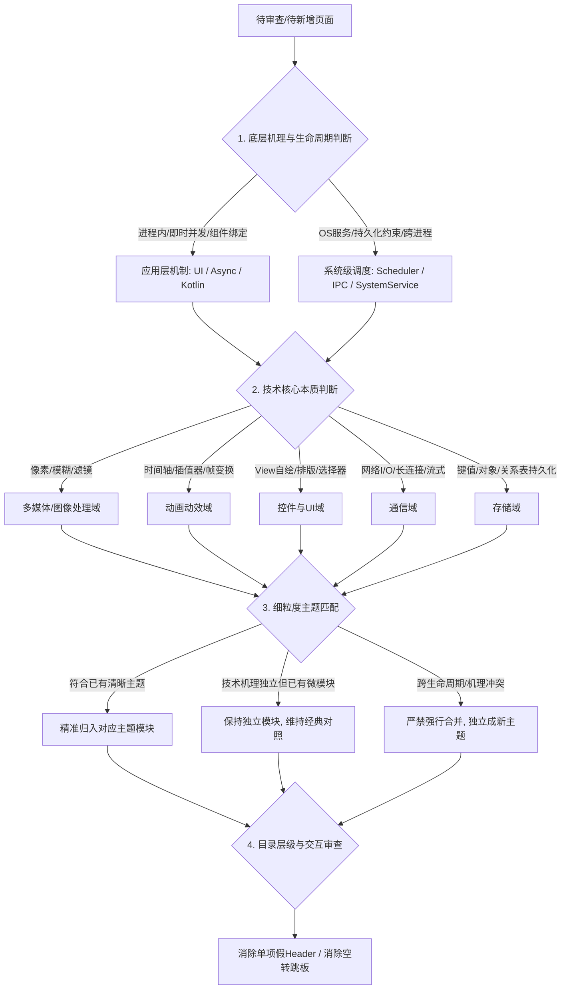

# 模块与页面架构治理指南 (Module & Page Governance)

本技能沉淀了 Android 现代化多模块工程中**页面归属评审、模块划分边界、目录分组治理与系统底层机理分析**的核心方法论与决策准则。

---

## 一、 核心治理准则 (Core Tenets)

### 准则 1：底层机理与生命周期边界优于代码量（Mechanism & Lifecycle First）

**严禁仅以“页面数量少”或“代码行数少”为由，将底层机理、生命周期和调度主体不同的能力强行合并。**

- **调度主体与执行空间判断**：
  - **应用进程内（In-Process）**：由 JVM 线程池、Linux 内核调度、Looper 消息队列驱动（如 Coroutines、HandlerThread、AsyncTask）。进程死亡，任务即刻消亡；
  - **操作系统级（OS-Level / System-Server）**：由 `system_server` 的 `JobSchedulerService`、Framework 级 IPC 统筹（如 JobScheduler、WorkManager）。具备条件约束、跨进程唤醒与开机广播持久化能力。
- **生命周期超越性判断**：
  - 严格绑定于组件/进程生命周期的即时并发机制，与能超越进程甚至开机重启持久化的系统调度机制，属于**完全不同维度的抽象**，必须保持物理隔离。

> **经典判例**：  
> `module_async`（进程内即时并发）与 `module_scheduler`（系统持久化约束调度）绝对不可合并为 `module_task`。

---

### 准则 2：细粒度主题模块化契约（Granular Theme-Driven Modularization）

在技术知识库、架构沉淀与展示型（Showcase / Playground）工程中，架构的首要目标是**“一领域一主题、职责纯粹、横向对称对比”**，而非单体工程构建期开销的极度压缩：

- **微模块合法性**：包含 2 个页面的微模块完全符合架构规范，前提是其**主题清晰、内部构成经典的横向对照**：
  - 官方推荐 vs 开源代表：如 `Room` vs `ObjectBox`（`module_database`）、`DataStore` vs `MMKV`（`module_storage`）、`Hilt` vs `Koin`（`module_di`）；
  - 传统系统机制 vs 现代化方案：如 `JobScheduler` vs `WorkManager`（`module_scheduler`）、`AsyncTask` vs `HandlerThread`（`module_async`）、`AIDL` vs `Messenger`（`module_ipc`）。
- **可扩展性（开闭原则）**：细粒度模块为后续拓展精准预留插槽（如 `module_scheduler` 后续自然纳入 `AlarmManager` 实现 Exact Work 对比，而不污染进程内异步机制）。

---

### 准则 3：严禁概念错置与形式化归类（Strict Concept Purity）

页面与技术点的归属必须忠实于其**技术本质与底层原理**，严禁仅凭表象归入容易混淆的模块：

- **图形滤镜 vs 动画机制**：
  - 动画的核心特征是：**时间维度、插值器驱动、帧/属性状态转移**（如 ObjectAnimator、Transition、Lottie、PAG）；
  - 图像处理的核心特征是：**GPU/CPU 像素着色、着色器 Shader、卷积核矩阵、模糊算法、Bitmap 导出**（如 RenderEffect、RenderScript、GPUImage）；
  - ❌ **反模式**：将 `RenderEffect`（Android 12+ 高斯模糊）或 `RenderScript`（底层模糊）归入 `module_anim`；它们属于图形图像处理。
- **系统窗口权限 vs 普通 UI 控件**：
  - `FloatWindow` 依赖 `WindowManager` 和 `SYSTEM_ALERT_WINDOW` 权限，具备跨应用浮窗属性，技术本质更偏向 Window 机制与系统服务，而非简单的本地 ViewGroup。
- **文本样式 vs 底层单点探索**：
  - 自定义字体加载（`Typeface`）本质是 UI 文本排版（Typography），应归入控件与排版，而非笼统的技术杂项。

---

### 准则 4：防歧义命名与官方体系对齐（Unambiguous Naming）

模块与分类的命名必须严谨，严禁使用与 Android 操作系统核心机制产生语义冲突的泛化词汇：

- ❌ **命名雷区**：避免使用 **`Task`** 命名后台并发模块。在 Android 源码中，`Task` 专指 **Activity 任务栈**（如 `TaskRecord`、`launchMode="singleTask"`、`FLAG_ACTIVITY_NEW_TASK`、`taskAffinity`）。使用 `module_task` 会导致严重的认知歧义。
- ✅ **官方分层对齐**：后台工作必须对齐 Google 官方《Background Work》顶层架构图谱：
  - **Immediate Work（即时任务）**：首选 Kotlin Coroutines（`module_kotlin`）；传统方案为 `module_async`（HandlerThread / AsyncTask）；
  - **Deferrable Work（延期持久化任务）**：首选 WorkManager，系统原生为 JobScheduler（统一收敛于 `module_scheduler`）；
  - **Exact Work（精确时间任务）**：AlarmManager（归入 `module_scheduler`）。

---

### 准则 5：扁平导航与反套娃机制（Anti-Passthrough & Shallow Hierarchy）

目录与分类交互必须以“最小点击穿透、最低认知负担”为原则：

- ❌ **单项假分组（Single-Item Section Noise）**：
  - 分组 Header 的唯一价值是“信息聚合”。如果某个分组下**只有 1 个子项，且 Header 文本与子项文本完全重复**（例如 `── 导航 ──` 下只有 `Tab 导航`；`── 数据库 ──` 下只有 `数据库`），必须直接移除该 Header，避免视觉噪音。
- ❌ **空转跳转跳板（Passthrough Intermediary）**：
  - 如果一个一级分类下**只有一个模块**（例如“AI 与机器学习”下只有 `module_ml`），强行经过 `CategoryActivity` 中转让用户点击两次才看到功能列表属于反模式。应支持直通目标模块或内联展示。
- ❌ **垃圾桶兜底模块（Catch-All Modules）**：
  - 避免设立类似 `module_sample`、`module_misc` 等按“代码来源形态”而非“技术领域”划分的垃圾桶分类。业务场景应按照场景领域（如复合动效、媒体裁剪）回归所属领域。

---

## 二、 架构审查决策流程 (Step-by-Step Governance Flow)

当审查现有页面、规划新页面或评估模块重构时，按以下四步执行：

### 审查 Checklist：
1. **机理审查**：该技术是否能在进程退出后存活？它的调度者是 JVM 线程还是操作系统？
2. **本质审查**：页面演示的核心是像素矩阵变换（图像），还是属性插值（动画）？是纯 UI 呈现，还是窗口级权限？
3. **结构审查**：当前模块是否保持了 1:1 的经典对标（如 Hilt vs Koin）？
4. **命名审查**：模块和路由命名是否使用了易混淆词汇（如 Task）？
5. **层级审查**：进入该页面需要几次点击？目录中是否存在“1个Header包1个同名Item”的冗余结构？

---

## 三、 典型判据与归类基准库 (Reference Cases)

| 技术/页面 | 正确归属建议 | 错误归属警示 | 核心底层理由 |
| :--- | :--- | :--- | :--- |
| **`RenderEffect` / `RenderScript`** | **多媒体 / 图像处理** (`module_image_process` 或 `module_gpuimage`) | ❌ `module_anim` | 核心是 GPU/CPU 离屏高斯模糊算法与 Bitmap 渲染，无时间维度与插值器，非动画机制 |
| **`WorkManager` / `JobScheduler`** | **系统能力 / 任务调度** (`module_scheduler`) | ❌ 与 `module_async` 合并为 `module_task` | 属于系统级 Deferrable Work，由 `system_server` 跨进程统筹持久化；而 `module_async` 随进程消亡 |
| **`FloatWindow`** | **系统服务 / 窗口管理** 或 **UI 浮层** | ❌ 混入普通容器布局 | 强依赖 `WindowManager` 与系统悬浮权限，本质是 Window 级别系统能力 |
| **`Typeface`** | **UI 交互 / 文本排版** (`module_widget`) | ❌ `module_sample` | 字体是标准的 View Typography 属性，不应被视为实验性底层单点技巧 |
| **`Compose MVI`** | **架构与工程 / 架构模式** (`module_arch`) | ❌ `module_compose` | 核心演示的是 MVI 单向数据流架构思想在 Compose 中的落地，重心在数据流架构而非 Compose 组件本身 |
| **`MPAndroidChart` vs `Compose Chart`** | **分别归入原生图表与 Compose Canvas**，但建立横向交叉索引 | ❌ 强行拉平或忽略对比 | 业务指标模型完全相同，但底层绘图管线（View invalidate vs DrawScope）不同，适合保持模块独立但互留索引 |
