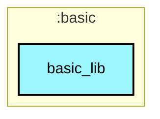
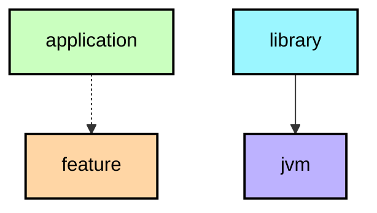

# `:basic:basic_lib`

基础架构层核心模块，作为可直接抽离到其他 Android 项目的通用基础库（Base Layer）。

## 核心领域分包（Domain Structure）

```
com.example.william.my.core.base/
├── app/                  # 【应用基建领域】全局 Application 生命周期、Hilt 模块与初始化分发
│   ├── BaseApp.kt
│   ├── BaseAppInit.kt
│   ├── hilt/             # (BaseInitImpl, BaseModule, IAppInit)
│   └── provider/         # (InitProvider)
│
├── ui/                   # 【视图容器领域】统一系统 UI 组件基类
│   ├── activity/         # BaseActivity, BaseVBActivity, BaseVMActivity, BaseFragmentActivity
│   ├── fragment/         # BaseFragment, BaseVBFragment, BaseVMFragment, LazyFragment
│   ├── dialog/           # BaseDialogFragment, BaseVBDialogFragment
│   │   └── bottomsheet/  # BaseBottomSheetDialogFragment, BaseVBBottomSheetDialogFragment
│   └── recycler/         # 统一列表基建 (合并 host, handler, decoration, layout, tab)
│       ├── host/         # RecyclerViewHost
│       ├── handler/      # BaseRecyclerHandler
│       ├── decoration/   # RItemDecoration 装饰器体系
│       ├── layout/       # FullyGridLayoutManager 等自适应布局管理器
│       └── tab/          # RecyclerTabAdapter 与 ViewPager2 顶层联动扩展
│
├── arch/                 # 【架构基类领域】多模式架构分层
│   ├── mvvm/             # BaseViewModel, BaseAndroidViewModel
│   ├── mvp/              # IBasePresenter, IBaseView, IEmptyView
│   └── rx/               # CompleteUseCase 等 RxJava 用例基类
│
├── coroutine/            # 【现代并发】Google NiA 规范协程调度与生命周期扩展
│   ├── AppDispatchers.kt # Default, IO, Main 调度器枚举
│   ├── Dispatcher.kt     # @Dispatcher 限定符注解与 Hilt 绑定
│   ├── ApplicationScope.kt # @ApplicationScope 全局作用域单例
│   ├── LifecycleExtensions.kt # collectWithLifecycle 生命周期流安全收集
│   └── di/
│
├── ext/                  # 【Kotlin 扩展】面向人体工学的顶层扩展函数
│   ├── FileExt.kt        # File.saveToPublicDownloads(context, fileName)
│   ├── TextViewExt.kt    # TextView.setMarquee(), TextView.setGradientColor(...)
│   └── ViewExt.kt        # View.isLocalVisibleOnScreen()
│
├── eventbus/             # 【事件总线】EventBus 专项编译期索引加速
│   └── EventBusHelper.kt
│
├── protocol/             # 【路由协议】私有协议分析与分发跳转
│   ├── ProtocolConstants.kt
│   └── ProtocolHelper.kt
│
└── utils/                # 【基础工具】纯算法与专项系统能力
    ├── AudioRecordPlayer.kt # 音频录制与播放封装
    ├── DensityAdaptUtils.kt # 今日头条 360dp 屏幕适配（附与 Blankj pt 方案详尽对比）
    ├── FragmentBackHelper.kt # 嵌套 childFragmentManager 递归返回键分发
    ├── NetworkChangeHelper.kt # observeNetwork(context): Flow<Boolean> 响应式网络监听
    ├── DeflaterUtils.kt  # 纯内存 Deflater 字符串压缩与解压
    ├── GzipUtils.kt      # 纯内存 GZIP 字符串压缩与解压
    ├── HandlerUtils.kt   # 弱引用 Handler 示例 (@Deprecated)
    └── AppExecutorsHelper.kt # 全局执行器编排示例 (@Deprecated)
```

## 协程与扩展使用示例

```kotlin
// 1. 在 Repository 或 UseCase 中注入指定 Dispatcher
class SampleRepository @Inject constructor(
    @Dispatcher(AppDispatchers.IO) private val ioDispatcher: CoroutineDispatcher,
    @ApplicationScope private val externalScope: CoroutineScope,
) {
    suspend fun fetchData(): Result<Data> = withContext(ioDispatcher) { ... }
}

// 2. 在 Activity / Fragment 中安全收集 Flow
viewLifecycleOwner.collectWithLifecycle(viewModel.uiState) { state ->
    // 自动在 STARTED 时收集，STOPPED 时挂起，防止后台重绘与内存泄漏
}

// 3. 响应式网络监听
NetworkChangeHelper.observeNetwork(context).collectWithLifecycle(this) { isOnline ->
    // 实时感知网络状态，随生命周期自动注销
}
```

## Module dependency graph

<!--region graph-->


<details><summary>📋 Graph legend</summary>



</details>
<!--endregion-->
