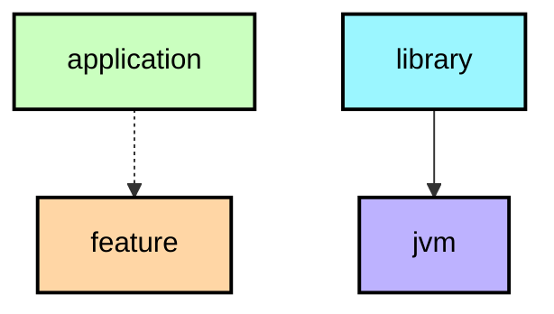

```mermaid
---
config:
  layout: elk
  elk:
    nodePlacementStrategy: SIMPLE
---
graph TB
  subgraph :libs
    direction TB
    :libs:lib_eventbus[lib_eventbus]:::android-library
    :libs:lib_httpurl[lib_httpurl]:::android-library
    :libs:lib_image_loader[lib_image_loader]:::android-library
    :libs:lib_ktor[lib_ktor]:::android-library
    :libs:lib_mqtt[lib_mqtt]:::android-library
    :libs:lib_mqtt_hivemq[lib_mqtt_hivemq]:::android-library
    :libs:lib_mqtt_paho_service[lib_mqtt_paho_service]:::android-library
    :libs:lib_nanohttpd[lib_nanohttpd]:::android-library
    :libs:lib_netty[lib_netty]:::android-library
    :libs:lib_ninepatch[lib_ninepatch]:::android-library
    :libs:lib_okhttp[lib_okhttp]:::android-library
    :libs:lib_retrofit[lib_retrofit]:::android-library
    :libs:lib_retrofit_rx[lib_retrofit_rx]:::android-library
    :libs:lib_rx_download[lib_rx_download]:::android-library
    :libs:lib_rx_request[lib_rx_request]:::android-library
    :libs:lib_rx_upload[lib_rx_upload]:::android-library
    :libs:lib_sse_ktor[lib_sse_ktor]:::android-library
    :libs:lib_sse_okhttp[lib_sse_okhttp]:::android-library
    :libs:lib_volley[lib_volley]:::android-library
    :libs:lib_websocket_java[lib_websocket_java]:::android-library
    :libs:lib_websocket_okhttp[lib_websocket_okhttp]:::android-library
    :libs:lib_widget[lib_widget]:::android-library
  end
  subgraph :modules
    direction TB
    :modules:module_anim[module_anim]:::android-library
    :modules:module_arch[module_arch]:::android-library
    :modules:module_async[module_async]:::android-library
    :modules:module_bluetooth[module_bluetooth]:::android-library
    :modules:module_component[module_component]:::android-library
    :modules:module_compose[module_compose]:::android-library
    :modules:module_database[module_database]:::android-library
    :modules:module_di[module_di]:::android-library
    :modules:module_event[module_event]:::android-library
    :modules:module_feature[module_feature]:::android-library
    :modules:module_flutter[module_flutter]:::android-library
    :modules:module_http[module_http]:::android-library
    :modules:module_image_loader[module_image_loader]:::android-library
    :modules:module_ipc[module_ipc]:::android-library
    :modules:module_jetpack[module_jetpack]:::android-library
    :modules:module_kotlin[module_kotlin]:::android-library
    :modules:module_markdown[module_markdown]:::android-library
    :modules:module_media[module_media]:::android-library
    :modules:module_ml[module_ml]:::android-library
    :modules:module_mqtt[module_mqtt]:::android-library
    :modules:module_performance[module_performance]:::android-library
    :modules:module_reactive[module_reactive]:::android-library
    :modules:module_sample[module_sample]:::android-library
    :modules:module_scheduler[module_scheduler]:::android-library
    :modules:module_socket[module_socket]:::android-library
    :modules:module_sse[module_sse]:::android-library
    :modules:module_storage[module_storage]:::android-library
    :modules:module_system_service[module_system_service]:::android-library
    :modules:module_tab[module_tab]:::android-library
    :modules:module_widget[module_widget]:::android-library
    :modules:module_widget_custom[module_widget_custom]:::android-library
    :modules:module_widget_thirdparty[module_widget_thirdparty]:::android-library
  end
  subgraph :basic
    direction TB
    :basic:basic_lib[basic_lib]:::android-library
    :basic:basic_repo[basic_repo]:::android-library
    :basic:basic_server[basic_server]:::android-library
    :basic:basic_shared[basic_shared]:::android-library
  end
  :flutter[flutter]:::unknown
  :benchmarks[benchmarks]:::android-test
  :app[app]:::android-application

  :app -.-> :basic:basic_lib
  :app -.-> :basic:basic_shared
  :app -.-> :modules:module_anim
  :app -.-> :modules:module_arch
  :app -.-> :modules:module_async
  :app -.-> :modules:module_bluetooth
  :app -.-> :modules:module_component
  :app -.-> :modules:module_compose
  :app -.-> :modules:module_database
  :app -.-> :modules:module_di
  :app -.-> :modules:module_event
  :app -.-> :modules:module_feature
  :app -.-> :modules:module_flutter
  :app -.-> :modules:module_http
  :app -.-> :modules:module_image_loader
  :app -.-> :modules:module_ipc
  :app -.-> :modules:module_jetpack
  :app -.-> :modules:module_kotlin
  :app -.-> :modules:module_markdown
  :app -.-> :modules:module_media
  :app -.-> :modules:module_ml
  :app -.-> :modules:module_mqtt
  :app -.-> :modules:module_performance
  :app -.-> :modules:module_reactive
  :app -.-> :modules:module_sample
  :app -.-> :modules:module_scheduler
  :app -.-> :modules:module_socket
  :app -.-> :modules:module_sse
  :app -.-> :modules:module_storage
  :app -.-> :modules:module_system_service
  :app -.-> :modules:module_tab
  :app -.-> :modules:module_widget
  :app -.-> :modules:module_widget_custom
  :app -.-> :modules:module_widget_thirdparty
  :basic:basic_repo -.-> :basic:basic_lib
  :basic:basic_repo -.-> :basic:basic_shared
  :basic:basic_repo --> :libs:lib_okhttp
  :basic:basic_repo --> :libs:lib_retrofit
  :basic:basic_repo --> :libs:lib_retrofit_rx
  :basic:basic_server -.-> :basic:basic_lib
  :basic:basic_server -.-> :basic:basic_shared
  :basic:basic_server -.-> :libs:lib_nanohttpd
  :basic:basic_server -.-> :libs:lib_netty
  :basic:basic_server -.-> :libs:lib_websocket_java
  :basic:basic_shared -.-> :basic:basic_lib
  :benchmarks -.->|testedApks| :app
  :libs:lib_mqtt_hivemq --> :libs:lib_mqtt
  :libs:lib_mqtt_paho_service --> :libs:lib_mqtt
  :libs:lib_retrofit --> :libs:lib_okhttp
  :libs:lib_retrofit_rx --> :libs:lib_retrofit
  :libs:lib_rx_download --> :libs:lib_retrofit_rx
  :libs:lib_rx_request --> :libs:lib_retrofit_rx
  :libs:lib_rx_upload --> :libs:lib_retrofit_rx
  :modules:module_anim -.-> :basic:basic_lib
  :modules:module_anim -.-> :basic:basic_shared
  :modules:module_arch -.-> :basic:basic_lib
  :modules:module_arch -.-> :basic:basic_repo
  :modules:module_arch -.-> :basic:basic_shared
  :modules:module_async -.-> :basic:basic_lib
  :modules:module_async -.-> :basic:basic_shared
  :modules:module_bluetooth -.-> :basic:basic_lib
  :modules:module_bluetooth -.-> :basic:basic_shared
  :modules:module_component -.-> :basic:basic_lib
  :modules:module_component -.-> :basic:basic_shared
  :modules:module_compose -.-> :basic:basic_lib
  :modules:module_compose -.-> :basic:basic_shared
  :modules:module_database -.-> :basic:basic_lib
  :modules:module_database -.-> :basic:basic_shared
  :modules:module_di -.-> :basic:basic_lib
  :modules:module_di -.-> :basic:basic_shared
  :modules:module_event -.-> :basic:basic_lib
  :modules:module_event -.-> :basic:basic_shared
  :modules:module_event -.-> :libs:lib_eventbus
  :modules:module_feature -.-> :basic:basic_lib
  :modules:module_feature -.-> :basic:basic_shared
  :modules:module_flutter -.-> :basic:basic_lib
  :modules:module_flutter -.-> :basic:basic_shared
  :modules:module_flutter -.-> :flutter
  :modules:module_http -.-> :basic:basic_lib
  :modules:module_http -.-> :basic:basic_repo
  :modules:module_http -.-> :basic:basic_server
  :modules:module_http -.-> :basic:basic_shared
  :modules:module_http -.-> :libs:lib_httpurl
  :modules:module_http -.-> :libs:lib_ktor
  :modules:module_http -.-> :libs:lib_okhttp
  :modules:module_http -.-> :libs:lib_retrofit
  :modules:module_http -.-> :libs:lib_retrofit_rx
  :modules:module_http -.-> :libs:lib_rx_download
  :modules:module_http -.-> :libs:lib_rx_request
  :modules:module_http -.-> :libs:lib_rx_upload
  :modules:module_http -.-> :libs:lib_volley
  :modules:module_image_loader -.-> :basic:basic_lib
  :modules:module_image_loader -.-> :basic:basic_shared
  :modules:module_image_loader -.-> :libs:lib_image_loader
  :modules:module_ipc -.-> :basic:basic_lib
  :modules:module_ipc -.-> :basic:basic_shared
  :modules:module_jetpack -.-> :basic:basic_lib
  :modules:module_jetpack -.-> :basic:basic_repo
  :modules:module_jetpack -.-> :basic:basic_shared
  :modules:module_kotlin -.-> :basic:basic_lib
  :modules:module_kotlin -.-> :basic:basic_repo
  :modules:module_kotlin -.-> :basic:basic_shared
  :modules:module_markdown -.-> :basic:basic_lib
  :modules:module_markdown -.-> :basic:basic_shared
  :modules:module_media -.-> :basic:basic_lib
  :modules:module_media -.-> :basic:basic_shared
  :modules:module_ml -.-> :basic:basic_lib
  :modules:module_ml -.-> :basic:basic_shared
  :modules:module_mqtt -.-> :basic:basic_lib
  :modules:module_mqtt -.-> :basic:basic_shared
  :modules:module_mqtt -.-> :libs:lib_mqtt
  :modules:module_mqtt -.-> :libs:lib_mqtt_hivemq
  :modules:module_mqtt -.-> :libs:lib_mqtt_paho_service
  :modules:module_performance -.-> :basic:basic_lib
  :modules:module_performance -.-> :basic:basic_shared
  :modules:module_reactive -.-> :basic:basic_lib
  :modules:module_reactive -.-> :basic:basic_shared
  :modules:module_sample -.-> :basic:basic_lib
  :modules:module_sample -.-> :basic:basic_shared
  :modules:module_scheduler -.-> :basic:basic_lib
  :modules:module_scheduler -.-> :basic:basic_shared
  :modules:module_socket -.-> :basic:basic_lib
  :modules:module_socket -.-> :basic:basic_shared
  :modules:module_socket -.-> :libs:lib_netty
  :modules:module_socket -.-> :libs:lib_websocket_java
  :modules:module_socket -.-> :libs:lib_websocket_okhttp
  :modules:module_sse -.-> :basic:basic_lib
  :modules:module_sse -.-> :basic:basic_shared
  :modules:module_sse -.-> :libs:lib_sse_ktor
  :modules:module_sse -.-> :libs:lib_sse_okhttp
  :modules:module_storage -.-> :basic:basic_lib
  :modules:module_storage -.-> :basic:basic_shared
  :modules:module_system_service -.-> :basic:basic_lib
  :modules:module_system_service -.-> :basic:basic_shared
  :modules:module_tab -.-> :basic:basic_lib
  :modules:module_tab -.-> :basic:basic_shared
  :modules:module_widget -.-> :basic:basic_lib
  :modules:module_widget -.-> :basic:basic_shared
  :modules:module_widget -.-> :libs:lib_widget
  :modules:module_widget_custom -.-> :basic:basic_lib
  :modules:module_widget_custom -.-> :basic:basic_shared
  :modules:module_widget_custom -.-> :libs:lib_ninepatch
  :modules:module_widget_custom -.-> :libs:lib_widget
  :modules:module_widget_thirdparty -.-> :basic:basic_lib
  :modules:module_widget_thirdparty -.-> :basic:basic_shared

classDef android-application fill:#CAFFBF,stroke:#000,stroke-width:2px,color:#000;
classDef android-feature fill:#FFD6A5,stroke:#000,stroke-width:2px,color:#000;
classDef android-library fill:#9BF6FF,stroke:#000,stroke-width:2px,color:#000;
classDef android-test fill:#A0C4FF,stroke:#000,stroke-width:2px,color:#000;
classDef jvm-library fill:#BDB2FF,stroke:#000,stroke-width:2px,color:#000;
classDef unknown fill:#FFADAD,stroke:#000,stroke-width:2px,color:#000;
```

# `:benchmarks`

## 模块介绍
本模块遵循 Google 官方 `Now in Android` 与 AndroidX 性能优化最佳实践，基于 **Jetpack Macrobenchmark** 与 **Baseline Profile** 体系构建：
1. **BaselineProfileGenerator**：自动生成 `baseline-prof.txt` 基线配置文件，供应用打包时做 AOT 预编译，显著优化冷启动时间（30%+）与消除界面滑动掉帧。
2. **StartupBenchmark**：量化评估应用冷启动性能，对比开启与未开启 Baseline Profile 下的启动耗时差异。

---

## 运行方式

> **注意**：生成基线配置与运行基准测试需在 Android 7.0+（推荐 Android 12+，API 31+）真机或模拟器上执行。

### 1. 生成 Baseline Profile
```bash
./gradlew :benchmarks:connectedCheck -Pandroid.testInstrumentationRunnerArguments.class=com.example.william.my.benchmarks.BaselineProfileGenerator
```

### 2. 执行冷启动性能对比测试
```bash
./gradlew :benchmarks:connectedCheck -Pandroid.testInstrumentationRunnerArguments.class=com.example.william.my.benchmarks.StartupBenchmark
```

<!--region graph-->


<details><summary>📋 Graph legend</summary>



</details>
<!--endregion-->
