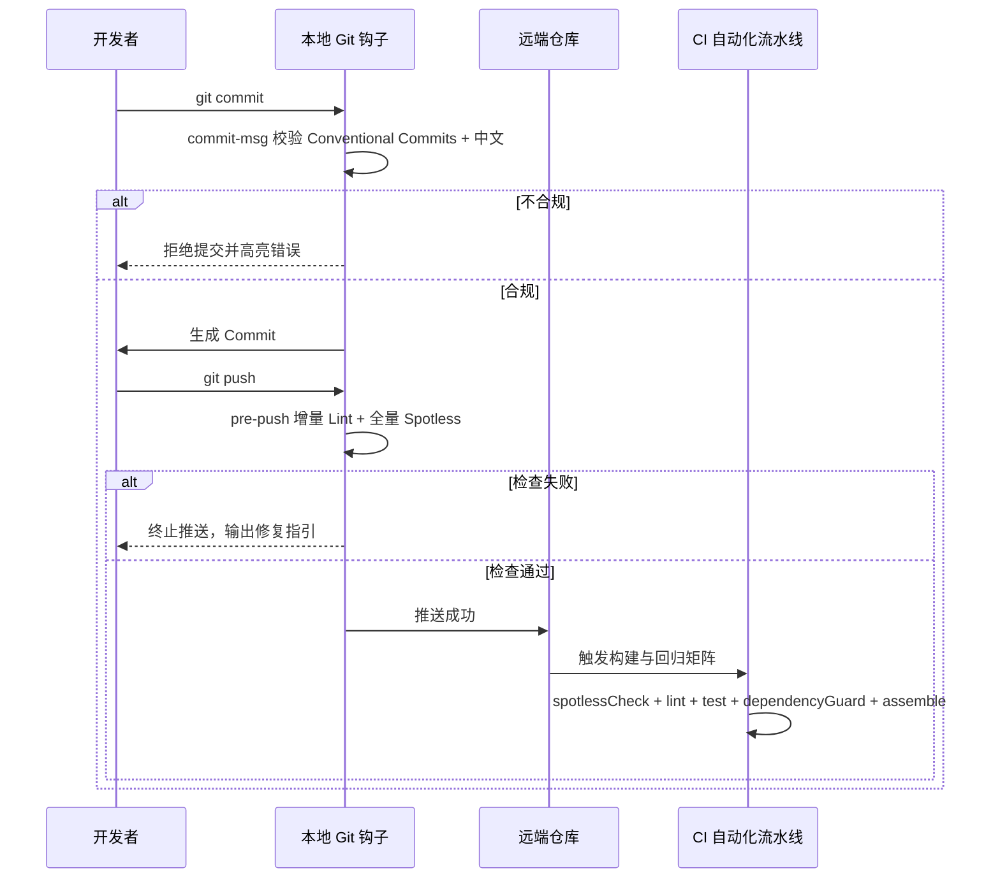

# 现代 Android 工程化实践（总览）

> 本文档系统梳理 Google 官方旗舰开源项目 [Now in Android (NiA)](https://github.com/android/nowinandroid) 的工程化底座，结合现代大型多模块 Android 研发演进，阐述**构建系统、代码规范、测试体系、架构解耦、性能度量与交付安全**六大维度的工程化设计与落地。
>
> **阅读指引**：本篇为**工程化总览**，承载全景图、成熟度矩阵与命令速查。各维度的完整实践已按主题拆分到分册与专题文档，入口见下表——按需跳读，无需通读。

## 工程化文档导航

| 维度 | 核心能力 | 详细文档 |
| :--- | :--- | :--- |
| **1. 构建系统与依赖治理** | Version Catalog / Convention Plugins / 极速构建 / 依赖守卫 / KMP 演进 | [工程化分册 · 构建系统与代码质量治理](engineering-build.md)、[build-logic.md](build-logic.md) |
| **2. 代码规范与静态治理** | Spotless / 自定义 Lint / Lint 基线 / Compose 稳定性 | [工程化分册 · 构建系统与代码质量治理](engineering-build.md)；项目规范见 [../01-rules/conventions.md](../01-rules/conventions.md)、[comments.md](../01-rules/comments.md)、[design.md](../01-rules/design.md) |
| **3. 现代测试体系** | Turbine + Fake / 测试命名 Lint / Roborazzi / GMD / JaCoCo | [testing.md](testing.md) |
| **4. 现代架构解耦与通信范式** | Offline-First / API-Impl / Navigation 3 / M3 Adaptive | [../03-architecture/engineering-patterns.md](../03-architecture/engineering-patterns.md)；模式选型见 [architecture.md](../03-architecture/architecture.md)、[modularization.md](../03-architecture/modularization.md) |
| **5. 性能度量与运行时监控** | Macrobenchmark / Baseline Profile / JankStats / Tracing | [../04-domains/performance.md](../04-domains/performance.md) |
| **6. 交付安全与门禁防御** | commit-msg / pre-push / Badging / CI | [git.md](../01-rules/git.md)、`tools/commit-msg`、`tools/pre-push`、`.github/workflows/`；要点见下文 |

---

## 现代 Android 工程化全景图

现代 Android 工程化的核心理念是：**确定性构建、增量加速、质量左移、全面可测试性与架构防腐解耦**。

```mermaid
flowchart TD
    subgraph Layer1["1. 构建系统与依赖治理 (Build & Dependency)"]
        B1["Version Catalog (TOML)\n14 类分层单一可信源"]
        B2["build-logic 复合构建\n正交 Convention Plugins 体系"]
        B3["类型安全项目访问器\nTYPESAFE_PROJECT_ACCESSORS"]
        B4["极速构建调优\nConfiguration Cache / Isolated Projects / 并行守护"]
        B5["现代 AGP 与 R 类优化\nbuiltInKotlin / newDsl / nonTransitiveRClass"]
        B6["依赖守卫与拓扑可视化\nDependency Guard / Graph / 空测试剔除"]
    end

    subgraph Layer2["2. 代码规范与静态代码治理 (Code Quality & Static Analysis)"]
        Q1["Spotless + ktlint\n全工程代码格式自动化治理"]
        Q2["自定义 Lint 规则体系\n测试命名 / 设计系统组件刚性拦截"]
        Q3["项目级 Lint 基线治理\nlint.xml / lint-baseline.xml / warningsAsErrors"]
        Q4["Compose 编译器稳定性\ncompose_compiler_config.conf / 稳定性指标监控"]
    end

    subgraph Layer3["3. 现代测试体系与质量基建 (Modern Testing Architecture)"]
        T1["支柱一: Turbine + Fake\n数据流断言，零 Mock 纯内存替身"]
        T2["支柱二: 测试命名 Lint\n被测对象_场景_预期结果 规范校验"]
        T3["支柱三: Roborazzi 截图测试\nJVM 原生图形渲染，无头像素级视觉回归"]
        T4["多设备规格与无障碍测试\nPhone/Foldable/Tablet 矩阵 + ATF 无障碍比对"]
        T5["自动化测试执行与效能\nGradle 托管设备 GMD / 禁用测试动画 / JaCoCo 覆盖率"]
        T6["共享测试基建\ncore:testing / MainDispatcherRule / TestDispatchersModule"]
    end

    subgraph Layer4["4. 现代架构解耦与通信范式 (Architecture & Decoupling)"]
        A1["离线优先 (Offline-First)\nRoom 响应式流 + SSOT 单一事实源"]
        A2["后台增量数据同步\nSynchronizer 契约 + SyncWorker 轮询调度"]
        A3["响应式网络状态监听\nNetworkMonitor 提供 isOnline 状态流"]
        A4["Navigation 3 声明式导航\n类型化 NavKey 与多返回栈 Multi-BackStack"]
        A5["Material 3 Adaptive 自适应布局\nListDetailPaneScaffold 大屏与折叠屏适配"]
        A6["API-Impl 契约隔离\n模块接口与实现物理隔离 + DI 自动装配"]
        A7["可插拔能力接口模式\nProd / Stub / NoOp 安全默认值兜底"]
    end

    subgraph Layer5["5. 性能基准与度量闭环 (Performance & Benchmarks)"]
        P1["Macrobenchmark + Baseline Profile\nAOT 预编译提速 30%+，帧耗时度量"]
        P2["JankStats 运行时掉帧采集\nPerformanceMetricsState UI 状态归因"]
        P3["AndroidX Tracing 深度追踪\n自定义 trace section 对齐 Perfetto 泳道"]
    end

    subgraph Layer6["6. 交付安全与门禁防御 (Defense Gate & CI/CD)"]
        G1["commit-msg 钩子\nConventional Commits 中文信息校验"]
        G2["pre-push 增量门禁\n推送前增量 Lint + 全量 Spotless"]
        G3["APK 产物基线与权限卫士\nBadging 任务自动化比对 APK 权限/体积"]
        G4["CI 流水线与依赖巡航\nGitHub Actions 矩阵自动化校验 / Renovate Bot"]
    end

    Layer1 --> Layer2 --> Layer3 --> Layer4 --> Layer5 --> Layer6
```



---

## 现代工程化全景成熟度矩阵

为了让开发者与维护者清晰掌握各项工程化能力的建设现状与后续演进方向，全仓能力遵循统一的成熟度标定规则：
* **`【已落地】`**：在当前工程代码库或构建逻辑中已有完整实现并正常生效运行；
* **`【部分落地】`**：核心机制或样板已建立，全仓铺开或自动化闭环正在推进中；
* **`【演进规划 - 待落地】`**：属于 Google 官方 NiA 标杆体系推荐、本工程已完成架构选型与规范设计，但尚未在代码库中完全物理落地的能力。

| 维度 | 能力项 | 技术栈 / 规范方案 | 落地成熟度 | 当前代码落点 / 演进规划说明 |
| :--- | :--- | :--- | :---: | :--- |
| **1. 构建系统与依赖治理** | Version Catalog 治理 | TOML 14 类分层单一真实源 | `【已落地】` | `gradle/libs.versions.toml` |
| | Convention Plugins 复合构建 | build-logic 约定优于配置 | `【已落地】` | `build-logic/convention/`（共 18 个插件文件） |
| | 类型安全项目访问器 | TYPESAFE_PROJECT_ACCESSORS | `【已落地】` | `settings.gradle.kts` |
| | 极速构建调优与项目隔离 | Configuration Cache + Parallel + BuiltIn Kotlin | `【已落地】` | `gradle.properties` |
| | 依赖拓扑可视化 | Mermaid 拓扑图生成任务 | `【已落地】` | `RootPlugin.kt`（`./gradlew generateModulesGraph`） |
| | 空测试模块任务剔除 | 检测 androidTest 源码自动关闭任务 | `【已落地】` | `AndroidInstrumentedTests.kt` |
| | 模块依赖漂移防护 | Dependency Guard 版本基线锁定 | `【部分落地】` | `app/dependencies/*.txt` 已生成，子模块全面接入与 CI 比对推进中 |
| | 纯领域模型 KMP 跨平台演进 | Kotlin Multiplatform 跨平台架构 | `【演进规划 - 待落地】` | `basic/basic_model` 为纯 JVM 库，规范已确立，规划升级为 KMP |
| **2. 代码规范与静态治理** | Spotless 格式自动化 | Spotless + ktlint + pre-push | `【已落地】` | `tools/pre-push` + `Spotless.kt` |
| | 自定义 Lint 测试命名拦截 | TestNamingDetector（UAST 分析） | `【已落地】` | `lint/src/main/kotlin/.../TestNamingDetector.kt` |
| | 自定义 Lint 设计系统拦截 | DesignSystemDetector（硬编码拦截） | `【已落地】` | `lint/src/main/kotlin/.../DesignSystemDetector.kt` |
| | 项目级 Lint 基线与边界治理 | checkDependencies = false 物理隔离混编 | `【已落地】` | `AndroidLintConventionPlugin.kt` + `lint-baseline.xml` |
| | Compose 编译器稳定性监控 | Strong Skipping + Metrics / Reports | `【已落地】` | `compose_compiler_config.conf` + `AndroidCompose.kt` |
| | NiA 进阶 Lint 规则矩阵 | 生命周期安全消费 / 现代时间 API / ViewModel 作用域 | `【演进规划 - 待落地】` | 拦截规则已设计，待在 `lint` 模块拓展实现 |
| **3. 现代测试体系** | Turbine 响应式数据流单测 | Turbine + 手写 Fake 内存替身 | `【已落地】` | `modules/module_reactive`（样板） |
| | 测试命名 Lint 机器校验 | 编译期命名 AST 机械校验 | `【已落地】` | `lint` 模块（注入全局 Android 模块） |
| | Roborazzi 像素级截图测试 | JVM Robolectric 原生图形无头渲染 | `【已落地】` | `modules/module_compose`（样板） |
| | ATF 自动化无障碍合规检查 | Accessibility Testing Framework 联动 | `【演进规划 - 待落地】` | 规范已确立，全工程截图用例全量集成推进中 |
| | 共享测试替身基础设施 | basic:basic_testing（Fake / Dispatchers） | `【演进规划 - 待落地】` | 现有替身分散于各模块，规划建立全局测试基建模块 |
| | Gradle 托管设备 (GMD) | pixel6api31aosp 纯净自动化插桩 | `【演进规划 - 待落地】` | 配置已声明，CI 自动化镜像流水线推进中 |
| | JaCoCo 代码覆盖率统一配置 | Convention 插件排除生成类与 BuildConfig | `【已落地】` | `build-logic` 覆盖率插件 |
| **4. 架构解耦与通信范式** | 离线优先与 SSOT 单一数据源 | Room 响应式流驱动 UI + 乐观更新 | `【已落地】` | `basic/basic_repo` + `modules/module_arch:ssot` |
| | 后台增量数据同步机制 | Synchronizer 契约 + SyncWorker 调度 | `【已落地】` | `basic/basic_sync`（WorkManager） |
| | 响应式网络状态监听 | NetworkMonitor 暴露 isOnline Flow | `【已落地】` | `basic/basic_lib/.../NetworkMonitor.kt` |
| | 响应式系统时区监听 | TimeZoneMonitor 广播监听与自动推流 | `【演进规划 - 待落地】` | 规范已制定，为全球化与离线时间戳自愈准备 |
| | 模块化 API-Impl 契约隔离 | 接口与实现物理双模块 + DI 自动装配 | `【演进规划 - 待落地】` | 架构已设计，规划提供 API/Impl 对应 Convention 插件 |
| | Navigation 3 声明式导航 | 类型安全 NavKey + 多返回栈保存 | `【部分落地】` | `module_compose` 已有 Nav3Activity，类型化拓扑深化中 |
| | Material 3 Adaptive 自适应 | NavigationSuiteScaffold + 双栏联动 | `【部分落地】` | `AdaptiveActivity` 已有基础，自适应脚手架推进中 |
| | 可插拔能力接口模式 | Prod / Stub / NoOp 安全默认值兜底 | `【已落地】` | `basic/basic_lib` |
| **5. 性能度量与运行时监控** | Macrobenchmark 冷启动与滑动压测 | 测量 StartupTiming / FrameTiming | `【已落地】` | `benchmarks` 模块 |
| | Baseline Profile 基线配置文件 | AOT 预编译提速 30%+ | `【已落地】` | `benchmarks` 模块生成并嵌入产物 |
| | JankStats 运行时掉帧归因 | PerformanceMetricsState 注入上下文状态 | `【已落地】` | `modules/module_performance` / `module_compose` |
| | TrackDisposableJank 统一封装 | Composable 声明式掉帧追踪容器 | `【演进规划 - 待落地】` | 规范已制定，规划下沉至 Compose 基础组件库 |
| | AndroidX Tracing 深度追踪 | trace section 联动 Perfetto 业务泳道 | `【已落地】` | `modules/module_performance` |
| **6. 交付安全与门禁防御** | Git commit-msg 校验 | Conventional Commits + 中文强制拦截 | `【已落地】` | `tools/commit-msg` + 安装脚本 |
| | Git pre-push 增量门禁 | 增量 Lint + 全量 Spotless 极速拦截 | `【已落地】` | `tools/pre-push` |
| | Badging 权限与组件基线卫士 | AAPT2 dump 元数据 diff 比对 | `【演进规划 - 待落地】` | 规范已设计，全自动化构建任务与基线推进中 |
| | CI 自动化矩阵 | GitHub Actions 自动化并发校验 | `【已落地】` | `.github/workflows/` |

---

## 交付安全与门禁要点（Shift-Left）

工程化规范的最终落地必须依托不可绕过的门禁。遵循**质量左移（Shift-Left）**原则：能由本地发现的绝不留到 CI，能由 CI 拦截的绝不带到线上。



* **commit-msg / pre-push 钩子**：格式规则、安装方式与跳过通道（`--no-verify` / `COMMIT_MSG_DISABLE=1` / `PRE_PUSH_DISABLE=1`）详见 [git.md](../01-rules/git.md)。
* **pre-push 增量算法**：全量 `spotlessCheck` → `git diff` 计算受影响模块 → 精准执行 `:<module>:lintProdDebug`（纯 JVM 模块执行 `:<module>:lint`，自定义规则模块 `:lint` 自身豁免），10~20 秒内完成本地门禁。
* **APK 产物基线与权限卫士（Badging）`【演进规划 - 待落地】`**：规划注册 `checkBadging` 任务，通过 AAPT2 dump APK 的 `badging`（`permissions`、`features`、`exported` 组件等）与入库基线（如 `app/badging/release.txt`）比对，依赖一旦隐式引入危险权限（如 `READ_EXTERNAL_STORAGE`、`ACCESS_FINE_LOCATION`）即拦截并输出 diff。
* **CI 并行矩阵 `【已落地】`**：`.github/workflows/build.yml` 拆为五条并行 Job —— `spotlessCheck`、`lintProdDebug`、`testProdDebugUnitTest`、`dependencyGuard`、`assembleProdDebug + assembleProdRelease`（APK 产物归档）；统一经 `gradle/actions/setup-gradle` 复用 Gradle User Home 缓存，并配置 `concurrency` 取消同分支的过期运行。**拆 Job 的收益以缓存为前提**——缺少缓存时各 Job 冷启动会拉长总时长。`verifyRoborazziProdDebug` 与 `checkBadging` 仍属演进规划：前者需先在 CI 环境重新生成截图基准（基准图与运行环境的字体、渲染相关），后者需先引入 badging 插件。

---

## 常用工程化命令速查字典

### 1. 代码格式化与规范
```bash
# 全工程代码格式检查（ktlint）
./gradlew spotlessCheck

# 全工程代码格式自动修复
./gradlew spotlessApply

# 校验 Git 提交日志规范
./tools/commit-msg .git/COMMIT_EDITMSG
```

### 2. 静态代码分析（Lint）
```bash
# 执行特定模块的 Lint 检查
./gradlew :basic:basic_lib:lintProdDebug

# 执行全工程 Lint 检查
./gradlew lintProdDebug

# 测试自定义 Lint 规则自身
./gradlew :lint:test
```

### 3. 单元测试与截图测试
```bash
# 运行单个模块的响应式单测（Turbine）
./gradlew :modules:module_reactive:testDemoDebugUnitTest

# 录制 Compose 截图基准图
./gradlew :modules:module_compose:recordRoborazziDemoDebug

# 校验 Compose 截图视觉回归
./gradlew :modules:module_compose:verifyRoborazziDemoDebug
```

### 4. 托管设备、基准性能与产物比对
```bash
# 生成多模块依赖拓扑 Mermaid 关系图
./gradlew generateModulesGraph

# 生成 Baseline Profile 基准文件（需连接设备）
./gradlew :benchmarks:generateBaselineProfile

# 运行冷启动与流畅度 Macrobenchmark 测试
./gradlew :benchmarks:connectedCheck

# 通过 Gradle 托管设备自动跑插桩测试（无需手工启动模拟器）
./gradlew pixel6api31aospDebugAndroidTest

# 校验 APK 权限与产物 Badging 基线
./gradlew checkBadging
```
