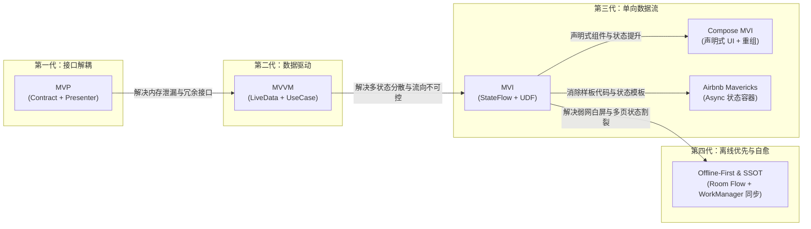
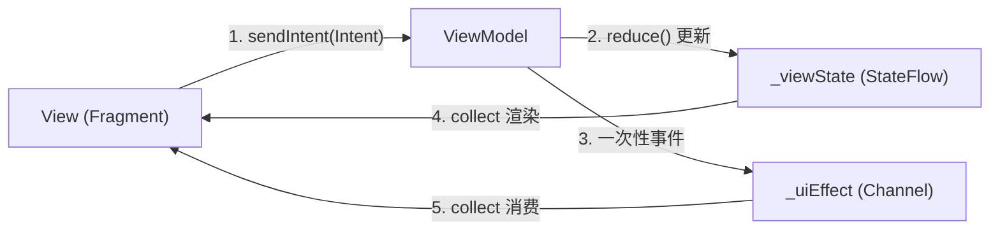
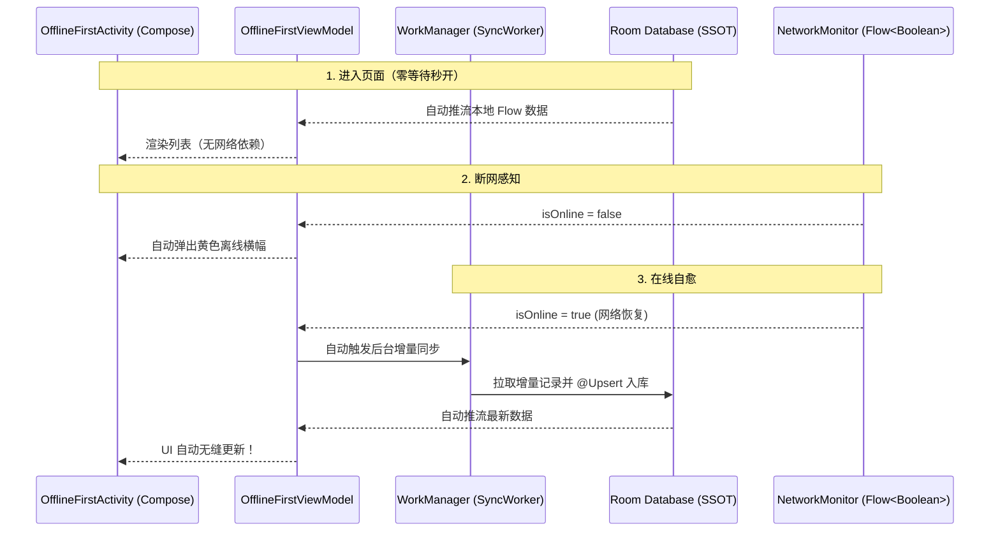
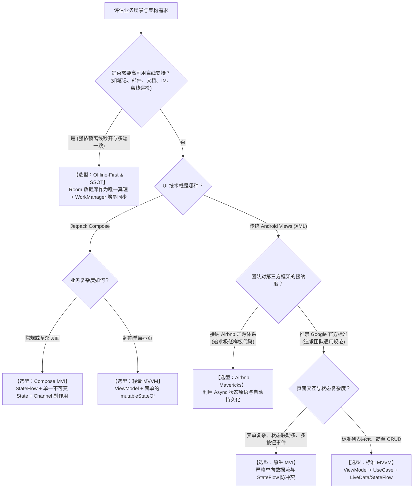

# 架构模式演进与选型指南（MVP / MVVM / MVI / Compose MVI / Mavericks / Offline-First）

本文档系统梳理 Android 移动端应用架构的演进脉络，全面解析 `modules/module_arch` 中落地的 6 种主流架构范式：**MVP**、**MVVM**、**MVI**、**Compose MVI**、**Airbnb Mavericks** 与 **Offline-First & SSOT（离线优先单一数据源）**。从核心原理、数据流向、状态容器、生命周期安全到实战代码切片进行纵向对比，并提供生产环境下的技术选型决策树。

---

## 一、架构演进全景与核心原理对比

### 1. 架构演进路线图



### 2. 六大架构横向对比矩阵

| 维度 | MVP | MVVM | MVI | Compose MVI | Airbnb Mavericks | Offline-First & SSOT |
| :--- | :--- | :--- | :--- | :--- | :--- | :--- |
| **数据流动** | 双向通信（P 调 V，V 调 P） | 双向/单向混合（观察者驱动） | **严格单向（UDF）** | **严格单向（UDF）** | **严格单向（UDF）** | **全局单向（数据库环形流）** |
| **真实数据源 (SSOT)** | Presenter 临时变量 | ViewModel 中的各 `LiveData` | ViewModel 的单一 `ViewState` | ViewModel 的单一 `ComposeState` | ViewModel 的 `MavericksState` | **本地数据库 (Room)** |
| **状态持有与表示** | 分散在 View 与 Presenter | 多个离散的 `LiveData<T>` | 单一不可变 `data class` | 单一不可变 `data class` | 单一不可变且包含 `Async<T>` | 数据库持久化实体 + `UiState` |
| **UI 交互机制** | 接口回调（`showLoading` 等） | `observe()` 局部更新 View | `collect()` 监听状态刷新 | `collectAsState()` 局部重组 | `withState()` / 订阅推流 | `collectAsState()` 局部重组 |
| **一次性副作用 (Effect)** | Presenter 直接调 View 接口 | `SingleLiveEvent` / 共享 Flow | 独立 `Channel<UiEffect>` 缓冲流 | 独立 `Channel<UiEffect>` 缓冲流 | 状态内置标志位或独立通知 | 独立 `Channel<UiEffect>` 缓冲流 |
| **离线可用性** | 弱（通常直接报错） | 弱（除非手动读本地缓存） | 弱（除非手动读本地缓存） | 弱（除非手动读本地缓存） | 中等（内置序列化持久化） | **极高（秒开、断网可用、自动增量同步）** |
| **生命周期安全性** | 差（需手动 `attach`/`detach`） | 优（`LiveData` 自动解绑） | 优（结合 `repeatOnLifecycle`）| 优（Compose 生命周期协同） | 优（框架托管生命周期） | 优（结合 `repeatOnLifecycle`） |
| **样板代码量** | 高（接口、实现类双倍代码） | 中等 | 较高（Intent/State/Effect） | 中等（无 ViewBinding 胶水层） | **极低（自动封装 Loading/Success）** | 中高（需维护数据库与同步器） |
| **单元测试成本** | 需大量 Mock View 接口 | 需测试各 `LiveData` 变化 | 仅测 `Intent -> ViewState` 输入输出 | 仅测 `Intent -> ViewState` 输入输出 | 仅测 State 转移与 `Async` 状态 | 可利用手写替身测试端到端同步链路 |

---

## 二、六大架构落地剖析（基于 `module_arch`）

### 2.1 MVP（Model-View-Presenter 契约架构）

- **模块源码位置**：[`com.example.william.my.module.arch.mvp`](file:///e:/StudioProjects/MyApplication/modules/module_arch/src/main/java/com/example/william/my/module/arch/mvp)
- **核心组件**：
  - `ArticleContract`：统一契约接口，内聚定义 `View` 与 `Presenter` 职责；
  - `ArticlePresenter`：业务调度核心，持有 View 弱引用并协调 Model；
  - `MvpFragment` / `MvpActivity`：被动视图（Passive View），实现 `Contract.View`。

#### 核心代码切片：契约定义与交互
```kotlin
// 契约清晰：一目了然看懂页面全部交互与展示能力
interface ArticleContract {
    interface View : IBaseView {
        fun onArticleSuccess(data: MutableList<ArticleDetailData>)
        fun onArticleFailed(message: String)
    }
    interface Presenter : IBasePresenter<View> {
        fun getArticle(page: Int)
    }
}
```

#### 优缺点与演进动力
- **优势**：彻底剥离 Activity 中的业务逻辑，各层职责边界清晰，易于对 Presenter 进行纯 Java/Kotlin 单元测试。
- **痛点**：
  1. **接口爆炸**：每个页面都需要编写大量的 Contract 接口与实现类；
  2. **内存泄漏隐患**：Presenter 必须在 `onDestroy` 时严谨执行 `detachView()`，稍有不慎即导致 Activity 泄漏；
  3. **非响应式**：属于命令式调用，缺乏现代响应式数据流。

---

### 2.2 MVVM（Model-View-ViewModel 数据驱动架构）

- **模块源码位置**：[`com.example.william.my.module.arch.mvvm`](file:///e:/StudioProjects/MyApplication/modules/module_arch/src/main/java/com/example/william/my/module/arch/mvvm)
- **核心组件**：
  - `ArticleUseCase`：领域层（Domain Layer）业务用例，复用业务规则；
  - `ArticleLiveDataViewModel`：状态持有者，暴露不可变 `LiveData`；
  - `MvvmFragment` / `MvvmActivity`：通过 `observe(viewLifecycleOwner)` 响应数据变更。

#### 核心代码切片：UseCase 封装与 LiveData 观察
```kotlin
// ViewModel 仅持有 LiveData，生命周期感知防泄漏
class ArticleLiveDataViewModel : BaseViewModel() {
    private val useCase = ArticleUseCase()
    private val _articleData = MutableLiveData<Resource<MutableList<ArticleDetailData>>>()
    val articleData: LiveData<Resource<MutableList<ArticleDetailData>>> = _articleData

    fun getArticle(page: Int) {
        viewModelScope.launch {
            _articleData.value = Resource.Loading()
            try {
                val result = useCase.execute(page)
                _articleData.value = Resource.Success(result)
            } catch (e: Exception) {
                _articleData.value = Resource.Error(e.message ?: "Unknown Error")
            }
        }
    }
}
```

#### 优缺点与演进动力
- **优势**：借助 Jetpack `ViewModel` 跨越配置变更（屏幕旋转）保留数据；`LiveData` 自带生命周期感知，彻底解决 MVP 的内存泄漏与空指针痛点。
- **痛点**：
  1. **状态分散**：页面复杂时，存在 10+ 个 `LiveData`（如 `loadingData`、`userData`、`errorData`），不同状态的更新顺序难以保证原子性；
  2. **非唯一真实源**：缺乏统一的不可变 State 约束，容易出现“既在加载中、又显示错误、还残留旧数据”的脏状态冲突。

---

### 2.3 MVI（Model-View-Intent 单向数据流架构）

- **模块源码位置**：[`com.example.william.my.module.arch.mvi`](file:///e:/StudioProjects/MyApplication/modules/module_arch/src/main/java/com/example/william/my/module/arch/mvi)
- **核心组件**：
  - `ArticleIntent`：密封接口，显式代表用户的每一次操作或系统事件；
  - `ArticleViewState`：单一不可变状态数据类，页面的唯一真实数据源；
  - `ArticleUiEffect`：一次性副作用（如弹 Toast、路由跳转、弹窗提示）；
  - `ArticleStateFlowViewModel`：Intent 处理器与状态生产机；
  - `MviFragment` / `MviActivity`：UI 发送 Intent，并收集 State 与 Effect。

#### 核心代码切片：单向循环流与副作用隔离


```kotlin
// 单一聚合状态：杜绝状态矛盾
data class ArticleViewState(
    val isLoading: Boolean = false,
    val data: List<ArticleDetailData>? = null,
    val error: String? = null
)

// 响应式 UDF 驱动
class ArticleStateFlowViewModel : BaseViewModel() {
    private val _viewState = MutableStateFlow(ArticleViewState())
    val viewState: StateFlow<ArticleViewState> = _viewState.asStateFlow()

    private val _uiEffect = Channel<ArticleUiEffect>(Channel.BUFFERED)
    val uiEffect: Flow<ArticleUiEffect> = _uiEffect.receiveAsFlow()

    fun sendIntent(intent: ArticleIntent) {
        when (intent) {
            is ArticleIntent.GetArticle -> loadArticles(intent.page)
        }
    }
}
```

#### 优缺点与演进动力
- **优势**：
  1. **状态一致性**：单一 `ViewState` 确保任何时刻界面的状态唯一确定，支持状态重放与时光旅行（Time-travel Debugging）；
  2. **严格单向流（UDF）**：数据只向一个方向流动，排查 Bug 时只需比对 Intent 与输出 State。
- **痛点**：样板代码较多（需定义 Intent、State、Effect），每次属性修改都需执行 `copy()`。

---

### 2.4 Compose MVI（声明式 UI 与 MVI 结合）

- **模块源码位置**：[`com.example.william.my.module.arch.compose`](file:///e:/StudioProjects/MyApplication/modules/module_arch/src/main/java/com/example/william/my/module/arch/compose)
- **核心组件**：
  - `ArticleComposeState` / `ArticleComposeIntent` / `ArticleComposeUiEffect`；
  - `ComposeMviActivity`：使用 Jetpack Compose 构建纯声明式视图，集成 SmartSwipeRefresh 下拉刷新组件。

#### 核心代码切片：状态提升与声明式局部重组
```kotlin
@Composable
fun ArticleScreen(
    state: ArticleComposeState,
    onIntent: (ArticleComposeIntent) -> Unit
) {
    Scaffold(...) { innerPadding ->
        SmartSwipeRefresh(
            isRefreshing = state.isRefreshing,
            onRefresh = { onIntent(ArticleComposeIntent.Refresh) }
        ) {
            LazyColumn {
                items(state.articleList, key = { it.id }) { article ->
                    ArticleItem(article) // Compose 按 Key 差量智能重组
                }
            }
        }
    }
}
```

#### 优缺点与演进动力
- **优势**：
  1. **天生绝配**：Compose 的声明式模型就是 `f(State) = UI`，与 MVI 的单一 State 契合度达到 100%；
  2. **消除 ViewBinding 胶水层**：无需再编写 `findViewById` 或 ViewBinding 赋值代码，Compose 运行时根据状态变化自动完成局部微重组。
- **注意事项**：需确保 State 对象的不可变性，并在 Composable 中合理拆分状态参数，避免大范围不必要重组。

---

### 2.5 Airbnb Mavericks（现代化轻量级 MVI）

- **模块源码位置**：[`com.example.william.my.module.arch.mavericks`](file:///e:/StudioProjects/MyApplication/modules/module_arch/src/main/java/com/example/william/my/module/arch/mavericks)
- **核心组件**：
  - `ArticleMavericksState`：实现 `MavericksState`；
  - `ArticleMavericksViewModel`：继承 `MavericksViewModel`；
  - `ArticleMavericksFragment`：通过 `fragmentViewModel()` 托管并复写 `invalidate()`。

#### 核心杀手锏：`Async<T>` 原语
Mavericks 将网络或异步操作的标准四态封装为第一公民类型 `Async<T>`（`Uninitialized`、`Loading`、`Success`、`Fail`），彻底消除了手写 `isLoading`、`isError`、`errorMsg` 的繁琐样板：

```kotlin
data class ArticleMavericksState(
    val articleList: Async<MutableList<ArticleDetailData>> = Uninitialized
) : MavericksState

class ArticleMavericksViewModel(
    initialState: ArticleMavericksState,
    private val repository: ArticleMavericksRepository
) : MavericksViewModel<ArticleMavericksState>(initialState) {

    fun getArticle(page: Int) {
        // suspend 代码直接 execute，自动经历 Loading -> Success/Fail 转换！
        suspend { repository.getArticle(page) }
            .execute { copy(articleList = it) }
    }
}
```

#### View 层响应：`withState` 安全读取
```kotlin
override fun invalidate() = withState(viewModel) { state ->
    when (state.articleList) {
        is Uninitialized -> { /* 初始状态 */ }
        is Loading -> showLoading()
        is Success -> showData(state.articleList())
        is Fail -> showError(state.articleList.error.message)
    }
}
```

#### 优缺点与适用场景
- **优势**：代码极度精炼，消除了原生 MVI 80% 的状态流转胶水代码；内置状态持久化与协程生命周期自动取消。
- **劣势**：属于三方深度侵入框架，有一定学习门槛。

---

### 2.6 Offline-First & SSOT（离线优先与单一真实数据源架构）

- **模块源码位置**：[`com.example.william.my.module.arch.ssot`](file:///e:/StudioProjects/MyApplication/modules/module_arch/src/main/java/com/example/william/my/module/arch/ssot)
- **基础支撑层（完全对齐 Google Now in Android 标准数据层解耦）**：
  - `basic/basic_lib`: `NetworkMonitor`（响应式网络感知）
  - `basic/basic_model`: 纯领域模型层（`ArticleDetailData` 领域实体、`ChangeListVersions` 增量游标模型，零 Android 依赖）
  - `basic/basic_datastore`: 键值与偏好存储（`SyncPreferencesDataSource` 基于 Tencent MMKV 高性能 mmap 持久化游标，并通过 `StateFlow` 暴露响应式流）
  - `basic/basic_database`: 本地持久化数据库（`ArticleEntity` Room 实体、`ArticleDao`、`ArticleDatabase`、`ArticleLocalDataSource`）
  - `basic/basic_network`: 远程网络数据通信（`ArticleApi` / `ArticleRxApi`、`NetworkChangeList`、`ArticleRemoteDataSource`）
  - `basic/basic_repo`: 纯数据仓库（`ArticleRepository` 聚合门面、`Synchronizer` / `Syncable` 契约、`ServiceLocator` 装配中心）
  - `basic/basic_sync`: 增量同步调度模块（`SyncWorker` WorkManager 任务调度、`WorkManagerSyncManager`、`Sync` 门面）
- **核心架构理念**：
  1. **SSOT（唯一真理在本地）**：UI 永远只读 Room 数据库推出来的 `Flow<List<Article>>`，绝不直接碰网络接口返回的原始 DTO；
  2. **Write-Only Sync（网络写同步）**：网络拉取的数据只做一件事——写入 Room 数据库，由 Room 的 `InvalidationTracker` 自动触发 UI 更新；
  3. **增量游标（ChangeList）**：基于 MMKV 保存版本号（如 `v1`、`v2`），每次向服务端请求增量数据，实现后台幂等同步；
  4. **在线自愈（Auto-Recovery）**：感知到断网重连后，无需用户下拉刷新，系统自动在后台调度增量同步。

#### 核心数据流动图解



#### 优缺点与适用场景
- **优势**：全场景高可用，秒开无白屏；即便断网用户仍可离线阅读与操作；彻底解决各页面间数据不同步的问题。
- **成本**：必须具备本地持久化（Room/SQLDelight）设施，且需要后端提供基于版本游标的增量拉取接口契约。

---

## 三、架构技术选型决策树

在面对实际生产项目或不同业务模块时，应根据业务特性、团队能力与界面复杂度进行务实选型：



---

## 四、最佳实践与生产避坑指南

### 1. 状态设计准则：单一 State vs 副作用 Effect
- **持久状态进 `ViewState`**：列表数据、加载状态、错误文本等与界面渲染紧密绑定的属性，属于不可变 `data class ViewState`；
- **一次性事件走 `Channel`**：弹 Toast、页面跳转、关闭弹窗等**仅消费一次**的动作，**绝对不能放入 ViewState**（否则页面重组或配置旋转时会导致 Toast 重复弹出），必须走 `Channel<UiEffect>` 缓冲区，并在 View 层收集。

### 2. 协程收集安全：必须结合 `repeatOnLifecycle`
在 Fragment / Activity 中收集 Flow 状态时，严禁直接使用 `lifecycleScope.launch`：
```kotlin
// ❌ 错误：应用切后台后依然持续收集，浪费 CPU 并可能引发后台空指针/Crash
lifecycleScope.launch {
    viewModel.viewState.collect { ... }
}

// ✅ 正确：当 Lifecycle 处于 STARTED 时收集，STOPPED 时自动取消挂起，RESUMED 时重新启动
viewLifecycleOwner.lifecycleScope.launch {
    viewLifecycleOwner.repeatOnLifecycle(Lifecycle.State.STARTED) {
        viewModel.viewState.collect { ... }
    }
}
```

### 3. 离线优先中的数据一致性：必须使用 `@Upsert`
在离线增量同步过程中，服务端拉回来的数据可能包含**新增**与**修改**的混合记录。本地数据库的 DAO 操作必须使用 Room 的 `@Upsert` 注解，保障主键冲突时自动走更新流程，确保增量写入的**幂等性**。
