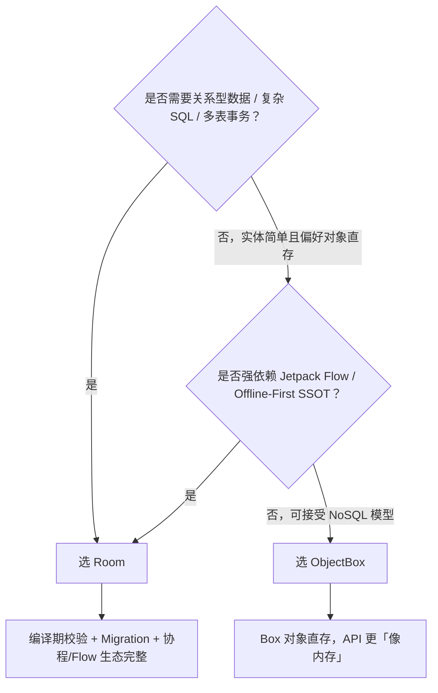

# 本地数据库方案对比（GreenDAO / ObjectBox / Room）

本文档对比 Android 端三套常见本地数据库持久化方案：**GreenDAO**、**ObjectBox** 与 **Room**。从底层存储模型、对象映射方式、响应式能力、事务与迁移、工程接入成本到本仓选型结论进行梳理，并映射到 `modules/module_database` 与相关架构落地。

---

## 一、核心结论速览

| 结论 | 说明 |
| :--- | :--- |
| **关系型 + 现代 Android 首选 Room** | Jetpack 官方 SQLite ORM；编译期 SQL 校验、Migration、协程/Flow/Rx 原生集成，适合多实体、关系查询与 Offline-First SSOT |
| **对象直存 / 高吞吐写场景看 ObjectBox** | 非 SQLite 的嵌入式对象数据库；`Box<T>` 直接 put/get/query，适合简单实体 CRUD 与对写入路径敏感的场景 |
| **GreenDAO 为经典 SQLite ORM** | greenrobot 系生态，注解实体 + 生成 DAO；本仓**不承接示例页**，仅在 Version Catalog 与 Convention Plugin 中保留可挪用配置模板 |
| **本仓演示矩阵** | `module_database` 仅保留 **Room ↔ ObjectBox 平行轴**；多实体 SSOT、离线同步等架构演示统一采用 Room |

---

## 二、核心原理与机制对比

```mermaid
flowchart TD
    subgraph GD["1. GreenDAO (SQLite ORM)"]
        G1["@Entity 注解实体"] --> G2["Gradle 插件生成 DaoSession / DAO"]
        G2 --> G3["QueryBuilder 组装查询"]
        G3 --> G4["底层 SQLite 读写"]
    end

    subgraph RoomN["2. Room (Jetpack SQLite ORM)"]
        R1["@Entity / @Dao / @Database"] --> R2["KSP/Kapt 生成 DAO 实现与 Schema 校验"]
        R2 --> R3["Flow / Rx / 协程 返回类型"]
        R3 --> R4["SQLite + InvalidationTracker 表变更驱动 UI"]
    end

    subgraph OB["3. ObjectBox (NoSQL 对象库)"]
        O1["@Entity 实体 + 注解处理器"] --> O2["生成 Box 与 ObjectBox 元数据"]
        O2 --> O3["Box.put / get / Query 对象直存"]
        O3 --> O4["自研引擎（非 SQLite）+ LiveData/订阅"]
    end
```



| 维度 | GreenDAO | Room | ObjectBox |
| :--- | :--- | :--- | :--- |
| **底层存储** | SQLite | SQLite | 自研嵌入式 NoSQL（非 SQLite） |
| **产品定位** | 经典 Android SQLite ORM | Jetpack 官方关系型持久层 | 嵌入式对象 / 文档型数据库 |
| **访问模型** | 实体 + 生成 DAO，偏 QueryBuilder/SQL | `@Dao` 显式 SQL/注解，类型安全 | `Box<T>` 对象 put/get/query |
| **维护状态（本仓视角）** | 配置模板保留，代码路径未启用 | 主力持久层与架构演示载体 | 平行演示轴，可独立选型 |

---

## 三、特性多维对比矩阵

| 评估维度 | GreenDAO | Room | ObjectBox |
| :--- | :--- | :--- | :--- |
| **编译期校验** | 生成代码阶段校验实体/DAO 映射 | ✅ **强**：`@Query` SQL 与实体列映射编译失败即暴露 | ✅ 实体元数据由注解处理器生成 |
| **关系型查询** | ✅ 支持（Join / QueryBuilder） | ✅ **强**（手写 SQL、`@Relation`、多表事务） | ⚠️ 弱关系：以对象图/链接为主，复杂 SQL 语义不同 |
| **Schema 迁移** | 有版本与迁移机制，工程上偏手工 | ✅ **Migration + schema 导出**，可测可审 | 演进模型不同，无 SQL Migration 概念 |
| **响应式观察** | 弱，通常需自行封装 Rx/LiveData | ✅ DAO 返回 `Flow`，表变更自动重发；支持 Rx | ✅ `ObjectBoxLiveData` / `Query.subscribe` |
| **协程 / Rx 集成** | 需业务层自行桥接 | ✅ 官方 `room-ktx` / `room-rxjava3` | 有 Rx/LiveData 桥接，协程侧多自行封装 |
| **写入与批量** | 支持批量 insert/事务 | ✅ DAO 事务批量，失败整体回滚 | ✅ `Box.put(List)` 底层事务 |
| **更新语义** | update 主键实体或 SQL | `@Update` / `@Upsert`（增量同步幂等常用） | **同 id `put` 即 upsert**，无独立 UPDATE SQL |
| **主线程约束** | 默认可主线程（易埋 ANR 隐患） | ❌ 默认禁止主线程查询（调试可 `allowMainThreadQueries`） | ❌ Box 操作应在非主线程 |
| **进程级生命周期** | DaoSession 管理 | Database 单例 | **BoxStore 进程级单例**，页面只 `boxFor` 不关 Store |
| **构建接入** | GreenDAO Gradle 插件 + 代码生成目录 | AndroidX + KSP/Kapt + Convention Plugin | ObjectBox Gradle 插件（字节码/元数据生成） |
| **本仓推荐场景** | 仅其他项目参考接入模板 | 多实体 / 关系 / 列表 SSOT / Offline-First | 对象直存对照、简单实体高速 CRUD 演示 |

---

## 四、API 与语法对照（对齐本仓平行示例轴）

本仓 `module_database` 将 Room 与 ObjectBox 做成**同一能力轴的平行实现**（插入 / 批量 / 更新 / 查询 / 观察 / 清理），便于对照记忆 API 形态。

| 能力轴 | Room（`RoomActivity` + DAO） | ObjectBox（`ObjectBoxActivity` + `Box`） | GreenDAO（本仓无示例页，形态说明） |
| :--- | :--- | :--- | :--- |
| **初始化** | `@Database` + `Room.databaseBuilder` 获取 DAO | Application 级 `ObjectBox.init`，`boxStore.boxFor(T)` | GreenDao DevOpenHelper / 自定义 Helper + DaoSession |
| **插入单条** | DAO `@Insert` | `box.put(entity)` | `dao.insert(entity)` |
| **批量插入** | DAO 事务方法（如 `insertAll`） | `box.put(list)` | `dao.insertInTx(list)` |
| **更新** | DAO `@Update` / `@Upsert` | 同 id `put`（upsert） | `dao.update(entity)` |
| **查询** | `@Query`（按 id / 全表） | `box.all` / `Query` 条件链 | `QueryBuilder` / `loadAll` |
| **响应式观察** | DAO 返回 `Flow`，表变更自动重发 | `ObjectBoxLiveData(query).observe(...)` | 多需自建 Rx/LiveData 封装 |
| **清空** | `@Query("DELETE FROM ...")` / DAO 删除 | `box.removeAll()` | `dao.deleteAll()` |
| **官方参考** | [Room 指南](https://developer.android.com/training/data-storage/room) | [objectbox-java](https://github.com/objectbox/objectbox-java) | [greenDAO](https://github.com/greenrobot/greenDAO) |

### 本仓示例页类头中的机制要点（摘要）

- **Room**：编译期校验 SQL 与实体映射；schema 变更递增 version 并提供 Migration；默认禁止主线程查询；Flow 表变更自动重发；批量写入在 DAO 事务内完成。
- **ObjectBox**：实体经注解处理器生成 Box，put/get 直接操作对象；BoxStore 为进程级单例；`put(List)` 批量事务；`put` 同 id 等价 upsert；响应式走 ObjectBoxLiveData / Query 订阅。

---

## 五、选型决策



| 场景特点 | 推荐方案 | 理由 |
| :--- | :--- | :--- |
| **多实体、关系、列表 SSOT、离线同步** | 🌟 **Room** | 类型安全 DAO、事务、`InvalidationTracker` 驱动 Flow，与 NiA 式 Offline-First 契合 |
| **Compose / 协程优先的现代 Android 工程** | 🌟 **Room** | `room-ktx`、`@Upsert`、Paging 协同成熟 |
| **简单实体 CRUD、希望少写 SQL** | **ObjectBox** | 对象模型直观，put/query 路径短 |
| **写入路径敏感的对象存储对照实验** | **ObjectBox**（与 Room 平行评测） | 非 SQLite 引擎，性能特征与 SQLite ORM 不同 |
| **存量 greenrobot / 老项目续接** | **GreenDAO（仅存量）** | 生态与代码生成链路成熟；新工程不建议作为默认选型 |
| **本仓新能力沉淀** | **Room 为主，ObjectBox 为平行对照** | 与现有 `module_database` 矩阵、SSOT 架构页一致 |

---

## 六、本工程落地与代码索引

### 1. 演示模块（`modules/module_database`）

```
modules/module_database/
├── DatabaseMainActivity.kt              # 模块入口（Room / ObjectBox 导航）
├── room/
│   ├── activity/RoomActivity.kt         # Room 平行轴示例
│   └── data/                            # OAuth 实体 / DAO / Database
└── objectbox/
    ├── activity/ObjectBoxActivity.kt    # ObjectBox 平行轴示例
    └── data/                            # ObjectBox 初始化与 ObjectBoxNote 实体
```

- **Room 示例**：[`RoomActivity.kt`](../../modules/module_database/src/main/java/com/example/william/my/module/database/room/activity/RoomActivity.kt)（路由 `RouterPath.Database.Room`）
- **ObjectBox 示例**：[`ObjectBoxActivity.kt`](../../modules/module_database/src/main/java/com/example/william/my/module/database/objectbox/activity/ObjectBoxActivity.kt)（路由 `RouterPath.Database.ObjectBox`）

### 2. 架构侧 Room 落地（SSOT）

多实体列表、离线优先与增量同步演示统一以 **Room 为本地 SSOT**，UI 只观察数据库 Flow，网络结果仅写入数据库：

- **Offline-First 示例**：[`OfflineFirstActivity.kt`](../../modules/module_arch/src/main/java/com/example/william/my/module/arch/ssot/activity/OfflineFirstActivity.kt)
- **本地数据库层**：`basic/basic_database`（Room 实体 / DAO / Database / LocalDataSource）
- **架构说明**：[engineering-patterns.md](engineering-patterns.md)、[architecture.md](architecture.md)

### 3. GreenDAO 配置模板（本仓未启用示例页）

| 资产 | 位置 | 说明 |
| :--- | :--- | :--- |
| **版本目录** | [`gradle/libs.versions.toml`](../../gradle/libs.versions.toml) | `greendao` / `gradlePlugin-greendao` 构件声明，注释标明供其他项目接入参考 |
| **Convention Plugin** | [`AndroidGreenDaoConventionPlugin.kt`](../../build-logic/convention/src/main/kotlin/AndroidGreenDaoConventionPlugin.kt) | 完整集成模板（GreendaoOptions、生成目录、Kotlin/kapt `dependsOn`）；内部应用代码保持注释态 |
| **构建文档** | [build-logic.md](../02-engineering/build-logic.md) | 插件在工程中的登记与状态说明 |

> 重新激活 GreenDAO 时：取消 Convention Plugin 内注释，将插件应用到目标模块，并按平行组规范补齐 Activity / Manifest / RouterPath / 入口与目录文档——是否补页以任务白名单为准，本文档仅记录对比结论与现有资产位置。

### 4. 存储分工速查（本仓文档口径）

| 数据形态 | 建议方案 | 文档锚点 |
| :--- | :--- | :--- |
| 轻量同步键值 | MMKV | [performance.md](../04-domains/performance.md) |
| 非结构化偏好 / 配置对象 | DataStore（Preferences / Proto） | [modules.md](../05-catalog/modules.md) · `module_storage` |
| 多实体 / 查询 / 关系 / 列表 SSOT | **Room** | 本文档 + Offline-First 相关章节 |
| 对象直存对照 | **ObjectBox** | 本文档 + `module_database` |

---

## 七、相关文档

| 文档 | 关联内容 |
| :--- | :--- |
| [modules.md](../05-catalog/modules.md) | `module_database` Activity 清单与平行轴说明 |
| [showcase.md](../01-rules/showcase.md) | 键值与对象存储平行组能力轴 |
| [engineering-patterns.md](engineering-patterns.md) | Room Flow + SSOT 架构范式 |
| [build-logic.md](../02-engineering/build-logic.md) | Room / ObjectBox / GreenDAO Convention Plugin |
| [performance.md](../04-domains/performance.md) | 本地存储选型（MMKV / DataStore / Room）分工 |
