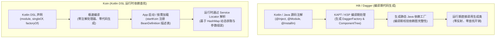

# 依赖注入方案对比（Hilt vs Koin）

本文档系统对比 Android 生态中两大主流依赖注入（DI）方案：**Google Hilt** 与 **Koin**。从底层原理、语法规范、作用域机制、性能开销、测试支持到跨平台能力进行全维度剖析，并给出技术选型建议与项目最佳实践。

---

## 一、核心原理与机制对比



| 维度 | Google Hilt (Dagger) | Koin |
| :--- | :--- | :--- |
| **底层范式** | **依赖注入（DI）**：编译期通过 APT/KSP 静态构建依赖图并生成工厂类 | **服务定位器（Service Locator）变体**：运行期通过 Kotlin DSL 注册并解析依赖 |
| **代码生成** | 强依赖 `kapt` / `ksp` 生成工厂类与组件容器 | 默认**零代码生成**（无额外编译插件开销） |
| **依赖图校验** | 编译期严格静态检查（缺失依赖直接编译失败） | 运行期解析查找（依赖缺失抛出 `NoBeanDefFoundException`，可通过单元测试 `verify()` 辅助校验） |
| **多平台支持** | 仅限 Android / JVM | 天然支持 **Kotlin Multiplatform (KMP)**（Android、iOS、Desktop、Web、Ktor） |

---

## 二、语法与常用 API 横向对照

| 依赖注入场景 | Hilt 语法范式 | Koin 4.x 语法范式 |
| :--- | :--- | :--- |
| **容器/模块声明** | ```kotlin
@Module
@InstallIn(SingletonComponent::class)
object AppModule { ... }
``` | ```kotlin
val appModule = module {
    ...
}
``` |
| **单例注入 (Singleton)** | ```kotlin
@Singleton
class Repository @Inject constructor(...)
// 或在 Module 中 @Provides / @Singleton
``` | ```kotlin
singleOf(::Repository)
// 或 single { Repository(get()) }
``` |
| **工厂注入 (每次新建)** | ```kotlin
class Helper @Inject constructor(...)
// 未声明 Scope 时默认每次新建
``` | ```kotlin
factoryOf(::Helper)
// 或 factory { Helper(get()) }
``` |
| **接口与多态绑定** | ```kotlin
@Binds
abstract fun bindStorage(
    impl: DiskStorageImpl
): StorageService
``` | ```kotlin
singleOf(::DiskStorageImpl) bind StorageService::class
// 或 single<StorageService> { DiskStorageImpl() }
``` |
| **多实现限定符** | ```kotlin
@Qualifier
annotation class ProdApi

@Inject @ProdApi
lateinit var api: ApiService
``` | ```kotlin
single<ApiService>(named("ProdApi")) {
    ProdApiServiceImpl()
}
val api: ApiService by inject(qualifier = named("ProdApi"))
``` |
| **Android 上下文注入** | ```kotlin
@Inject constructor(
    @ApplicationContext val app: Context,
    @ActivityContext val act: Context
)
``` | ```kotlin
// 声明时自动感知 Context
single { Database(androidContext()) }
``` |
| **ViewModel 注入** | ```kotlin
@HiltViewModel
class MyViewModel @Inject constructor(
    val repo: Repository
) : ViewModel()

// Activity 中获取:
val vm: MyViewModel by viewModels()
``` | ```kotlin
class MyViewModel(
    val repo: Repository
) : ViewModel()

// 模块声明:
viewModelOf(::MyViewModel)

// Activity 中获取:
val vm: MyViewModel by viewModel()
``` |
| **动态运行时参数注入** | 需要通过 `@AssistedInject` 与 `@AssistedFactory` 辅助工厂实现 | ```kotlin
factory { (userId: String) ->
    UserSession(userId, get())
}
// 使用:
val s: UserSession = get { parametersOf("ID_1001") }
``` |
| **非 Android 组件访问** | ```kotlin
val entry = EntryPointAccessors.fromApplication(
    context,
    CustomEntryPoint::class.java
)
``` | ```kotlin
// 随时随地可通过 Koin 全局上下文获取
val service: MyService = GlobalContext.get().get()
``` |

---

## 三、生命周期与作用域（Scope）体系

### 1. Hilt 的层次化预置组件
Hilt 将依赖严格绑定到 Android 核心生命周期层次中：

```
[SingletonComponent] (整个 App 生命周期)
   ├── [ActivityRetainedComponent] (跨配置变更保留，如 ViewModelStore)
   │      └── [ViewModelComponent] (ViewModel 生命周期)
   │      └── [ActivityComponent] (Activity 生命周期)
   │             ├── [FragmentComponent] (Fragment 生命周期)
   │             │      └── [ViewWithFragmentComponent]
   │             └── [ViewComponent] (自定义 View 生命周期)
   └── [ServiceComponent] (Service 生命周期)
```

- **优点**：天然与 Android 各组件生命周期强绑定，自动防泄漏，避免跨层级非法引用。
- **限制**：作用域层级由框架固定，创建自定义全局作用域的灵活性较低。

### 2. Koin 的灵活动态作用域
Koin 默认提供根作用域（Root Scope），并支持通过 DSL 声明和动态管理生命周期：

```kotlin
// 1. DSL 声明 Scope
val sessionModule = module {
    scope(named("UserSessionScope")) {
        scoped { SessionTokenHolder() }
    }
}

// 2. 动态创建与销毁
val sessionScope = getKoin().createScope("scope_id", named("UserSessionScope"))
val tokenHolder: SessionTokenHolder = sessionScope.get()
sessionScope.close() // 销毁并释放 Scope 内所有 Scoped 对象
```

- **优点**：完全动态可控，适用于用户会话（Login Session）、临时工作流、多步骤向导等场景。
- **限制**：开发者需自行保证 Scope 的创建与释放时机，管理不当可能导致内存泄漏。

---

## 四、多维深度对比矩阵

| 评估维度 | Hilt (Dagger) | Koin 4.x | 深度解析 |
| :--- | :--- | :--- | :--- |
| **编译耗时** | 较慢（随着大型项目注入类增多，KAPT/KSP 处理时间线性增长） | **极快**（无代码生成开销，Kotlin 正常编译速度） | 小型项目差异不大；超大型多模块项目中，Koin 显著节约开发调试时的增量编译时间。 |
| **运行时性能** | **极高**（直接调用静态生成的工厂类构造对象） | 极佳（首次解析有微秒级 HashMap 查找与反射调用） | 现代设备下 Koin 的运行时查找开销在绝大多数业务场景下完全可忽略。 |
| **启动性能** | 零初始化开销（按需懒加载构造） | `startKoin` 阶段需扫描并注册 Module（通常在几毫秒至十几毫秒） | 超大型 App 在启动关键路径上 Hilt 略有优势。 |
| **类型安全与报错** | **编译期报错**（强保证，依赖未提供无法通过编译） | **运行期报错**（可通过 `module.verify()` 在单元测试中静态检查） | Hilt 团队协作安全边际更高；Koin 必须配套测试规范防范漏配。 |
| **学习与维护成本** | 高（概念多：Subcomponent、Binds、Provides、Qualifier、Multibindings） | **极低**（纯 Kotlin 函数与 lambda，几乎零门槛） | 新员工入职 Koin 上手通常只需半天，Hilt/Dagger 需要系统学习。 |
| **跨平台（KMP）** | 不支持（依赖 Android SDK 与 JVM 注解生成） | **原生支持**（共享至 iOS / Desktop / Ktor） | KMP 跨端项目首选 Koin。 |
| **代码侵入性** | 较高（类与成员遍布注解与 `@AndroidEntryPoint` 基类继承） | **极低**（业务类保持纯 Kotlin，无需任何注解） | Koin 对纯业务领域层（Clean Architecture Domain Layer）代码侵入更小。 |
| **测试替换** | 需 `@TestInstallIn` / `@UninstallModules` 或 HiltTestRule | `loadKoinModules` / `unloadKoinModules` 即插即用 | Koin 在单元测试中 Mock 依赖更加轻量快捷。 |

---

## 五、技术选型与场景建议

### 场景 1：推荐选择 Hilt 的项目
1. **纯 Android 原生大型团队项目**：团队规模大，多团队并行开发，依赖编译期强校验阻断低级注入错误。
2. **重度依赖 Google Android 官方生态**：与 Jetpack Compose、Navigation、WorkManager 等官方库紧密配合。
3. **极致启动速度敏感**：金融、电商等头部 App 对冷启动耗时有极致优化要求。

### 场景 2：推荐选择 Koin 的项目
1. **Kotlin Multiplatform (KMP) 跨端架构**：Android 与 iOS / Desktop 共享核心业务、Repository 与 ViewModel 逻辑。
2. **中小型项目与敏捷迭代**：追求快速开发、低样板代码与极速编译构建反馈。
3. **服务端 Ktor / 纯 Kotlin 模块**：需要轻量统一的依赖注入体验。
4. **测试驱动开发（TDD）**：需要频繁动态注入 Mock/Fake 实例。

---

## 六、本工程落地与实践指南

在本工程的 `module_di` 中，集中落地了两种方案的标准实践：

```
modules/module_di/
├── DiMainActivity.kt            # 导航入口
└── activity/
    ├── HiltActivity.kt          # 演示 @Inject / @Binds / @Provides / @Qualifier / 上下文 / 作用域 / @HiltViewModel / @EntryPoint
    └── KoinActivity.kt          # 演示 singleOf / factoryOf / bind / named / parametersOf / viewModelOf / 自定义 Scope
```

- **Hilt 实战代码**：查阅 [`HiltActivity.kt`](file:///E:/StudioProjects/MyApplication/modules/module_di/src/main/java/com/example/william/my/module/di/activity/HiltActivity.kt)
- **Koin 实战代码**：查阅 [`KoinActivity.kt`](file:///E:/StudioProjects/MyApplication/modules/module_di/src/main/java/com/example/william/my/module/di/activity/KoinActivity.kt)
