# Android 事件总线方案对比（EventBus / RxEventBus / LiveEventBus / FlowEventBus）

本文档系统对比 Android 生态中主流的四种事件总线（Event Bus）方案：**EventBus（GreenRobot）**、**RxEventBus（基于 RxJava3）**、**LiveEventBus（基于 LiveData）** 与 **FlowEventBus（基于 Kotlin Flow）**。从底层通信模型、生命周期管理、线程调度、内存安全到最佳实践进行全维度深度剖析。

---

## 一、核心原理与机制对比

```mermaid
flowchart TD
    subgraph EventBus["1. GreenRobot EventBus (注解与索引)"]
        E1["@Subscribe 注解方法"] --> E2["APT 预生成 SubscriberInfoIndex\n或运行时反射扫描"]
        E2 --> E3["EventBus 订阅树维护\n(根据 Event.class 分发)"]
        E3 --> E4["通过 Handler 切换 Main/Background 线程\n(需手动 unregister)"]
    end

    subgraph RxEventBus["2. RxEventBus (RxJava3 响应式数据流)"]
        R1["PublishSubject / SerializedSubject"] --> R2["ofType(Class) 过滤事件类型"]
        R2 --> R3["RxJava 操作符链 (debounce, filter, map)\n+ 线程调度器 (Schedulers)"]
        R3 --> R4["Disposable 订阅管理\n(需手动 clear / AutoDispose 解绑)"]
    end

    subgraph LiveEventBus["3. LiveEventBus (Jetpack LiveData)"]
        L1["MutableLiveData 事件包装"] --> L2["结合 LifecycleOwner 观察\n(版本号 Hook 解决数据倒灌)"]
        L2 --> L3["主线程生命周期感知分发\n(活跃状态接收，销毁自动反注册)"]
    end

    subgraph FlowEventBus["4. FlowEventBus (Kotlin SharedFlow)"]
        F1["MutableSharedFlow 事件流\n(replay 控制粘性事件)"] --> F2["结合 repeatOnLifecycle / 协程作用域"]
        F2 --> F3["结构化并发 + 协程调度器\n(天然生命周期安全，零内存泄漏)"]
    end
```



---

## 二、特性多维对比矩阵

| 评估维度 | EventBus (GreenRobot) | RxEventBus (RxJava3) | LiveEventBus (LiveData) | FlowEventBus (Kotlin Flow) |
| :--- | :--- | :--- | :--- | :--- |
| **底层驱动核心** | 观察者模式 + 反射 / APT 索引 | `PublishSubject` / `BehaviorSubject` | `MutableLiveData` + Hook | `MutableSharedFlow` |
| **生命周期感知** | ❌ **无**（必须手动 `unregister`） | ❌ **无**（必须维护 `Disposable`） | ✅ **原生支持**（绑定 `LifecycleOwner`） | ✅ **原生支持**（结合 `repeatOnLifecycle`） |
| **内存泄漏风险** | 🔴 较高（忘记 unregister 会直接持有页面） | 🔴 较高（忘记 dispose 会泄漏订阅者） | 🟢 极低（页面 `DESTROYED` 自动注销） | 🟢 **零风险**（协程作用域取消即停止） |
| **线程调度分发** | ✅ 支持（`MAIN`、`BACKGROUND`、`ASYNC` 等） | ✅ **极强**（RxJava 完整调度器体系） | ⚠️ 仅限主线程分发通知 | ✅ **极强**（挂起函数与协程 `Dispatchers`） |
| **流操作符支持** | ❌ 无 | ✅ **极其丰富**（debounce、throttle 等） | ⚠️ 较弱（基础 Transformations） | ✅ **极其丰富**（Flow 原生高阶流操作符） |
| **粘性事件 (Sticky)** | ✅ 原生支持 | ✅ 自定义 `Map` 缓存支持 | ✅ 支持（通过包装版本号控制） | ✅ **原生支持**（`replay = 1`） |
| **作用域隔离** | ⚠️ 默认仅全局总线 | ⚠️ 默认仅全局总线 | ✅ 支持按 `ViewModelStoreOwner` 隔离 | ✅ **支持**（App Scope / Activity / Fragment） |
| **编译开销** | 需要配置 APT 插件生成 Index | 无额外生成开销 | 零生成开销 | 零生成开销（纯 Kotlin 协程） |
| **推荐等级** | 存量维护 | 存量 RxJava 项目使用 | 适合 Java / LiveData 项目 | 🌟 **现代 Kotlin 项目首选推荐** |

---

## 三、常用 API 与语法对照

### 1. 事件定义
```kotlin
// 统一事件数据类
data class MessageEvent(val message: String)
```

### 2. 订阅与发送对照表

| 方案 | 订阅事件（Subscribe / Observe） | 发送普通事件（Post） | 发送粘性事件（Post Sticky） | 注销与防泄漏（Unregister） |
| :--- | :--- | :--- | :--- | :--- |
| **EventBus** | ```kotlin
@Subscribe(threadMode = ThreadMode.MAIN)
fun onEvent(e: MessageEvent) { ... }
// 注册:
EventBusHelper.register(this)
``` | ```kotlin
EventBusHelper.postEvent(
    MessageEvent("Hello")
)
``` | ```kotlin
EventBusHelper.postStickyEvent(
    MessageEvent("Sticky")
)
``` | ```kotlin
override fun onDestroy() {
    super.onDestroy()
    EventBusHelper.unregister(this)
}
``` |
| **RxEventBus** | ```kotlin
val d = RxEventBus.observeEvent(
    MessageEvent::class.java
).observeOn(AndroidSchedulers.mainThread())
 .subscribe { e -> ... }
mDisposable.add(d)
``` | ```kotlin
RxEventBus.postEvent(
    MessageEvent("Hello")
)
``` | ```kotlin
RxEventBus.postStickyEvent(
    MessageEvent("Sticky")
)
``` | ```kotlin
override fun onDestroy() {
    super.onDestroy()
    mDisposable.clear()
}
``` |
| **LiveEventBus** | ```kotlin
LiveEventBus.observeEvent<MessageEvent>(this) { e ->
    // 自动在活跃生命周期内接收
}
``` | ```kotlin
LiveEventBus.postEvent(
    this,
    MessageEvent("Hello")
)
``` | ```kotlin
LiveEventBus.observeEvent<MessageEvent>(
    this, 
    isSticky = true
) { e -> ... }
``` | **无需手动注销**（生命周期感知自动解除） |
| **FlowEventBus** | ```kotlin
FlowEventBus.observeEvent<MessageEvent>(this) { e ->
    // repeatOnLifecycle 驱动
}
``` | ```kotlin
FlowEventBus.postEvent(
    this,
    MessageEvent("Hello")
)
``` | ```kotlin
FlowEventBus.observeEvent<MessageEvent>(
    this,
    isSticky = true
) { e -> ... }
``` | **无需手动注销**（跟随宿主协程作用域自动注销） |

---

## 四、核心技术痛点与方案剖析

### 1. 为什么 LiveData 会出现“数据倒灌”，如何解决？
- **原因**：`LiveData` 内部维护了 `mVersion`（发送版本）和 `ObserverWrapper.mLastVersion`（观察者版本）。新观察者在 `STARTED` 状态激活时，若其 `mLastVersion < mVersion`，会立即触发一次历史数据分发，导致**普通事件表现为粘性事件**（即数据倒灌）。
- **本项目解决方案**：在 `lib_eventbus/livedata` 中通过反射或自定义 `BusObserverWrapper`，使非粘性监听在注册时将 `mLastVersion` 对齐为当前的 `mVersion`，仅在后续有新值传入时才触发回调。

### 2. FlowEventBus 如何优雅实现粘性与非粘性？
- **机制**：Kotlin `SharedFlow` 提供了 `replay` 参数：
  - **普通事件**：`replay = 0`，不缓存历史数据，仅向当前活跃的 Collector 广播。
  - **粘性事件**：`replay = 1`，缓存最新一条数据，新订阅的 Collector 启动时立即重放。
- **生命周期绑定**：配合 `LifecycleOwner.lifecycleScope` 与 `repeatOnLifecycle(Lifecycle.State.STARTED)`，当页面处于后台（如 `STOPPED`）时自动挂起或暂停收集，页面销毁时自动取消 Job，彻底解决内存泄漏与后台无用刷新问题。

### 3. 作用域隔离（Scope Isolation）
传统的 EventBus / RxEventBus 是全局单例，任何组件发送的事件均会广播到全局，极易发生“事件污染”。
在 `lib_eventbus` 的 **LiveEventBus** 与 **FlowEventBus** 中均支持分级作用域：
1. **App Scope（全局作用域）**：跨页面、跨模块的全局广播。
2. **Activity / Fragment Scope（容器作用域）**：绑定 `ViewModelStoreOwner`，仅在宿主 Activity 与其内部的 Sub-Fragments 之间流转，页面退出即随 ViewModelStore 彻底销毁。

---

## 五、技术选型与迁移指引

### 选型决策表

| 场景特点 | 最佳推荐方案 | 选型理由 |
| :--- | :--- | :--- |
| **新业务 / 纯 Kotlin 现代化项目** | 🌟 **FlowEventBus** | 协程原生支持、零内存泄漏风险、支持多级 Scope、支持丰富 Flow 操作符 |
| **存量 Java 项目 / 基于 LiveData 的 MVVM** | **LiveEventBus** | 学习曲线极低、生命周期感知、对 AndroidX LiveData 体系完全兼容 |
| **存量重度依赖 RxJava3 链式处理的项目** | **RxEventBus** | 无缝衔接既有 RxJava 流式转换与调度操作符 |
| **老旧遗留系统 / 多进程 / 历史兼容** | **EventBus** | 生态成熟、支持优先级与事件拦截，但需注意严格注销 |

---

## 六、本工程落地与代码索引

本项目在 `modules/module_event` 和 `libs/lib_eventbus` 中完整封装并落地了四种方案的示例与基础设施：

```
libs/lib_eventbus/                      # 底层封装库
├── flow/                               # FlowEventBus 核心实现（FlowEventBus.kt / FlowEventBusModel.kt）
├── livedata/                           # LiveEventBus 核心实现（LiveEventBus.kt / BusMutableLiveData.kt）
└── rxjava/                             # RxEventBus 核心实现（RxEventBus.kt）

modules/module_event/                   # 业务演示模块
├── EventMainActivity.kt                # 模块入口（ARouter 导航）
└── activity/
    ├── EventBusActivity.kt             # GreenRobot EventBus 实战页面
    ├── RxEventBusActivity.kt           # RxEventBus 实战页面
    ├── LiveEventBusActivity.kt         # LiveEventBus 实战页面
    └── FlowEventBusActivity.kt         # FlowEventBus 实战页面
```

- **模块入口**：[`EventMainActivity.kt`](file:///E:/StudioProjects/MyApplication/modules/module_event/src/main/java/com/example/william/my/module/event/EventMainActivity.kt)
- **Flow 演示**：[`FlowEventBusActivity.kt`](file:///E:/StudioProjects/MyApplication/modules/module_event/src/main/java/com/example/william/my/module/event/activity/FlowEventBusActivity.kt)
