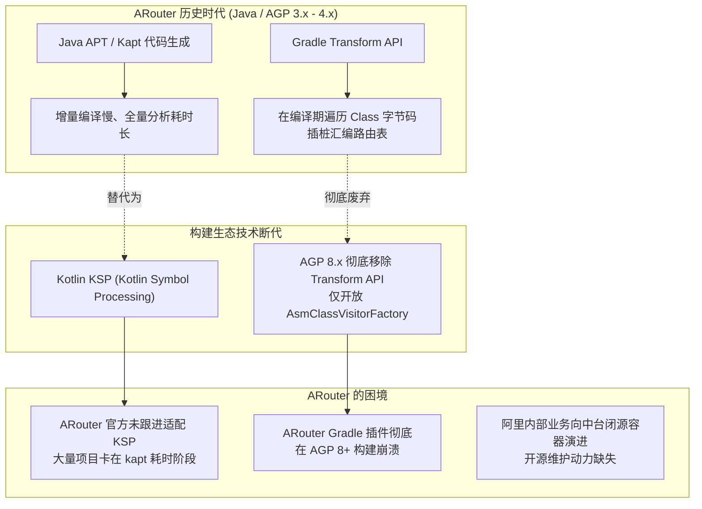
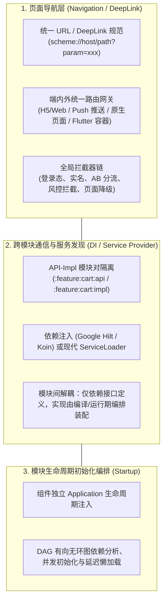
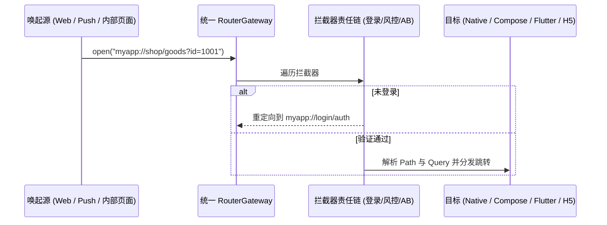

# Android 现代组件化架构演进与技术选型指南

> 本文档系统解答 **“ARouter 停更后现代大厂如何做组件化”**，深入解析技术底座变革、现代大厂主流架构方案、开源替代选型及最佳落地实践。

---

## 核心结论速览

1. **大厂绝未放弃组件化**：相反，组件化/模块化（Modularization）已从中大型 App 的“可选项”升级为百人协同研发的“底座标配”。
2. **ARouter 停更原因**：并非组件化理念被淘汰，而是因为 **Gradle 构建底层生态（Transform API 移除）与 Kotlin 编译工具链（KSP 取代 Kapt）发生剧烈断代变革**，老旧的架构设计无法低成本兼容现代构建体系。
3. **现代大厂在用什么**：
   - **大型互联网大厂**：自研轻量路由与服务发现中台（兼容 AGP 8+ / KSP，深度集成端内外统一 DeepLink 协议与拦截链）。
   - **现代开源替代（中大型团队）**：以 **TheRouter**（货拉拉开源，专为兼容 KSP、AGP 8+ 与平滑平替 ARouter 设计）和 **WMRouter**（美团）为主。
   - **现代官方架构实践**：推行 **“API-Impl 接口下沉”** 架构，利用 **Google Hilt / Koin** 解决模块间服务通信，配合 **统一 DeepLink / Navigation** 解决页面跳转。

---

## 一、为什么阿里的 ARouter 停更了？

ARouter 是 Java 时代与 Android Gradle Plugin (AGP) 3.x/4.x 时期的产物，其停更主要源于以下四个不可调和的技术断代：



1. **AGP 7.x 废弃 / AGP 8.x 彻底移除 Transform API**：
   ARouter 依赖 Transform API 遍历每个 Module 打包出来的 Class 文件，寻找 `@Route` 注解并聚合生成主路由映射清单。AGP 8.x 移除该 API 后，原生 ARouter 插件在现代构建环境直接构建报错无法运行。
2. **编译效率痛点（APT/kapt vs KSP）**：
   ARouter 基于传统 APT（Java）与 kapt（Kotlin）。在数百个模块的工程中，kapt 需先将 Kotlin 源码转为 Java Stub 再做注解分析，导致冷启动编译严重卡顿；而现代 Android 全面转向直面 Kotlin 编译器 AST 的 **KSP**，ARouter 官方未提供 KSP 支持。
3. **单 Activity + Compose 现代 UI 范式冲击**：
   ARouter 核心抽象基于 `Activity` 级跨页面跳转。但在 Jetpack Compose 和单 Activity 多 Composable 页面盛行的当下，传统的纯 Activity 路由抽象显得过于笨重。
4. **大厂内部基建与开源割裂**：
   阿里及各厂内部基建早已向动态化容器、端内外统一流量网关演进，开源版背负历史包袱过重，维护性价比低。

---

## 二、现代大厂组件化架构全景

现代大厂的组件化不再把所有职责全堆在一个“万能胖路由”上，而是解构为 **三层正交体系**：



---

## 三、大厂落地与开源选型对比

| 评估维度 | ARouter (阿里-已停更) | TheRouter (货拉拉开源) | WMRouter (美团) | 现代官方规范 (API-Impl + Hilt + DeepLink) |
| :--- | :--- | :--- | :--- | :--- |
| **AGP 8.x / 9.x 兼容** | ❌ 崩溃（依赖已废弃 Transform） |  原生支持（基于新版 `AsmClassVisitorFactory`） | ⚠️ 需魔改插件支持 AGP 8+ |  原生支持（官方生态持续迭代） |
| **Kotlin KSP 支持** | ❌ 仅支持 kapt / APT |  全面原生支持 KSP | ❌ 社区分支支持 |  原生支持 KSP |
| **模块服务发现机制** | `IProvider` 反射查找 | `TheRouter.get(Service::class)` 依赖倒置 | `ServiceLoader` SPI | **Google Hilt (`@Inject` / `@Binds`)** 或 Koin |
| **跨端与统一协议** | 弱（偏原生 Activity） | 强（支持多端协议映射、动态修复降级） | 强（核心基于 URI 正则与节点分发） | 规范统一（统一 DeepLink 协议） |
| **拦截器与路由链** | 粗粒度优先级的全局拦截器 | 阶段式拦截器 + 动态重定向 | 责任链设计模式（Chained Handler） | OkHttp 式责任链或自定义 Router Gateway |
| **ARouter 迁移成本** | — | **极低**（提供一键迁移脚本与兼容注解） | 中等（需重写注解与路由调用点） | 较高（需架构重构，分拆 API-Impl） |
| **适用场景** | 历史老旧项目维护 | **当前国内中大型项目首选替换方案** | 偏好责任链架构的定制自研团队 | **Google 倡导的标准架构、中长期演进团队** |

---

## 四、现代大厂两大主流落地方案剖析

### 方案 A：快速平替升级方案（采用 TheRouter）

对于当前既有庞大代码库重度依赖 ARouter，无法承受架构全盘重构成本的团队，业界主流做法是切换至 **TheRouter**：

1. **Gradle 构建配置迁移**：
   - 移除老旧的 `arouter-register` 插件；
   - 引入 TheRouter 现代 Gradle 插件（直接基于 AGP 最新字节码处理 API，适配 Configuration Cache）；
   - 使用 `ksp` 替换 `kapt` 声明注解处理器。
2. **代码无缝兼容**：
   - TheRouter 提供了与 ARouter API 语义对齐的注解与能力：
     ```kotlin
     // 页面跳转路由
     @Route(path = "/user/detail")
     class UserDetailActivity : AppCompatActivity()

     // 跨模块服务发现与调用
     val userService = TheRouter.get(IUserService::class.java)
     ```
3. **动态路由修复与降级**：
   - 支持云端下发路由映射表，在出现线上 Bug 时将某个页面跳转动态重定向为 H5 兜底页面或降级提示。

---

### 方案 B：工业级架构规范方案（API-Impl 模式 + Hilt + 统一网关）

在字节跳动、Google 官方（如 Now in Android）以及架构治理严格的现代大厂项目中，业界正从“过度依赖黑盒路由框架”逐步转向更加类型安全、编译期确定性更强的 **API-Impl 架构**。

#### 1. 模块结构拆分规范

传统的粗暴模块依赖容易导致两个问题：要么全部依赖公共 `basic_shared`（导致基类层无休止膨胀），要么模块间循环依赖。API-Impl 模式将每个业务特性拆分为成对的两个模块：

```
modules/
├── module_user/
│   ├── api/      # :modules:module_user:api （轻量接口层）
│   │   ├── IUserService.kt        # 对外暴露的能力接口
│   │   ├── UserDetailRoute.kt     # 类型安全的路由常量/参数模型
│   │   └── UserEvent.kt           # 用户模块对外发布的数据模型/事件
│   └── impl/     # :modules:module_user:impl （核心实现层）
│       ├── UserServiceImpl.kt    # 具体业务实现
│       ├── UserDetailActivity.kt  # 实际 Activity/Fragment/Compose 页面
│       └── UserModuleDi.kt        # Hilt / Koin 依赖注入装配
```

- **其他业务模块（如 `module_order`）**：仅依赖 `:modules:module_user:api`。
- **构建隔离**：`module_order` 根本无法访问 `UserDetailActivity` 或 `UserServiceImpl` 的内部私有逻辑，从编译期杜绝了代码耦合。
- **壳工程（`:app`）**：负责通过 Gradle `implementation` 将所有业务模块的 `:impl` 拼装到最终 APK 中。

#### 2. 跨模块通信与服务解耦（Hilt 方案）

在 `:user:api` 中定义纯 Kotlin 接口：
```kotlin
interface IUserService {
    suspend fun fetchCurrentUser(): UserProfile?
    fun isLogin(): Boolean
}
```

在 `:user:impl` 中实现并通过 Hilt 绑定到全局单例容器：
```kotlin
@Singleton
class UserServiceImpl @Inject constructor(
    private val repo: UserRepository
) : IUserService {
    override suspend fun fetchCurrentUser(): UserProfile? = repo.getUser()
    override fun isLogin(): Boolean = repo.hasToken()
}

@Module
@InstallIn(SingletonComponent::class)
abstract class UserExportModule {
    @Binds
    @Singleton
    abstract fun bindUserService(impl: UserServiceImpl): IUserService
}
```

在其他模块（如 `:order:impl`）中直接通过依赖注入获取，**零反射、零全局字典查找、编译期类型安全检查**：
```kotlin
@HiltViewModel
class OrderCheckoutViewModel @Inject constructor(
    private val userService: IUserService // 编译期自动装配，缺失即编译失败
) : ViewModel() {
    fun checkOrder() {
        if (!userService.isLogin()) { /* 唤起登录 */ }
    }
}
```

#### 3. 端内外统一路由网关（DeepLink Gateway）

放弃为每个简单跳转都配置复杂的反射路由表，统一通过一套基于 URI 标准的网关协议进行分发：



---

## 五、现代大厂组件化的延伸工程演进

现代大厂的组件化早已超越了单纯的“页面跳转与类解耦”，向极致工程效能演进：

1. **独立调试（Run Alone）**：
   - 业务模块通过构建逻辑插件（Convention Plugin）配置自由切换 `com.android.library` 与 `com.android.application`。
   - 开发“购物车”模块时，开发者无需启动包含几百个模块的完整 App，仅编译运行 `:feature:cart` 调试用壳工程，**将增量编译由几分钟缩减至 5~10 秒**。
2. **二进制化分发（AAR Cache）**：
   - 依赖 Gradle 依赖替换机制（Dependency Substitution）。
   - 本地开发未修改的底层模块，自动下载 CI 编译好的远程 AAR 二进制包；仅正在开发的代码保持源码编译，解决超大型工程构建瓶颈。
3. **多技术栈跨端容器协同**：
   - 路由框架演变为“跨端调度中心”：通过统一 URI 判断目标。如果是 Web 页面则唤起自研 WebView 容器；如果是 Flutter 页面则路由到 Flutter 容器引擎；如果是纯 Compose 页面则触发本地 NavHost 分发。

---

## 六、总结与落地建议

1. **现有项目已重度依赖 ARouter**：
   - **推荐路径**：采用 **TheRouter** 进行平滑替代。利用其提供的兼容层和一键迁移脚本，升级 Gradle 插件至 AGP 8+，全面转用 KSP，以最小代价解除构建与编译卡点。
2. **新立项或正在进行大型架构重构的项目**：
   - **推荐路径**：践行 **API-Impl 模块解耦 + Hilt 依赖注入 + 统一 DeepLink 网关**。这是目前 Android 官方与行业长期演进最稳健的标准范式，彻底摆脱第三方重型黑盒框架的维护风险。
