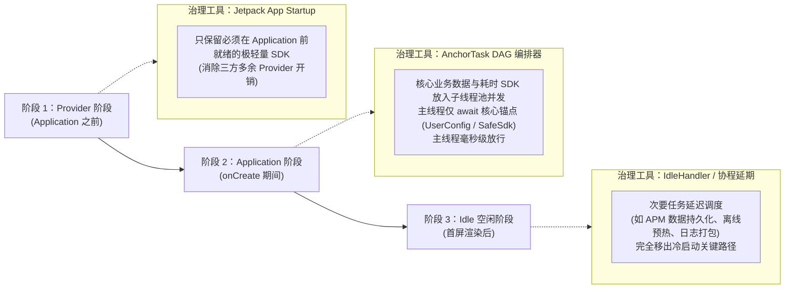

# Android 启动初始化方案对比（ContentProvider vs App Startup vs AnchorTask）

本文档系统对比 Android 生态中三种具有代表性的应用启动初始化与任务调度方案：**原生多 ContentProvider 自动初始化**、**Google Jetpack App Startup** 与 **企业级 AnchorTask 多线程 DAG 编排框架**。从底层调度机理、时序阶段、线程模型、依赖拓扑、锚点卡点到工业级最佳实践进行全维度深度剖析。

---

## 一、核心原理与机制对比

```mermaid
flowchart TD
    subgraph CP["1. 传统多 ContentProvider (无序隐式自动初始化)"]
        CP1["每个 SDK 在 AndroidManifest 声明 Provider"] --> CP2["系统进程在 Application 之前串行拉起"]
        CP2 --> CP3["每个 Provider 带来单独的 Binder/IPC 与反射开销"]
        CP3 --> CP4["主线程串行阻塞，无法控制依赖与执行时序"]
    end

    subgraph Startup["2. Jetpack App Startup (单 Provider 聚合托管)"]
        S1["实现 Initializer&lt;T&gt; 接口"] --> S2["由单一虚拟 InitializationProvider 聚合"]
        S2 --> S3["通过 dependencies() 进行拓扑排序 (DAG)"]
        S3 --> S4["主线程串行按序执行 (可 tools:node='remove' 懒加载)"]
    end

    subgraph Anchor["3. AnchorTask (多线程并发 DAG + 锚点卡点)"]
        A1["实现 StartupTask，指定 isRunOnMainThread"] --> A2["TaskDispatcher 计算入度表构建 DAG"]
        A2 --> A3["入度为 0 自动分发主线程与后台线程池并发"]
        A3 --> A4["CountDownLatch 仅阻塞主线程等待 Anchor 任务\n非关键任务后台持续运行，主线程极速放行"]
    end
```



| 评估维度 | 原生多 ContentProvider | Jetpack App Startup | AnchorTask / 启动编排引擎 |
| :--- | :--- | :--- | :--- |
| **设计初衷** | SDK 提供方追求“零代码侵入”，自动捕获 Context | 消除多 Provider 启动耗时，建立官方初始化规范 | 解决大型应用数十个 SDK 复杂依赖、主子线程并发与首屏卡点等待 |
| **执行阶段** | `ContentProvider.onCreate` 阶段（早于 Application） | `ContentProvider.onCreate` 阶段（早于 Application） | `Application.onCreate` 或 `SplashActivity` 阶段 |
| **线程模型** | 强制主线程串行 | **强制主线程串行**（官方不支持后台线程池并发） | **主线程 + 后台线程池混合并发**（支持精细化指定线程） |
| **依赖拓扑（DAG）** | ❌ 无依赖机制，各 Provider 加载顺序不可控 | ✅ 支持 `dependencies()` 拓扑排序（主线程串行依次执行） | ✅ 支持完整多线程 DAG，入度递减自动触发就绪后继任务 |
| **锚点（Anchor）卡点** | ❌ 无 | ❌ 无（要么启动串行执行完毕，要么手动延迟加载） | ✅ **核心特性**：基于 `CountDownLatch` 仅等待关键锚点任务 |
| **第三方库接入** | 极透明，引入依赖即自动加载 | 极佳（Jetpack 生态原生支持，透明合并） | 需编写 Task 适配层包装第三方库，侵入宿主工程 |

---

## 二、语法与 API 横向对照

| 编排调度场景 | Jetpack App Startup 语法范式 | AnchorTask 语法范式 |
| :--- | :--- | :--- |
| **任务/初始化器声明** | ```kotlin
class SecuritySdkInitializer : Initializer<SecuritySdk> {
    override fun create(context: Context): SecuritySdk {
        return SecuritySdk.init(context)
    }
    override fun dependencies(): List<Class<out Initializer<*>>> {
        return listOf(LogSdkInitializer::class.java)
    }
}
``` | ```kotlin
class SecurityTask : StartupTask {
    override val id: String = "SecurityTask"
    override val isRunOnMainThread: Boolean = false
    override fun dependencies(): List<Class<out StartupTask>> {
        return listOf(LogTask::class.java)
    }
    override fun execute() {
        SecuritySdk.init(context)
    }
}
``` |
| **锚点任务声明 (Anchor)** | ❌ 官方无锚点概念 | ```kotlin
// 声明实现 IAnchorTask 标记接口
class UserConfigTask : IAnchorTask {
    override val id: String = "UserConfigTask"
    override val isRunOnMainThread: Boolean = false // 子线程异步跑
    override fun execute() { ... }
}
``` |
| **调度触发与卡点** | 声明在 `AndroidManifest.xml` 中自动触发：<br>```xml
<provider
    android:name="androidx.startup.InitializationProvider"
    android:authorities="${applicationId}.androidx-startup">
    <meta-data
        android:name="...SecuritySdkInitializer"
        android:value="androidx.startup" />
</provider>
``` | 在 `Application.onCreate` 中显式构建并调度：<br>```kotlin
TaskDispatcher.newBuilder()
    .addTask(LogTask())
    .addTask(SecurityTask())
    .addTask(UserConfigTask()) // Anchor 锚点
    .addTask(ApmTask())        // 非锚点后台
    .build()
    .start()
    .await() // 仅等待 UserConfigTask 就绪即放行主线程！
``` |
| **按需/延迟初始化** | ```kotlin
// 手动按需调用（需在 Manifest 中 tools:node="remove"）
AppInitializer.getInstance(context)
    .initializeComponent(ManualSdkInitializer::class.java)
``` | 结合 `IdleHandler` 或协程按需调用：<br>```kotlin
Looper.myQueue().addIdleHandler {
    lazyTask.execute()
    false
}
``` |

---

## 三、启动链路时序与阻断机制（Stage & Barrier）

### 1. Android 进程冷启动核心时序

```
System fork 进程
   └── ActivityThread.main()
          ├── LoadedApk.makeApplication()
          │      └── Application.attachBaseContext()
          │
          ├── [Provider 阶段] ➔ installContentProviders()
          │      ├── 多 Provider 模式：逐个串行拉起第三方 ContentProvider.onCreate() (耗时叠加)
          │      └── App Startup 模式：单个 InitializationProvider 拓扑调用 Initializer.create()
          │
          ├── [Application 阶段] ➔ Application.onCreate()
          │      └── AnchorTask 模式：构建 DAG 依赖图，子线程池并发初始化，主线程 await() 仅卡点锚点任务
          │
          └── [Activity 阶段] ➔ Activity.onCreate() / onResume() ➔ 首帧绘制可交互 (TTFD)
                 └── Idle 阶段：IdleHandler 在消息队列空闲时加载非关键长尾任务
```

### 2. 为什么 App Startup 无法完全替代企业级任务编排？
- **并发能力缺失**：App Startup 的设计目标是**轻量化与收拢 ContentProvider**，其所有 `create(context)` 方法默认全部运行在主线程。若某个 SDK 初始化涉及本地数据库解密或耗时 I/O（如 100ms），App Startup 会直接在主线程串行卡死 100ms。
- **阶段局限性**：App Startup 运行在 `ContentProvider.onCreate` 时期，此时 `Application.onCreate` 尚未执行，许多需要完整 Application 实例或全局依赖注入（如 Hilt）就绪的业务组件不适合在此时期加载。

### 3. AnchorTask 锚点阻断原语的价值
在真实业务中，初始化任务通常分为三类：
1. **主线程强依赖**：必须在主线程执行（如主 UI 相关、路由装载），耗时通常极短（1~10ms）；
2. **异步关键数据（Anchor）**：涉及 I/O 或加密计算，但首屏展示前必须拿到数据（如用户登录态、AB 实验分流、合规隐私证书）。这类任务放在子线程池并发执行，但主线程在进入首屏前**必须等待其完成（`CountDownLatch.await()`）**；
3. **异步次要服务（Non-Anchor）**：如 APM 性能监控上报、推送长链接、离线缓存预热。这类任务在后台并发运行，**主线程无需等待其结束，直接放行首屏**。

**收益**：通过多核并发 + 锚点卡点，主线程阻塞时间由“所有任务耗时累加”大幅缩减至“最长锚点关键路径耗时”，用户白屏时间显著下降 50%~80%。

---

## 四、多维深度对比矩阵

| 评估维度 | 原生多 ContentProvider | Jetpack App Startup | AnchorTask 启动编排框架 | 深度解析 |
| :--- | :--- | :--- | :--- | :--- |
| **主线程阻塞程度** | 🔴 极高（每个 Provider 产生 IPC 与串行阻塞） | 🟡 较高（多任务在主线程串行累加耗时） | 🟢 **极低**（仅阻塞等待最长锚点路径，次要任务后台平滑运行） | AnchorTask 充分压榨现代手机 8 核 CPU 计算资源。 |
| **多线程并发支持** | ❌ 无 | ❌ 无 | ✅ **原生多线程池并发调度** | 启动优化的本质是将 CPU 主频与多核算力最大化利用。 |
| **依赖拓扑灵活性** | ❌ 无任何依赖保障 | 🟡 基础串行拓扑 | ✅ **高阶 DAG 流转**（入度清零即刻唤醒后续子任务） | 支持复杂的网状依赖（如 C 依赖 A 和 B，A 在主线程，B 在子线程）。 |
| **生态透明度** | 🟢 极高（导入 aar 自动生效） | 🟢 极高（Google 官方标准，SDK 广泛兼容） | 🟡 中等（需要宿主编写 Task 适配层） | App Startup 更适合三方 SDK 交付；AnchorTask 适合 App 宿主全局管控。 |
| **超时与容灾机制** | ❌ 系统无防护，超时易 ANR | ❌ 依赖出现异常直接阻断启动 | ✅ 支持 `await(timeout)` 超时熔断与任务异常隔离 | 避免因单个次要子线程 SDK 死锁或超时卡死整个 App 首屏。 |
| **维护与技术选型** | ❌ 强烈反对继续新增 | ✅ 官方推荐用于轻量 SDK 聚合 | ✅ 头部大型 App（阿里、字节、携程、美团）标准架构模式 | 两者非对立关系，而是分阶段协同。 |

---

## 五、工业级启动治理最佳实践（三阶段黄金模型）

在大型 Android 工业级工程中，推荐采用 **App Startup + AnchorTask + IdleHandler** 的三阶段分层治理架构：



---

## 六、本工程落地与实践指南

在本工程的 [`module_performance`](../../modules/module_performance/) 中，已完整落地了上述启动优化各维度的交互式演示：

```
modules/module_performance/
├── PerformanceMainActivity.kt           # 导航入口
├── task/
│   └── TaskDispatcher.kt                # 轻量纯 Kotlin DAG 调度器内核、入度解算与 Anchor 锚点原语
└── activity/
    ├── ContentProviderActivity.kt       # 演示 ContentProvider 启动时序与多 Provider 耗时分析
    ├── StartupActivity.kt               # 演示 Jetpack App Startup 的 InitializationProvider 聚合与拓扑排序
    ├── AnchorTaskActivity.kt            # 演示 AnchorTask 串行基准 vs DAG 并发锚点等待 (卡点放行)
    └── IdleHandlerActivity.kt           # 演示 IdleHandler 主线程空闲延迟调度
```

- **ContentProvider 启动源码**：查阅 [`ContentProviderActivity.kt`](../../modules/module_performance/src/main/java/com/example/william/my/module/performance/activity/ContentProviderActivity.kt)（路由：`/Performance/ContentProvider`）
- **App Startup 实战源码**：查阅 [`StartupActivity.kt`](../../modules/module_performance/src/main/java/com/example/william/my/module/performance/activity/StartupActivity.kt)（路由：`/Performance/Startup`）
- **AnchorTask 调度源码**：查阅 [`AnchorTaskActivity.kt`](../../modules/module_performance/src/main/java/com/example/william/my/module/performance/activity/AnchorTaskActivity.kt)（路由：`/Performance/AnchorTask`）
- **IdleHandler 调度源码**：查阅 [`IdleHandlerActivity.kt`](../../modules/module_performance/src/main/java/com/example/william/my/module/performance/activity/IdleHandlerActivity.kt)（路由：`/Performance/IdleHandler`）
