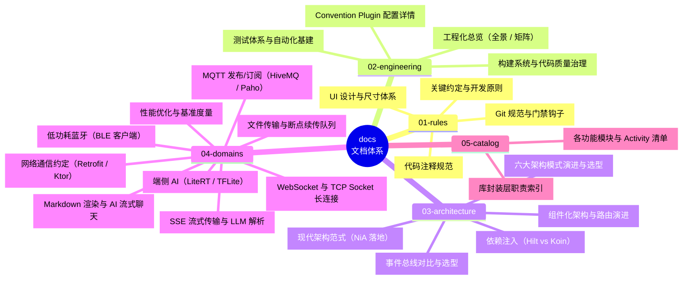

# MyApplication 技术文档导航

> 本目录收录项目的所有技术规范、架构决策、技术选型对比与专项开发指南。
> 文档按用途**物理分组**为五类（见下），本文件是全仓唯一的**阅读入口**：先看「阅读建议」定位需求，再按分组表或「选型对比速查」跳转到目标文档，无需逐个打开。

---

## 🧭 阅读建议（按角色/场景）

| 我想…… | 先去读 | 说明 |
| :--- | :--- | :--- |
| 给项目提交代码 / 新写模块 | [01-rules/conventions.md](01-rules/conventions.md) → [git.md](01-rules/git.md) | 硬性约定：路由、模块结构、提交格式与门禁 |
| 摸清工程化全貌与各能力落地状态 | [02-engineering/engineering.md](02-engineering/engineering.md) | 全景图 + 成熟度矩阵 + 各维度入口 |
| 做技术选型 / 想对比方案 | 跳到「选型对比速查」表 | 全仓对比类文档一张表聚合 |
| 查某个模块有哪些页面 | [05-catalog/modules.md](05-catalog/modules.md) | 各功能模块 × Activity 清单，Ctrl+F 直达 |
| 查某个 libs 库怎么用 | [05-catalog/libs.md](05-catalog/libs.md) | 库职责 + 专题文档索引 |

> 各文档普遍采用「先结论后细节」结构（核心结论速览 / 对比矩阵 / 决策树在正文前部），按需跳读章节即可。

---

## 🗂 文档全景（五组）

---

## 一、项目规范（01-rules/）

项目**硬性约定**：所有模块与提交必须遵守的规则。

| 文档 | 说明 | 核心关注点 |
| :--- | :--- | :--- |
| [conventions.md](01-rules/conventions.md) | **关键约定** | 路由命名、模块标准结构、示例页面编写准则、Activity 继承树与十大约定 |
| [comments.md](01-rules/comments.md) | **代码注释规范** | 中文优先、KDoc 结构分层、选型与约束注释保护、最小修改切片 |
| [design.md](01-rules/design.md) | **设计规范** | 4dp 网格间距、字体阶梯、圆角规范、统一图标尺寸系统 |
| [git.md](01-rules/git.md) | **Git 提交规范** | Conventional Commits 格式、中文门禁、钩子安装、历史遗留与 pre-push 门禁 |

---

## 二、构建与工程化（02-engineering/）

构建系统、工程质量与测试基建。`engineering.md` 是工程化能力的总览入口，其余为分册与细则。

| 文档 | 说明 | 核心关注点 |
| :--- | :--- | :--- |
| [engineering.md](02-engineering/engineering.md) | **工程化总览** | NiA 六大维度全景图、全仓成熟度矩阵、交付门禁要点与命令速查字典 |
| [engineering-build.md](02-engineering/engineering-build.md) | **构建与代码质量治理** | Version Catalog、极速构建、依赖守卫、KMP 演进、Spotless、自定义 Lint 与 checkDependencies 决策 |
| [build-logic.md](02-engineering/build-logic.md) | **构建逻辑** | 19 个 Convention Plugin 插件配置、依赖聚合与构建隔离 |
| [testing.md](02-engineering/testing.md) | **测试体系** | Turbine 流测试、测试命名 Lint 门禁、Roborazzi 截图回归、GMD 托管设备与 JaCoCo |

---

## 三、架构与选型（03-architecture/）

**决策型文档聚合区**：架构演进与横向选型对比集中于此，用于「在多个候选方案中做选择」的阅读场景。

| 文档 | 说明 | 核心关注点 |
| :--- | :--- | :--- |
| [architecture.md](03-architecture/architecture.md) | **架构模式演进与选型** | MVP、MVVM、MVI、Compose MVI、Mavericks 与 Offline-First 全景对比及选型树 |
| [modularization.md](03-architecture/modularization.md) | **现代组件化演进** | ARouter 现状、业界主流解耦方案（TheRouter / WMRouter）、API-Impl 架构设计 |
| [engineering-patterns.md](03-architecture/engineering-patterns.md) | **现代架构范式（NiA 落地）** | Offline-First、Environment Monitors、Synchronizer、Navigation 3、M3 Adaptive 与可插拔接口 |
| [di.md](03-architecture/di.md) | **依赖注入对比** | Hilt（编译期注入）vs Koin（运行时注入）对比矩阵与实战 |
| [event.md](03-architecture/event.md) | **事件总线选型** | EventBus、RxEventBus、LiveEventBus 与 FlowEventBus 选型矩阵 |

---

## 四、领域指南（04-domains/）

各技术领域的使用约定与实战手册，均含与本工程示例模块的映射。

| 文档 | 说明 | 核心关注点 |
| :--- | :--- | :--- |
| [network.md](04-domains/network.md) | **网络通信约定** | OkHttp、Retrofit、Retrofit Rx 与 Ktor 的功能边界与架构分工 |
| [transfer.md](04-domains/transfer.md) | **文件传输机制** | 大文件上传、断点下载、分片重试与并发优先级调度 |
| [socket.md](04-domains/socket.md) | **WebSocket 与 TCP Socket 长连接** | OkHttp WS / Java-WebSocket / Netty TCP 三条客户端封装线、本地服务端打靶与选型矩阵 |
| [sse.md](04-domains/sse.md) | **SSE 流式传输** | OkHttp / Ktor 两条 SSE 线、LLM 流解析（`LlmStreamParser`）与 DeepSeek 对话链路 |
| [mqtt.md](04-domains/mqtt.md) | **MQTT 发布/订阅** | HiveMQ（异步 API）vs Paho Android Service、QoS 0/1/2、EMQX 公共 Broker 闭环 |
| [bluetooth.md](04-domains/bluetooth.md) | **低功耗蓝牙 (BLE)** | 8 大核心功能流程、原生 BLE 踩坑指南与第三方开源 BLE 方案评估 |
| [markdown.md](04-domains/markdown.md) | **Markdown 渲染与 AI 流式交互** | Markwon 渲染、Prism4j 高亮、流式打字机与语法容错、AI 聊天 Payload 增量刷新实战 |
| [ml.md](04-domains/ml.md) | **端侧机器学习** | LiteRT / TFLite 模型加载、图像预处理、硬件加速（GPU / XNNPACK）与推理 |
| [performance.md](04-domains/performance.md) | **性能优化实战** | 内存抖动与对象池治理、卡顿掉帧排查、启动加速与基准度量闭环 |

---

## 五、仓内全景清单（05-catalog/）

全仓多模块全景地图与 API 库职责索引。

| 文档 | 说明 | 核心关注点 |
| :--- | :--- | :--- |
| [modules.md](05-catalog/modules.md) | **功能模块详情** | 30 个功能业务模块的定位、依赖拓扑与各 Activity 页面清单 |
| [libs.md](05-catalog/libs.md) | **库封装层索引** | `libs/` 目录下各无 UI 基础库的对外 API 与职责边界说明 |

---

## ⚖️ 横向速查：选型对比一页通

> 全仓带「对比 / 选型 / 评估」性质的文档散落在各分组中，这里按**决策主题**横向聚合，供做技术选型时一页直达。同一文档既有使用约定又有对比小节（如 `network.md`）时，链接后标注对比所在章节。

| 决策主题 | 对比对象 | 关键结论（速览） | 详细文档 |
| :--- | :--- | :--- | :--- |
| **架构模式** | MVP / MVVM / MVI / Compose MVI / Mavericks / Offline-First | 复杂业务走 MVVM/MVI；强离线与多端一致走 Offline-First + SSOT；决策树见文档 | [architecture.md](03-architecture/architecture.md) |
| **组件化与路由** | ARouter（停更）/ TheRouter / WMRouter / API-Impl | 弃黑盒路由框架，走向 API-Impl + Hilt + DeepLink 标准范式 | [modularization.md](03-architecture/modularization.md) |
| **现代架构范式** | Offline-First / SyncWorker / Nav3 / Adaptive / API-Impl / 可插拔接口 | NiA 工程落地范式集合，各能力落地状态见成熟度矩阵 | [engineering-patterns.md](03-architecture/engineering-patterns.md) |
| **依赖注入** | Hilt vs Koin | Hilt 编译期注入更稳（团队/大型工程）；Koin 轻量起步快 | [di.md](03-architecture/di.md) |
| **事件总线** | EventBus / RxEventBus / LiveEventBus / FlowEventBus | FlowEventBus 响应式现代首选；老代码看迁移矩阵 | [event.md](03-architecture/event.md) |
| **网络请求封装** | OkHttp / Retrofit / Retrofit-Rx / Ktor | 按调用形态分工，不可强行对齐的能力见「功能对比」节 | [network.md](04-domains/network.md) |
| **文件传输** | 单任务 vs 并发队列 Builder | 统一 Builder 风格，大文件并发走 Manager | [transfer.md](04-domains/transfer.md) |
| **长连接传输层** | OkHttp WS / Java-WebSocket / Netty TCP | 应用层 WS 优先 OkHttp 线；自建服务端选 Java-WS；私有协议高并发上 Netty | [socket.md](04-domains/socket.md)（第四章） |
| **服务端单向推送** | SSE vs WebSocket | SSE 走普通 HTTP、复杂度低，AI 流式对话标准姿势；双向实时交互才上 WS | [sse.md](04-domains/sse.md)（第一章） |
| **MQTT 客户端** | HiveMQ vs Paho Android Service | HiveMQ 异步 API 现代、支持 MQTT 5.0；Paho 借 Service 后台保活、自动重连 | [mqtt.md](04-domains/mqtt.md)（第二章） |
| **Markdown 渲染** | Markwon / WebView / Compose RichText | 原生 Spannable 流式最优；重排版 WebView；纯 Compose 页面用 RichText | [markdown.md](04-domains/markdown.md)（第二章） |
| **BLE 客户端方案** | 原生 / Nordic / FastBle / RxAndroidBle | 各有适用：可控性 / 工程化 / 链式 / 响应式 | [bluetooth.md](04-domains/bluetooth.md) |
| **端侧推理加速** | CPU 多核 / XNNPACK / GPU Delegate | GPU 加速显著，需权衡模型兼容与内存 | [ml.md](04-domains/ml.md) |
| **测试替身** | 手写 Fake vs MockK / Mockito | 零 Mock，接口签名变化编译期强制同步 | [testing.md](02-engineering/testing.md) |
| **性能度量手段** | Macrobenchmark / Baseline Profile / JankStats / Tracing | 压测 + 运行时归因 + 深挖追踪三件套 | [performance.md](04-domains/performance.md)（第八章） |
| **Git 门禁** | commit-msg / pre-push / CI 矩阵 | 质量左移：本地钩子 + CI 回归双层拦截 | [git.md](01-rules/git.md) + [engineering.md](02-engineering/engineering.md) |

---

## 📌 分组边界说明（维护时对照）

- **01-rules**：只放"必须遵守的规则/规范"类文档（约定、注释、设计、Git）。
- **02-engineering**：构建逻辑 + NiA 工程化实践系列 + 测试基建；`engineering.md` 系列分册（`engineering-build.md`、`../03-architecture/engineering-patterns.md`）由原单篇 940 行长文拆分而来。
- **03-architecture**：以「多方案对比 → 选型决策」为主线的文档全部聚于此（架构/组件化/DI/事件总线 + 现代范式分册）。
- **04-domains**：偏"怎么用/怎么做"的领域手册；其中含对比小节时，在「选型对比一页通」中横向收录。
- **05-catalog**：面向检索的索引类文档。
