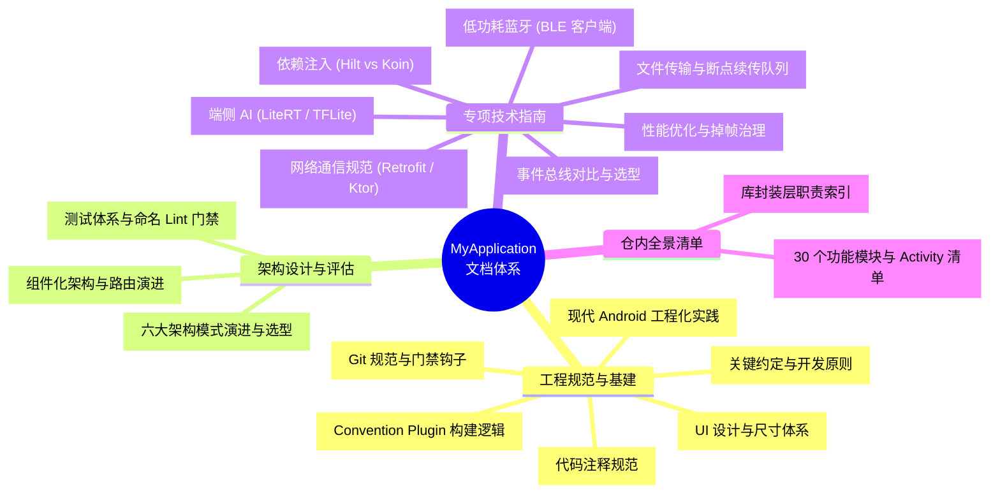

# MyApplication 技术文档导航

> 本目录收录项目的所有技术规范、架构决策、技术选型对比与专项开发指南。
> 采用**「物理平铺、逻辑分层」**结构，所有文档均位于 `docs/` 根目录下，通过本文件进行四维逻辑导航。

---

## 📚 文档全景导航

---

## 一、工程规范与研发基建 (Engineering & Standards)

涵盖项目统一的代码约定、提交标准、UI 视觉尺度、构建脚本与工程化防护门禁。

| 文档 | 说明 | 核心关注点 |
| :--- | :--- | :--- |
| [conventions.md](conventions.md) | **关键约定** | 路由命名、模块标准结构、示例页面编写准则、Activity 继承树与十大约定 |
| [comments.md](comments.md) | **代码注释规范** | 中文优先、KDoc 结构分层、选型与约束注释保护、最小修改切片 |
| [design.md](design.md) | **设计规范** | 4dp 网格间距、字体阶梯、圆角规范、统一图标尺寸系统 |
| [git.md](git.md) | **Git 提交规范** | Conventional Commits 格式要求、标题字数与中文门禁、本地钩子安装 |
| [build-logic.md](build-logic.md) | **构建逻辑** | 22 个 Convention Plugin 插件配置、依赖聚合与构建隔离 |
| [engineering.md](engineering.md) | **现代工程化实践** | 构建系统演进、静态语法治理、测试三支柱、基准配置文件与门禁防御 |

---

## 二、架构设计与评估 (Architecture & Evolution)

系统化沉淀移动端应用架构的演进路线，记录技术选型依据与官方前沿参考。

| 文档 | 说明 | 核心关注点 |
| :--- | :--- | :--- |
| [architecture.md](architecture.md) | **架构模式演进与选型** | MVP、MVVM、MVI、Compose MVI、Airbnb Mavericks 与 Offline-First 全景对比及选型树 |
| [modularization.md](modularization.md) | **现代组件化演进** | ARouter 现状、业界主流解耦方案（TheRouter / WMRouter）、API-Impl 架构设计 |
| [testing.md](testing.md) | **测试体系** | Turbine 流测试、手写测试替身、自定义方法名 Lint 门禁、Roborazzi 截图回归 |

---

## 三、专项技术指南 (Domain & Tech Stack)

针对各核心技术领域提供横向对比、选型决策、设计模式与最佳实战指南。

| 文档 | 说明 | 核心关注点 |
| :--- | :--- | :--- |
| [network.md](network.md) | **网络通信约定** | OkHttp、Retrofit、Retrofit Rx 与 Ktor 的功能边界与架构分工 |
| [transfer.md](transfer.md) | **文件传输机制** | 基于 RxJava 的大文件上传、断点下载、分片重试与并发优先级调度 |
| [bluetooth.md](bluetooth.md) | **低功耗蓝牙 (BLE)** | 8 大核心功能流程、原生 BLE 踩坑指南与第三方开源 BLE 方案评估 |
| [di.md](di.md) | **依赖注入对比** | Google Hilt（编译期注入）vs Koin（纯 Kotlin 运行时注入）对比与实战 |
| [event.md](event.md) | **事件总线选型** | EventBus、RxEventBus、LiveEventBus 与 FlowEventBus 选型矩阵 |
| [ml.md](ml.md) | **端侧机器学习** | LiteRT / TFLite 模型加载、图像预处理、硬件加速（GPU / XNNPACK）与推理 |
| [performance.md](performance.md) | **性能优化实战** | 内存抖动与对象池治理、线程调度、卡顿掉帧排查与启动加速 |

---

## 四、仓内全景清单 (Catalogs & Overview)

维护全仓多模块全景地图与 API 库职责索引。

| 文档 | 说明 | 核心关注点 |
| :--- | :--- | :--- |
| [modules.md](modules.md) | **功能模块详情** | 30 个功能业务模块的定位、技术分类、依赖拓扑与各 Activity 页面清单 |
| [libs.md](libs.md) | **库封装层索引** | `libs/` 目录下各无 UI 基础库的对外 API 与职责边界说明 |
