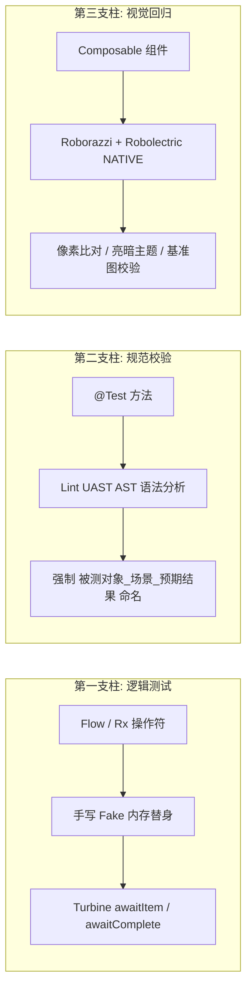
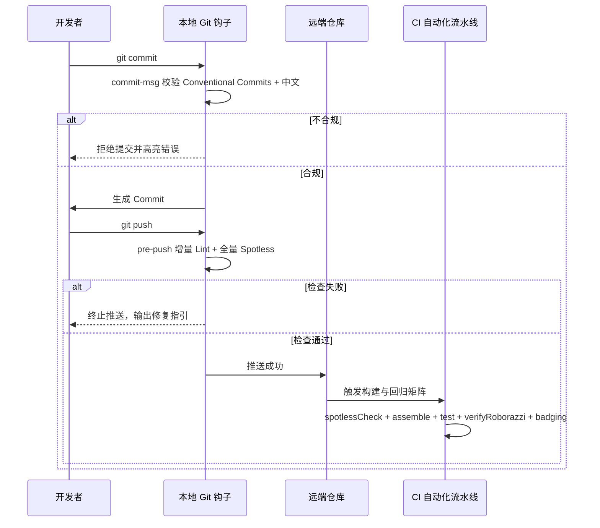

# 现代 Android 工程化实践指南

> 本文档全面系统梳理 Google 官方旗舰开源项目 [Now in Android (NiA)](https://github.com/android/nowinandroid) 的工程化底座，结合现代大型多模块 Android 研发演进，深入阐述在**构建系统、代码规范、测试体系、架构解耦、性能度量与交付安全**六大维度的完整工程化设计与落地实践。

---

## 现代 Android 工程化全景图

现代 Android 工程化的核心理念是：**确定性构建、增量加速、质量左移、全面可测试性与架构防腐解耦**。

```mermaid
flowchart TD
    subgraph Layer1["1. 构建系统与依赖治理 (Build & Dependency)"]
        B1["Version Catalog (TOML)\n14 类分层单一可信源"]
        B2["build-logic 复合构建\n正交 Convention Plugins 体系"]
        B3["类型安全项目访问器\nTYPESAFE_PROJECT_ACCESSORS"]
        B4["极速构建调优\nConfiguration Cache / Isolated Projects / 并行守护"]
        B5["现代 AGP 与 R 类优化\nbuiltInKotlin / newDsl / nonTransitiveRClass"]
        B6["依赖守卫与拓扑可视化\nDependency Guard / Graph / 空测试剔除"]
    end

    subgraph Layer2["2. 代码规范与静态代码治理 (Code Quality & Static Analysis)"]
        Q1["Spotless + ktlint\n全工程代码格式自动化治理"]
        Q2["自定义 Lint 规则体系\n测试命名 / 设计系统组件刚性拦截"]
        Q3["项目级 Lint 基线治理\nlint.xml / lint-baseline.xml / warningsAsErrors"]
        Q4["Compose 编译器稳定性\ncompose_compiler_config.conf / 稳定性指标监控"]
    end

    subgraph Layer3["3. 现代测试体系与质量基建 (Modern Testing Architecture)"]
        T1["支柱一: Turbine + Fake\n数据流断言，零 Mock 纯内存替身"]
        T2["支柱二: 测试命名 Lint\n被测对象_场景_预期结果 规范校验"]
        T3["支柱三: Roborazzi 截图测试\nJVM 原生图形渲染，无头像素级视觉回归"]
        T4["多设备规格与无障碍测试\nPhone/Foldable/Tablet 矩阵 + ATF 无障碍比对"]
        T5["自动化测试执行与效能\nGradle 托管设备 GMD / 禁用测试动画 / JaCoCo 覆盖率"]
        T6["共享测试基建\ncore:testing / MainDispatcherRule / TestDispatchersModule"]
    end

    subgraph Layer4["4. 现代架构解耦与通信范式 (Architecture & Decoupling)"]
        A1["离线优先 (Offline-First)\nRoom 响应式流 + SSOT 单一事实源"]
        A2["后台增量数据同步\nSynchronizer 契约 + SyncWorker 轮询调度"]
        A3["响应式网络状态监听\nNetworkMonitor 提供 isOnline 状态流"]
        A4["Navigation 3 声明式导航\n类型化 NavKey 与多返回栈 Multi-BackStack"]
        A5["Material 3 Adaptive 自适应布局\nListDetailPaneScaffold 大屏与折叠屏适配"]
        A6["API-Impl 契约隔离\n模块接口与实现物理隔离 + DI 自动装配"]
        A7["可插拔能力接口模式\nProd / Stub / NoOp 安全默认值兜底"]
    end

    subgraph Layer5["5. 性能基准与度量闭环 (Performance & Benchmarks)"]
        P1["Macrobenchmark + Baseline Profile\nAOT 预编译提速 30%+，帧耗时度量"]
        P2["JankStats 运行时掉帧采集\nPerformanceMetricsState UI 状态归因"]
        P3["AndroidX Tracing 深度追踪\n自定义 trace section 对齐 Perfetto 泳道"]
    end

    subgraph Layer6["6. 交付安全与门禁防御 (Defense Gate & CI/CD)"]
        G1["commit-msg 钩子\nConventional Commits 中文信息校验"]
        G2["pre-push 增量门禁\n推送前增量 Lint + 全量 Spotless"]
        G3["APK 产物基线与权限卫士\nBadging 任务自动化比对 APK 权限/体积"]
        G4["CI 流水线与依赖巡航\nGitHub Actions 矩阵自动化校验 / Renovate Bot"]
    end

    Layer1 --> Layer2 --> Layer3 --> Layer4 --> Layer5 --> Layer6
```



---

## 现代工程化全景成熟度矩阵

为了让开发者与维护者清晰掌握各项工程化能力的建设现状与后续演进方向，全仓能力遵循统一的成熟度标定规则：
* **`【已落地】`**：在当前工程代码库或构建逻辑中已有完整实现并正常生效运行；
* **`【部分落地】`**：核心机制或样板已建立，全仓铺开或自动化闭环正在推进中；
* **`【演进规划 - 待落地】`**：属于 Google 官方 NiA 标杆体系推荐、本工程已完成架构选型与规范设计，但尚未在代码库中完全物理落地的能力。

| 维度 | 能力项 | 技术栈 / 规范方案 | 落地成熟度 | 当前代码落点 / 演进规划说明 |
| :--- | :--- | :--- | :---: | :--- |
| **1. 构建系统与依赖治理** | Version Catalog 治理 | TOML 14 类分层单一真实源 | `【已落地】` | `gradle/libs.versions.toml` |
| | Convention Plugins 复合构建 | build-logic 约定优于配置 | `【已落地】` | `build-logic/convention/`（共 18 个插件文件） |
| | 类型安全项目访问器 | TYPESAFE_PROJECT_ACCESSORS | `【已落地】` | `settings.gradle.kts` |
| | 极速构建调优与项目隔离 | Configuration Cache + Parallel + BuiltIn Kotlin | `【已落地】` | `gradle.properties` |
| | 依赖拓扑可视化 | Mermaid 拓扑图生成任务 | `【已落地】` | `RootPlugin.kt`（`./gradlew generateModulesGraph`） |
| | 空测试模块任务剔除 | 检测 androidTest 源码自动关闭任务 | `【已落地】` | `AndroidInstrumentedTests.kt` |
| | 模块依赖漂移防护 | Dependency Guard 版本基线锁定 | `【部分落地】` | `app/dependencies/*.txt` 已生成，子模块全面接入与 CI 比对推进中 |
| | 纯领域模型 KMP 跨平台演进 | Kotlin Multiplatform 跨平台架构 | `【演进规划 - 待落地】` | `basic/basic_model` 为纯 JVM 库，规范已确立，规划升级为 KMP |
| **2. 代码规范与静态治理** | Spotless 格式自动化 | Spotless + ktlint + pre-push | `【已落地】` | `tools/pre-push` + `Spotless.kt` |
| | 自定义 Lint 测试命名拦截 | TestNamingDetector（UAST 分析） | `【已落地】` | `lint/src/main/kotlin/.../TestNamingDetector.kt` |
| | 自定义 Lint 设计系统拦截 | DesignSystemDetector（硬编码拦截） | `【已落地】` | `lint/src/main/kotlin/.../DesignSystemDetector.kt` |
| | 项目级 Lint 基线与边界治理 | checkDependencies = false 物理隔离混编 | `【已落地】` | `AndroidLintConventionPlugin.kt` + `lint-baseline.xml` |
| | Compose 编译器稳定性监控 | Strong Skipping + Metrics / Reports | `【已落地】` | `compose_compiler_config.conf` + `AndroidCompose.kt` |
| | NiA 进阶 Lint 规则矩阵 | 生命周期安全消费 / 现代时间 API / ViewModel 作用域 | `【演进规划 - 待落地】` | 拦截规则已设计，待在 `lint` 模块拓展实现 |
| **3. 现代测试体系** | Turbine 响应式数据流单测 | Turbine + 手写 Fake 内存替身 | `【已落地】` | `modules/module_reactive`（样板） |
| | 测试命名 Lint 机器校验 | 编译期命名 AST 机械校验 | `【已落地】` | `lint` 模块（注入全局 Android 模块） |
| | Roborazzi 像素级截图测试 | JVM Robolectric 原生图形无头渲染 | `【已落地】` | `modules/module_compose`（样板） |
| | ATF 自动化无障碍合规检查 | Accessibility Testing Framework 联动 | `【演进规划 - 待落地】` | 规范已确立，全工程截图用例全量集成推进中 |
| | 共享测试替身基础设施 | basic:basic_testing（Fake / Dispatchers） | `【演进规划 - 待落地】` | 现有替身分散于各模块，规划建立全局测试基建模块 |
| | Gradle 托管设备 (GMD) | pixel6api31aosp 纯净自动化插桩 | `【演进规划 - 待落地】` | 配置已声明，CI 自动化镜像流水线推进中 |
| | JaCoCo 代码覆盖率统一配置 | Convention 插件排除生成类与 BuildConfig | `【已落地】` | `build-logic` 覆盖率插件 |
| **4. 架构解耦与通信范式** | 离线优先与 SSOT 单一数据源 | Room 响应式流驱动 UI + 乐观更新 | `【已落地】` | `basic/basic_repo` + `modules/module_arch:ssot` |
| | 后台增量数据同步机制 | Synchronizer 契约 + SyncWorker 调度 | `【已落地】` | `basic/basic_sync`（WorkManager） |
| | 响应式网络状态监听 | NetworkMonitor 暴露 isOnline Flow | `【已落地】` | `basic/basic_lib/.../NetworkMonitor.kt` |
| | 响应式系统时区监听 | TimeZoneMonitor 广播监听与自动推流 | `【演进规划 - 待落地】` | 规范已制定，为全球化与离线时间戳自愈准备 |
| | 模块化 API-Impl 契约隔离 | 接口与实现物理双模块 + DI 自动装配 | `【演进规划 - 待落地】` | 架构已设计，规划提供 API/Impl 对应 Convention 插件 |
| | Navigation 3 声明式导航 | 类型安全 NavKey + 多返回栈保存 | `【部分落地】` | `module_compose` 已有 Nav3Activity，类型化拓扑深化中 |
| | Material 3 Adaptive 自适应 | NavigationSuiteScaffold + 双栏联动 | `【部分落地】` | `AdaptiveActivity` 已有基础，自适应脚手架推进中 |
| | 可插拔能力接口模式 | Prod / Stub / NoOp 安全默认值兜底 | `【已落地】` | `basic/basic_lib` |
| **5. 性能度量与运行时监控** | Macrobenchmark 冷启动与滑动压测 | 测量 StartupTiming / FrameTiming | `【已落地】` | `benchmarks` 模块 |
| | Baseline Profile 基线配置文件 | AOT 预编译提速 30%+ | `【已落地】` | `benchmarks` 模块生成并嵌入产物 |
| | JankStats 运行时掉帧归因 | PerformanceMetricsState 注入上下文状态 | `【已落地】` | `modules/module_performance` / `module_compose` |
| | TrackDisposableJank 统一封装 | Composable 声明式掉帧追踪容器 | `【演进规划 - 待落地】` | 规范已制定，规划下沉至 Compose 基础组件库 |
| | AndroidX Tracing 深度追踪 | trace section 联动 Perfetto 业务泳道 | `【已落地】` | `modules/module_performance` |
| **6. 交付安全与门禁防御** | Git commit-msg 校验 | Conventional Commits + 中文强制拦截 | `【已落地】` | `tools/commit-msg` + 安装脚本 |
| | Git pre-push 增量门禁 | 增量 Lint + 全量 Spotless 极速拦截 | `【已落地】` | `tools/pre-push` |
| | Badging 权限与组件基线卫士 | AAPT2 dump 元数据 diff 比对 | `【演进规划 - 待落地】` | 规范已设计，全自动化构建任务与基线推进中 |
| | CI 自动化矩阵 | GitHub Actions 自动化并发校验 | `【已落地】` | `.github/workflows/` |

---

## 一、构建系统与依赖治理

### 1. Version Catalog（版本目录集中治理）

#### 为什么弃用传统 Groovy `ext` / Kotlin `buildSrc`
* **Groovy `ext`**：无类型提示、拼写错误只能在运行期报错、依赖坐标散落不可控；
* **传统 `buildSrc`**：任何配置微调都会导致全局构建缓存全部失效，触发全量重新编译；
* **Gradle Version Catalog (`gradle/libs.versions.toml`)**：Gradle 官方原生支持，声明式 TOML，支持类型安全补全，且不破坏 Gradle 构建缓存。

#### 分层设计规范
在 `gradle/libs.versions.toml` 中，按照组件职责建立严格的 14 分类分层体系：

```toml
[versions]
# 0. 语义化版本 (SemVer)
# 1. 核心运行时与 Kotlin 基础设施 (Coroutines, Turbine, Roborazzi, Robolectric)
# 2. Google 核心基础库与 Material Design (Gson, Guava, Protobuf, Material3)
# 3. AndroidX 核心组件与基础 UI 控件 (Core-KTX, Activity, Fragment, RecyclerView)
# 4. Jetpack 架构组件 (Lifecycle, ViewModel, Navigation, Room, DataStore, WorkManager)
# 5. Jetpack Compose 现代化 UI 工具包 (Compose BOM, Compiler, Foundation, Material3)
# 6. 网络通信与流式传输 (OkHttp, Retrofit, Ktor, Netty, MQTT, SSE)
# 7. 响应式编程与异步数据流 (RxJava 3, RxAndroid)
# 8. 依赖注入与组件化路由 (Hilt, Koin, ARouter)
# 9. 图片加载与媒体处理 (Glide, Coil, CameraX)
# 10. 常用第三方实用工具库 (MMKV, BaseRecyclerViewAdapterHelper, SmartRefreshLayout)
# 11. 性能优化与基准测试 (Macrobenchmark, ProfileInstaller, JankStats, Tracing)
# 12. 代码质量与工程规范 (Android Lint, Spotless, ktlint)
# 13. Gradle 构建工具与核心插件 (AGP, Kotlin, KSP, R8, Dependency-Guard)

[libraries]
# 统一遵循 <group>-<artifact> 命名映射，禁止模糊命名

[bundles]
# 原子化依赖包聚合，减少模块 build.gradle 样板代码
testing-unit = ["junit", "kotlinx-coroutines-test", "turbine"]
testing-screenshot = ["robolectric", "roborazzi", "roborazzi-compose", "roborazzi-rule"]
compose-core = ["androidx-compose-ui", "androidx-compose-material3", "androidx-compose-ui-tooling-preview"]
```

---

### 2. 复合构建与 Convention Plugins (`build-logic`)

#### 约定优于配置（Convention over Configuration）
### 2. 复合构建与 Convention Plugins (`build-logic`) 【已落地】

#### 约定优于配置（Convention over Configuration）
多模块项目中如果每个模块都复制几十行 `android { ... }` 配置，升级版本或调整编译选项将是灾难。现代工程化采用 `build-logic` 复合构建（Composite Build），将通用构建逻辑抽取为 **Convention Plugin**。

当前工程 `build-logic/convention/src/main/kotlin/` 实际落地的 19 个构建管理插件清单：

```
build-logic/convention/src/main/kotlin/
├── AndroidLibraryConventionPlugin.kt           # Android Library 通用插件 【已落地】
├── AndroidApplicationConventionPlugin.kt       # Application 壳工程插件 【已落地】
├── AndroidFeatureConventionPlugin.kt           # 业务 Feature 模块插件（含公共依赖与基础配置） 【已落地】
├── AndroidFeatureComposeConventionPlugin.kt   # Compose 业务功能模块插件 【已落地】
├── AndroidLibraryComposeConventionPlugin.kt    # Compose UI 库插件 【已落地】
├── AndroidApplicationComposeConventionPlugin.kt # Compose 壳工程插件 【已落地】
├── AndroidHiltConventionPlugin.kt              # Hilt 依赖注入插件 【已落地】
├── AndroidRoomConventionPlugin.kt              # Room 数据库与 Schema 导出插件 【已落地】
├── AndroidLintConventionPlugin.kt              # Lint 检查与配置插件 【已落地】
├── AndroidTestConventionPlugin.kt              # 测试与基准模块插件 【已落地】
├── AndroidARouterConventionPlugin.kt           # ARouter 路由组件化插件 【已落地】
├── AndroidEventBusConventionPlugin.kt          # EventBus 事件总线插件 【已落地】
├── AndroidGreenDaoConventionPlugin.kt          # GreenDAO ORM 插件 【已落地】
├── AndroidObjectBoxConventionPlugin.kt         # ObjectBox 数据库插件 【已落地】
├── AndroidProtobufConventionPlugin.kt          # Protocol Buffers 插件 【已落地】
├── AndroidKspConventionPlugin.kt               # KSP 注解处理插件 【已落地】
├── AndroidKaptConventionPlugin.kt              # Kapt 遗留注解处理插件 【已落地】
├── JvmLibraryConventionPlugin.kt               # 纯 Kotlin/JVM 模块通用插件 【已落地】
└── RootPlugin.kt                               # 根工程全局管理插件（Mermaid 拓扑与 Spotless） 【已落地】
```

#### 架构演进规划插件【演进规划 - 待落地】
为实现彻底的业务物理隔离，规划在后续演进中补充成对的 API/Impl 契约隔离插件：
* `AndroidFeatureApiConventionPlugin.kt`：轻量对外接口契约层（零业务实现、仅含 Model 与 Service 接口定义）；
* `AndroidFeatureImplConventionPlugin.kt`：具体业务实现层（内部封装私有逻辑并通过 DI 装配，对外完全黑盒不可见）。

#### 模块接入极简契约
业务模块的 `build.gradle.kts` 仅需声明业务依赖与自身特有的插件别名，所有公共配置自动继承：

```kotlin
// 业务功能模块声明示例
plugins {
    alias(libs.plugins.nowinandroid.android.feature)
    alias(libs.plugins.nowinandroid.android.arouter)
}

android {
    namespace = "com.example.william.my.module.reactive"
}

dependencies {
    // 仅需声明该模块特定的业务依赖，通用依赖已由 feature 插件统一注入
    implementation(libs.rxjava3)
    implementation(libs.rxandroid3)
}
```

---

### 3. 类型安全项目访问器 (Typesafe Project Accessors) 【已落地】

在 `settings.gradle.kts` 中开启：

```kotlin
enableFeaturePreview("TYPESAFE_PROJECT_ACCESSORS")
```

#### 收益对比
* **传统方式**：`implementation(project(":basic:basic_lib"))`。字符串路径一旦重构拼错，只能在 Gradle Sync 失败甚至编译报错时暴露，IDE 无法智能感知，无法安全重命名；
* **类型安全方式**：`implementation(projects.basic.basicLib)`。Gradle 自动根据项目目录生成强类型 DSL 访问器，输入即补全，拼错在编辑期高亮报错，支持 IDE 安全重构。

---

### 4. 现代 Gradle / AGP 深度优化与极速构建 【已落地】

#### 配置缓存（Configuration Cache）与并行配置
在 `gradle.properties` 中开启：
```properties
# 开启配置缓存，在构建脚本未变更时完全跳过 Gradle 配置期
org.gradle.configuration-cache=true
# 开启配置缓存并行执行
org.gradle.configuration-cache.parallel=true
# 遇到配置缓存违规时直接判定失败，确保构建逻辑纯洁性
org.gradle.configuration-cache.problems=fail
```
* **核心原理**：Gradle 将 Task 图的计算结果序列化到磁盘，后续构建跳过所有 `build.gradle.kts` 的执行，秒级直达 Task 执行期；
* **约束规范**：任何自定义 Task 严禁在运行期引用 `project`、`gradle` 等动态对象，所有入参和出参必须使用 `Property<T>`、`Provider<T>`、`RegularFileProperty` 显式声明。

#### 项目隔离（Isolated Projects）与 KSP 隔离
```properties
# 开启项目隔离配置，实现各个模块配置期的完全物理隔离与并发计算
org.gradle.isolated-projects=true
# 开启 KSP 项目隔离模式
ksp.project.isolation.enabled=true
```
在超多模块工程中，项目隔离禁止跨 Project 间直接访问状态，解绑各个子项目的配置计算依赖，带来巨大的配置并发提速。

#### 编译器守护进程独立内存配置
```properties
# Kotlin 守护进程只继承 Gradle 的 -Xmx，其余参数需单独声明，防止大型多模块编译 OOM
kotlin.daemon.jvmargs=-Xmx4g -XX:MaxMetaspaceSize=1g -XX:+UseParallelGC
```

#### 现代 AGP 特性适配（BuiltIn Kotlin 与 New DSL）
现代 Android 构建工具链已深度融合 Kotlin：
* **`android.builtInKotlin=true`**：由 AGP 原生内置 Kotlin 编译配置，直接基于 Kotlin 现代编译器选项，无需单独声明旧版 Kotlin 插件配置；
* **`android.newDsl=true`**：切换至新版 Variant API 与扩展契约，淘汰旧版 `BaseExtension` 转型，保障与最新 Gradle 及 AGP 的前向兼容；
* **非传递性 R 类与编译时 R 类**：
  ```properties
  android.nonTransitiveRClass=true
  android.enableAppCompileTimeRClass=true
  ```
  每个模块仅生成自身声明的 R 类符号，避免上游模块的资源 ID 级联穿透，极大缩短多模块增量编译耗时。

---

### 5. 依赖守卫、拓扑可视化与空测试优化 【部分已落地】

* **Dependency Guard（依赖漂移防护）`【部分已落地】`**：
  接入 `com.dropbox.dependency-guard` 插件。目前壳工程已生成运行时依赖基线快照（`app/dependencies/prodDebugRuntimeClasspath.txt`）。依赖树发生非预期变更（如三方库隐式引入冲突版本或风险许可证库）时，构建直接中断并给出 diff。下一步规划在 CI 门禁中全面铺开至全部 Library 模块。
* **依赖拓扑图自动生成 `【已落地】`**：
  在根工程运行：
  ```bash
  ./gradlew generateModulesGraph
  ```
  自动遍历所有子模块依赖关系，生成可视化 Mermaid 图形（`build/mermaid/graph.txt`），实时掌握模块依赖边界。
* **空测试模块任务剔除（`AndroidInstrumentedTests.kt`）`【已落地】`**：
  在多模块工程中，多数模块未编写插桩测试。Convention 插件自动检测各模块 `src/androidTest` 目录，若无测试源码则自动关闭该模块的 `connected*AndroidTest` 任务，免除空容器构建与分发的无效开销。

---

### 6. Kotlin Multiplatform (KMP) 跨平台架构演进指南 【演进规划 - 待落地】

#### 演化驱动与定位
Google 官方 NiA 正在持续将其纯领域模型（`:core:model`）与算法工具平滑向 Kotlin Multiplatform (KMP) 演进。
当前项目中，[`basic/basic_model`](file:///e:/StudioProjects/MyApplication/basic/basic_model) 已经是**零 Android 依赖的纯 Kotlin/JVM 库**（由 `JvmLibraryConventionPlugin.kt` 配置），具备无缝向 KMP 演化的天然优势。

#### 迁移落地路径
将 `basic_model` 从纯 JVM 插件升级为 KMP 插件，使其不仅能在 Android 端运行，还能编译为 Desktop (JVM) 与 iOS (Native) 目标架构：

```kotlin
// basic/basic_model/build.gradle.kts (规划演进目标)
plugins {
    alias(libs.plugins.kotlin.multiplatform)
    alias(libs.plugins.kotlin.serialization)
}

kotlin {
    // 1. Android Target
    androidTarget()
    
    // 2. JVM / Desktop Target
    jvm("desktop")
    
    // 3. iOS Targets
    iosX64()
    iosArm64()
    iosSimulatorArm64()

    sourceSets {
        commonMain.dependencies {
            implementation(libs.kotlinx.coroutines.core)
            implementation(libs.kotlinx.serialization.json)
            implementation(libs.kotlinx.datetime) // 替代 java.util.Date
        }
        commonTest.dependencies {
            implementation(libs.kotlin.test)
        }
    }
}
```

* **收益**：模型层与版本游标契约彻底成为跨平台资产，为后续引入 Compose Multiplatform（全平台共享 UI）奠定坚实的领域层基础设施。

---

## 二、代码规范与静态治理

### 1. Spotless + ktlint 代码格式自动化治理 【已落地】

* **工具组合**：[Spotless](https://github.com/diffplug/spotless) + [ktlint](https://pinterest.github.io/ktlint/)。
* **设计原则**：**代码格式零争论，完全交由工具自动化**。开发人员无需在 PR 中 review 缩进、空格、换行等格式细节。
* **配置范围**：
  * 全工程 `.kt` 文件：遵循官方 Kotlin 代码规范与 ktlint 规则（单行长度限制、禁止星号通配符导入、空行规则）；
  * 全工程 `.kts` 脚本文件：统一 Gradle 构建脚本书写格式；
  * `build-logic` 自身源码受同等格式约束。

#### 常用命令
```bash
# 检查全工程代码格式规范（不合规直接退出并标红）
./gradlew spotlessCheck

# 自动修复全工程所有格式违规
./gradlew spotlessApply
```

---

### 2. 自定义 Lint 规则体系（独立纯 JVM 模块） 【已落地】

#### 为什么需要自定义 Lint
架构设计规范（如间距、测试命名规范、设计系统组件使用）如果只写在 Markdown 里，极易随时间腐化。现代工程化采用**独立 Lint 模块在编译期刚性拦截违规**。

#### 落地结构
在项目中设立独立纯 Kotlin/JVM 模块 `:lint`：
```
lint/
├── src/main/kotlin/com/example/william/my/lint/
│   ├── TestNamingDetector.kt          # 测试命名规范探测器（基于 UAST 分析） 【已落地】
│   ├── DesignSystemDetector.kt        # 设计系统规范探测器（拦截裸组件与硬编码） 【已落地】
│   └── IssueRegistry.kt               # 规则注册表（通过 META-INF/services 导出） 【已落地】
└── src/test/kotlin/com/example/william/my/lint/
    ├── TestNamingDetectorTest.kt      # 测试命名 Lint 规则单测
    └── DesignSystemDetectorTest.kt    # 设计系统 Lint 规则单测
```

#### 检查规则与拦截标准
1. **测试规范检查（`TestNamingDetector`）`【已落地】`**：
   * **`TestClassName` 规则**：类中包含 `@Test` 方法时，类名必须以 `Test` 结尾（避免测试类被测试套件遗漏）；
   * **`TestMethodName` 规则**：测试方法名必须为 `被测对象_场景_预期结果` 格式（如 `fetchUser_networkError_emitsErrorState`），严禁使用反引号中文或无意义命名。
2. **设计系统规范检查（`DesignSystemDetector`）`【已落地】`**：
   * **禁止裸调 Material3 组件**：扫描 Compose 代码，拦截对 `androidx.compose.material3.Button`、`Text`、`TopAppBar` 等原生组件的直接调用，强制走工程设计系统封装；
   * **禁止硬编码 Magic Number**：拦截在 Modifier 中直接书写硬编码 dp/sp（如 `.padding(16.dp)`），强制引用设计规范中定义的语义化间距。
3. **全局生效接线**：
   在 `build-logic` 中通过 `AndroidDeps.kt` 为全工程 Android 模块统一注入：
   ```kotlin
   dependencies {
       "lintChecks"(projects.lint)
   }
   ```

---

### 3. 项目级 Lint 基线与多模块边界设计 【已落地】

* **`lint.xml` 项目级规则配置**：统一配置各个 Issue 的严重级别（Severity），严禁模块各自为政；
* **`lint-baseline.xml` 增量治理基线**：对于历史代码中的既有告警生成基线快照，**老代码不报错，新提交新增的任何违规直接中断构建**，确保技术债务不再新增；
* **严格门禁**：在 CI 中开启 `abortOnError = true` 与 `warningsAsErrors = true`，杜绝警告带病上线。

#### 多模块 Lint 边界设计与 `checkDependencies` 深度实践

在 AGP（Android Gradle Plugin）中，`lint.checkDependencies` 用于控制静态代码分析是否递归深入扫描当前模块所依赖的所有 Gradle 子工程源码。

##### 1. NiA 官方机制与适用前提
Google 官方开源项目 Now in Android (NiA) 在 `AndroidLintConventionPlugin` 中配置了 `checkDependencies = true`。NiA 能够这样配置的前提是：
* **100% 第一方原生工程**：所有子模块（`core:*`、`feature:*`）均由 Google 团队自行编写，外部依赖全走 Maven 远程 AAR 二进制；
* **CI 单一根节点驱动**：NiA 在 GitHub Actions CI 中只执行一次全量命令 `./gradlew :app:lintProdRelease`，依赖 `:app` 自顶向下穿透分析所有子模块代码。

##### 2. 本项目（大型多模块 + Flutter 混编）为什么必须设为 `false`
本项目在落地现代工程化时，明确将 `checkDependencies` 关闭（设为 `false`），根因在于解决真实工业界场景下的三大冲突：
1. **隔离混编外部源码子工程**：
   Flutter Add-to-App 机制（`include_flutter.groovy`）会将所有 Pub 插件（如 `geolocator_android`、`flutter_blue_plus_android`）以**本地 Gradle 源码子工程**形式挂载到根工程中。若开启 `checkDependencies = true`，Lint 会将这些不可控的第三方插件 Java 源码当成第一方代码进行严苛扫描，因第三方插件未在 Java 层书写 `checkSelfPermission` 而触发数十处 `MissingPermission` 错误，导致合法构建被异常阻断；
2. **避免多模块重复交叉扫描的算力黑洞**：
   本项目包含 30+ 功能模块，若每个模块都开启穿透扫描且均依赖 `basic_lib`，全量执行时底层基础库会被重复分析 30+ 次，构建耗时呈指数级膨胀；
3. **与本地增量门禁（`tools/pre-push`）完美自洽**：
   工程引入了客户端 `pre-push` 增量门禁，通过 `git diff` 逆向映射变更文件，仅对受影响的子模块独立触发 `:<module>:lintProdDebug`。各模块“自扫门前雪”，确保本地推送前在 10~20 秒内极速完成静态审查，杜绝等待焦虑。

##### 3. `checkDependencies` 选型矩阵与决策建议

| 场景 | 推荐配置 | 核心决策理由 |
| :--- | :--- | :--- |
| **日常增量门禁 / 本地提交（`pre-push`）** | `checkDependencies = false` | 保证单模块静态检查边界清晰、轻量极速，在本地秒级闭环。 |
| **所有 Library 子模块（基础层、功能模块）** | `checkDependencies = false` | 杜绝各模块重复穿透基础依赖，避免构建算力浪费。 |
| **混合开发工程（含 Flutter / RN 等源码子工程）** | `checkDependencies = false` | 物理隔离第三方未抑制的代码告警，避免外部不可控代码阻断构建。 |
| **纯原生单一入口 CI 门禁（如 NiA）** | 仅 `:app` 开启 `true` | 在不跑子模块 Lint 任务的前提下，由 `:app` 统一穿透覆盖全工程第一方代码。 |
| **发版前全局审计（`UnusedResources` / Merged Manifest）** | 仅 `:app` 发版流水线开启 `true` | 站在整包最终合并产物的“上帝视角”进行全量无用资源清理与清单冲突排查。 |

---

### 4. Compose 编译器稳定性配置与性能指标监控 【已落地】

#### 稳定性声明与强跳过模式
在根目录提供 `compose_compiler_config.conf` 配置文件，并在 `AndroidCompose.kt` 中注入：
```ini
// 声明外部不可变类或标准模型为稳定类型
java.time.Instant
java.time.LocalDate
kotlinx.datetime.Instant
```
配合 Compose 编译器的 Strong Skipping 模式，最大限度减少非必要重组开销。

#### 编译器指标与报告（Metrics & Reports）
通过开关开启 Compose 编译器诊断生成：
```bash
./gradlew assembleRelease -PenableComposeCompilerReports=true -PenableComposeCompilerMetrics=true
```
输出位于 `build/compose-reports`，精确报告：
* 哪些 Composable 函数是可跳过的（`restartable skippable`）；
* 哪些数据类的字段被推断为不稳定（`unstable class`），为 UI 性能重构提供准确数据源。

---

### 5. NiA 进阶 Lint 规则规划与拦截准则 【演进规划 - 待落地】

参考 Google 官方 NiA 最佳实践，规划在 `:lint` 模块后续拓展以下 3 项刚性静态拦截规则：

#### 1. 生命周期安全流收集检查（`CollectAsStateWithLifecycleDetector`）
* **违规场景**：在 Compose UI 树中直接调用 `Flow.collectAsState()`；
* **危害**：当 Activity/Fragment 切入后台（STOPPED 状态）时，`collectAsState()` 依然持续监听上游冷流发射，无法释放计算资源甚至导致内存泄漏与后台异常；
* **拦截与修复建议**：拦截 `collectAsState()`，强制要求使用 `androidx.lifecycle.compose` 提供的 `collectAsStateWithLifecycle()`，确保当页面生命周期低于 `Lifecycle.State.STARTED` 时自动取消协程收集。

#### 2. 现代时间 API 强制检查（`DateTimeApiDetector`）
* **违规场景**：在数据实体模型与网络层直接使用老旧易错的 `java.util.Date`、`java.util.Calendar` 或 `SimpleDateFormat`；
* **危害**：非线程安全、不支持时区不可变性、且无法支持 Kotlin Multiplatform 跨平台序列化；
* **拦截与修复建议**：强制迁移至 Java 8+ `java.time.Instant` / `LocalDateTime` 或全平台通用的 `kotlinx.datetime.Instant`。

#### 3. ViewModel 作用域声明检查（`ViewModelScopeDetector`）
* **违规场景**：在可复用的小粒度子 Composable 内部，无条件调用 `viewModel()` 默认工厂获取全局 ViewModel；
* **危害**：破坏组件的可复用性与可测试性，使子组件无法独立 Preview，且在复杂回退栈或 LazyColumn 中极易引发状态错乱与实例泄漏；
* **拦截与修复建议**：强制要求 ViewModel 仅在顶层 Screen/Route Composable 中获取，子组件只接收不可变 `UiState` 数据类与 Lambdas 回调事件（状态提升 State Hoisting）。

---

## 三、现代测试体系与自动化基建

测试体系构建了覆盖**逻辑层、规范层与视觉层**的三维防线，并辅以自动化设备与覆盖率基建。

| 支柱 | 技术栈 | 职责定位 | 核心优势 |
| :--- | :--- | :--- | :--- |
| **第一支柱** | **Turbine + 手写 Fake** | 响应式数据流（Flow / RxJava）逻辑单测 | 彻底剔除 Mock 框架脆性，强类型内存行为，强制消费完整流事件 |
| **第二支柱** | **测试命名 Lint** | 测试命名规范静态校验 | 编译期机器校验，CI 失败日志一目了然 |
| **第三支柱** | **Roborazzi 截图测试** | Compose UI 像素级视觉回归 | 在 JVM 借助 Robolectric 原生图形运行，无真机依赖，矩阵化覆盖亮暗主题 |



### 1. 为什么手写 Fake 优于 Mock 框架（MockK / Mockito） 【已落地】
* **Mock 框架的痛点**：基于运行期反射插桩。一旦底层接口增加参数或签名调整，测试代码不会在编译期报错，而在运行期静默出现桩失配；过度使用 `every { ... }` 和 `verify { ... }` 会导致测试与实现细节高度耦合，重构成本极高；
* **手写 Fake 的优势**：Fake 是真实实现的轻量内存版本（如 `FakeUserRepository`、`FakeNumberSource`），接口签名变化时由 Kotlin 编译器强制同步更新；内部维护事件发射序列与调用计数，断言清晰、零反射、执行速度极快。当前在 [`modules/module_reactive`](file:///e:/StudioProjects/MyApplication/modules/module_reactive) 已建立完整手写 Fake 驱动操作符单测的工业级样板。

---

### 2. Roborazzi 截图测试、多设备矩阵与无障碍检查 【部分落地】

当前已在 [`modules/module_compose`](file:///e:/StudioProjects/MyApplication/modules/module_compose) 落地基于 JVM + Robolectric Native Graphics 的像素级截图回归样板。

#### 多设备规格覆盖（`captureMultiDevice`）`【已落地】`
一份 UI 组件测试同时生成三档物理设备形态的渲染快照：
```kotlin
enum class DefaultTestDevices(val description: String, val spec: String) {
    PHONE("phone", "spec:shape=Normal,width=640,height=360,unit=dp,dpi=480"),
    FOLDABLE("foldable", "spec:shape=Normal,width=673,height=841,unit=dp,dpi=480"),
    TABLET("tablet", "spec:shape=Normal,width=1280,height=800,unit=dp,dpi=480"),
}
```

#### 同步无障碍检查（RoboAccessibility + ATF）`【演进规划 - 待落地】`
NiA 在截图比对的同时，深度挂载了 Google 官方 **Accessibility Testing Framework (ATF)**，将视觉回归与无障碍可访问性合规检查合二为一：
```kotlin
// 截图时自动校验无障碍标签缺失、文字对比度与触控区域（Touch Target 48dp+）
captureRoboImage(filePath) {
    checkRoboAccessibility(AccessibilityCheckPreset.LATEST)
}
```
* **核心检查维度**：
  1. **触控热区最小面积**：可交互组件点击区域必须 ≥ 48dp × 48dp（避免老人或手抖用户误触）；
  2. **文本色彩对比度**：普通文本与背景对比度必须 ≥ 4.5:1，大号文本（18pt+ 或 14pt+ 粗体）≥ 3:1；
  3. **屏幕阅读器语义缺失**：可交互图标与按钮必须具备有效的 `contentDescription`，不可读装饰元素必须显式标注 `decorative`。
* **演进规划**：当前工程已验证该 API，后续规划在全工程 UI 截图用例中全面启用无障碍自动校验，并在 CI 中作为门禁阻断。

#### 自动化联动开关 `【已落地】`
在 `gradle.properties` 配置 `roborazzi.test.verify=true`，使得常规 `./gradlew test` 会自动联动触发截图比对，杜绝“代码改了却忘记跑视觉回归”的隐患。

---

### 3. 测试效能与自动化配套基建

#### 共享测试基建模块（`basic:basic_testing`）`【演进规划 - 待落地】`
* **现状与痛点**：当前项目的手写 Fake（如 `FakeNumberSource`）分散在具体的业务测试目录中，其他模块无法跨工程复用通用的调度器生命周期与数据替身；
* **规划目标**：参考 NiA 的 `:core:testing`，建立全局独立的纯测试基础共享库 `:basic:basic_testing`，统一对外导出：
  * **`MainDispatcherRule`**：通过 `StandardTestDispatcher()` 统管协程主线程调度器生命周期；
  * **`TestDispatchersModule`**：提供通过 Hilt `@TestInstallIn` 自动替换生产 Dispatcher 的测试模块；
  * **全局 Fake Repository 与生成器**：`FakeArticleRepository`、`FakeNetworkMonitor`、`FakeTimeZoneMonitor` 等，供所有功能模块和 UI 测试开箱即用。

#### Gradle 托管设备（Gradle Managed Devices, GMD）`【演进规划 - 待落地】`
插桩测试如果依赖开发者手动启动本地模拟器，容易因模拟器状态污染、系统版本差异导致测试偶发失败。
在构建插件中引入 GMD 声明：
```kotlin
// build-logic 中的托管设备配置
android.testOptions.managedDevices.devices {
    create<ManagedVirtualDevice>("pixel6api31aosp") {
        device = "Pixel 6"
        apiLevel = 31
        systemImageSource = "aosp"
    }
}
```
* **命令**：`./gradlew pixel6api31aospDebugAndroidTest`
* **优势**：Gradle 自动从官方源拉取纯净镜像、无头启动、执行测试用例、拉取报告并自动销毁容器，保障插桩测试结果 100% 可复现。

#### 禁用测试动画 `【已落地】`
在测试配置中固定配置：
```kotlin
android.testOptions.animationsDisabled = true
```
全面禁用系统窗口动画、过渡动画与矢量动画，彻底消除插桩测试因动画延迟造成的 Flaky 偶发报错。

#### 代码覆盖率（JaCoCo 约定插件）`【已落地】`
编写 `AndroidLibraryJacocoConventionPlugin` 与 `AndroidApplicationJacocoConventionPlugin`：
* 自动为各模块挂载 `testDebugUnitTest` 与插桩测试的任务绑定；
* 统一排除生成的 R 类、Dagger/Hilt 工厂代码与 BuildConfig 文件；
* 生成统一的模块及全工程聚合 HTML / XML 覆盖率报告，提供 CI 质量看板。

---

## 四、现代架构解耦与通信范式

### 1. 离线优先（Offline-First）与单一事实源（SSOT）架构 【已落地】

现代 Android 架构坚决摒弃“网络直接驱动 UI”的脆弱模式，采用本地数据库驱动 UI 的响应式闭环：

```mermaid
flowchart LR
    A["Remote API 网络后端"] -->|增量拉取 Sync| B["Room 本地数据库 (SSOT)"]
    B -->|响应式 Flow 流| C["Repository / UseCase"]
    C -->|UIState 流| D["UI (Compose / Activity)"]
    D -.->|用户写操作 (乐观更新)| B
    B -.->|后台异步同步写| A
```
* **核心原则**：UI 永远只观察 Room 数据库吐出的冷流（Flow），网络请求成功后仅写入数据库，由数据库的变动天然触发 UI 响应；
* **离线可用**：即使断网，App 依然立即可用并展现最新的持久化数据，零加载白屏。在 [`basic/basic_repo`](file:///e:/StudioProjects/MyApplication/basic/basic_repo) 与 [`modules/module_arch:ssot`](file:///e:/StudioProjects/MyApplication/modules/module_arch) 已完整落地。

---

### 2. 响应式系统环境监视器体系（Environment Monitors）

现代应用 UI 不仅需要感知业务数据，还需要对操作系统外部环境（网络连接、系统时区、电量状态）保持实时敏锐的响应式观察。

#### 网络状态监视器（`NetworkMonitor`）`【已落地】`
在 [`basic/basic_lib`](file:///e:/StudioProjects/MyApplication/basic/basic_lib) 提供统一的网络感知接口：
```kotlin
interface NetworkMonitor {
    val isOnline: Flow<Boolean>
}
```
基于系统 `ConnectivityManager.NetworkCallback` 实现，向上层暴露热状态流。UI 结合 `repeatOnLifecycle` 收集状态，离线时顶部显示离线横幅提示，在线时自动唤醒数据重试与后台同步。

#### 系统时区监视器（`TimeZoneMonitor`）`【演进规划 - 待落地】`
* **问题痛点**：跨国用户飞行、系统时区切换或夏令时切换时，若 App 未重启，UI 上的格式化时间戳（如“发布于 2 小时前”、“2026-09-08 13:00”）将出现时区漂移或计算偏差；在截图测试时，不同机器的默认时区差异也会导致断言失败；
* **设计契约**：
  ```kotlin
  interface TimeZoneMonitor {
      val currentTimeZone: Flow<TimeZone>
  }
  ```
* **落地机理**：
  1. **生产实现（`LiveTimeZoneMonitor`）**：注册广播接收器监听 `Intent.ACTION_TIMEZONE_CHANGED`，配合 `callbackFlow` 在时区变更时发射最新 `TimeZone.currentSystemDefault()`；
  2. **测试替身（`TestTimeZoneMonitor`）**：在截图测试与单测中固定发射 UTC 或特定时区，保障时间相关的 UI 渲染绝对确定；
  3. **UI 消费联动**：通过 CompositionLocal 注入当前时区，所有涉及时间格式化的 Composable 自动响应重组。

---

### 3. 声明式后台增量数据同步（`Synchronizer` + `SyncWorker`） 【已落地】

针对后台数据同步，抽取高阶同步契约（在 [`basic/basic_sync`](file:///e:/StudioProjects/MyApplication/basic/basic_sync) 落地）：
```kotlin
interface Synchronizer {
    suspend fun getChangeListVersions(): ChangeListVersions
    suspend fun updateChangeListVersions(update: ChangeListVersions.() -> ChangeListVersions)
    suspend fun Syncable.sync(): Boolean = syncWith(this@Synchronizer)
}
```
* **WorkManager 定时调度**：通过 `SyncWorker` 声明约束（仅在有网络、充电或空闲时运行）；
* **增量变更同步（ChangeList）**：每次只拉取版本号高于本地游标的增量数据，极大节省流量与设备电量。

---

### 4. 模块化 API-Impl 契约隔离架构（模块物理防腐） 【演进规划 - 待落地】

为防止多模块架构下模块间发生循环依赖或横向业务耦合，将 Feature 拆分为成对的两个模块：

```
modules/
├── module_user/
│   ├── api/      # :modules:module_user:api （对外暴露的轻量接口契约）
│   │   ├── IUserService.kt        # 服务接口
│   │   └── UserModel.kt           # 对外数据载荷
│   └── impl/     # :modules:module_user:impl （具体实现，对外部不可见）
│       ├── UserServiceImpl.kt    # 业务逻辑实现
│       └── UserModuleDi.kt        # Hilt 装配绑定
```
* **构建隔离**：调用方模块（如 `module_order`）仅依赖 `:module_user:api`，无法调用到实现类中的私有逻辑；
* **DI 自动装配**：`UserServiceImpl` 通过 Hilt `@Binds` 绑定到接口，壳工程在打包时拉取所有 `:impl`，在编译期实现无反射、强类型的依赖注入。

---

### 5. Jetpack Navigation 3 声明式导航体系 【部分落地】

现代 Android 官方导航已经从基于 URL 字符串跳转全面演进至 **Navigation 3**（`androidx.navigation3`）。已在 [`modules/module_compose`](file:///e:/StudioProjects/MyApplication/modules/module_compose) 落地 `Nav3Activity` 基础样板。

#### 核心机制
* **类型安全路由模型 (`NavKey`)**：放弃拼接 URL，导航键（NavKey）由强类型 `data class` / `@Serializable` 承载：
  ```kotlin
  @Serializable
  data class ArticleDetailKey(val articleId: String)
  ```
* **多返回栈（Multi-BackStack）原生支持**：通过 `rememberNavBackStack` 分别为底部主导航的每个 Tab 独立维护导航栈，切换 Tab 时状态完美保留；
* **解耦与测试友好**：`NavDisplay` 接收当前栈顶的 `key`，并由各 Feature 模块提供的独立 Content 映射函数渲染 UI，彻底消除全局黑盒胖路由表的编译耦合。

---

### 6. Material 3 Adaptive 大屏与折叠屏自适应布局 【部分落地】

针对手机、折叠屏、平板及桌面设备的多样化屏幕尺寸，现代工程化要求 UI 原生具备自适应响应式能力。已在 `module_compose` 落地基础 `AdaptiveActivity`。

#### 列表-详情自适应脚手架 (`ListDetailPaneScaffold`)
```kotlin
val navigator = rememberListDetailPaneScaffoldNavigator()

ListDetailPaneScaffold(
    directive = navigator.scaffoldDirective,
    value = navigator.scaffoldValue,
    listPane = {
        ArticleListPane(onArticleClick = { navigator.navigateTo(ListDetailPaneScaffoldRole.Detail, it) })
    },
    detailPane = {
        ArticleDetailPane(article = navigator.currentDestination?.content)
    }
)
```
* **自适应表现**：
  * **紧凑屏幕（标准手机）**：单栏展示，点击列表项平滑入栈推进详情页；
  * **展开屏 / 平板 / 横屏**：自动平铺为左右双栏，左侧列表常驻，右侧同步展现选中详情，无需书写任何多套 Activity 或适配碎片代码。

---

### 7. 可插拔能力接口模式（Null-Object 安全兜底） 【已落地】

对于日志、埋点、设备探针、动态能力等外部基础设施，采用三套实现范式：

| 实现类型 | 命名约定 | 职责 |
| :--- | :--- | :--- |
| **真实生产实现** | `ProdXxx` | 打包生产环境，执行真实业务上报与设备调用 |
| **本地调试桩** | `StubXxx` | 本地开发使用，仅向 Logcat 输出结构化参数 |
| **安全空实现** | `NoOpXxx` | 纯空操作，供单元测试与 Compose Preview 消费 |

配合 CompositionLocal 注入默认值：
```kotlin
val LocalAppAnalytics = staticCompositionLocalOf<AnalyticsHelper> {
    // 默认空实现，保证任何 Compose 组件在 Preview 中直接渲染，绝不抛出依赖缺失异常
    NoOpAnalyticsHelper()
}
```

---

## 五、性能度量与运行时监控

现代性能工程化将优化从“凭感觉猜测”转为“基于量化数据验证”的闭环。

### 1. Macrobenchmark 与 Baseline Profile（基线配置文件） 【已落地】

#### 原理与价值
* **AOT 编译优化**：Android 运行时（ART）在应用安装或空闲时通过 Profile 引导预编译热点方法；
* **收益**：冷启动提速 **30% 以上**，初次进入页面免去 JIT 解释器编译开销，滑动列表掉帧率显著下降。

#### 落地结构 (`benchmarks` 模块)
独立测试工程 `:benchmarks`，声明：
```kotlin
// benchmarks/build.gradle.kts
plugins {
    alias(libs.plugins.baselineprofile)
    alias(libs.plugins.nowinandroid.android.test)
}

android {
    targetProjectPath = ":app"
    experimentalProperties["android.experimental.self-instrumenting"] = true
}
```

#### 两大核心基准测试
1. **启动性能基准（`StartupBenchmark`）`【已落地】`**：
   对比 `CompilationMode.None()`（无优化冷启动）与 `CompilationMode.Partial()`（加载 Baseline Profile）下的精确耗时分布：
   ```kotlin
   benchmarkRule.measureRepeated(
       packageName = "com.example.william.my.application",
       metrics = listOf(StartupTimingMetric()),
       compilationMode = compilationMode,
       iterations = 5,
       startupMode = StartupMode.COLD,
   ) {
       pressHome()
       startActivityAndWait()
   }
   ```
2. **列表滑动基准（`ScrollBenchmark`）`【已落地】`**：
   通过 UI Automator 模拟列表连续快速滑动，测量 `FrameTimingMetric`，输出 50th、90th、99th 百分位帧耗时与掉帧比例。

---

### 2. JankStats 运行时掉帧监控闭环 【部分落地】

Macrobenchmark 适用于发布前压测，而 **JankStats** 负责应用在真实环境下的运行时掉帧持续观测。

* **逐帧回调采集 `【已落地】`**：`JankStats.createAndTrack(window, frameListener)`，在后台线程逐帧计算渲染耗时是否超出预期显示周期（16ms / 8.3ms）；
* **UI 状态归因（`PerformanceMetricsState`）`【已落地】`**：
  仅记录掉帧没有意义，关键是知道“掉帧时用户在哪个页面、处于什么状态”：
  ```kotlin
  // 在用户交互区注入上下文状态
  metricsStateHolder.state?.putState("Screen", "JankStatsActivity")
  metricsStateHolder.state?.putState("ScrollState", "Flinging")
  ```
  掉帧发生时，`FrameData` 中会携带上述上下文键值对，直接输出到卡顿日志，快速归因。

#### `TrackDisposableJank` 标准化 Composable 容器 【演进规划 - 待落地】
* **现状痛点**：在 Compose 中手工调用 `putState` / `removeState` 容易因未配对执行或缺少生命周期解绑而产生状态残留（如页面已跳出，但其状态依旧附带在后续帧上）；
* **设计规范**：参考 NiA 封装通用的生命周期感知 Composable：
  ```kotlin
  @Composable
  fun TrackDisposableJank(
      stateHolder: StateHolder,
      stateKey: String,
      stateValue: String,
      content: @Composable () -> Unit
  ) {
      DisposableEffect(stateHolder, stateKey, stateValue) {
          val state = stateHolder.state
          state?.putState(stateKey, stateValue)
          onDispose {
              state?.removeState(stateKey)
          }
      }
      content()
  }
  ```
* **落地价值**：使业务界面仅需包裹根布局即可自动绑定当前路由与滚动状态，并在退出或切换时自动清理，杜绝状态污染。

---

### 3. AndroidX Tracing 与 Perfetto 联动 【已落地】

在关键代码路径注入 Trace Section：
```kotlin
trace("JankStatsDemo:heavyWork") {
    // 耗时计算逻辑
}
```
结合 Compose 的 `runtime-tracing`，系统追踪工具（Perfetto / Android Studio Profiler）能精确展开带有业务方法名、UI 节点与卡顿帧的泳道图，彻底消除无源码调试的猜测。

---

## 六、交付安全与门禁防御（Git Hooks & CI/CD）

工程化规范的最终落地必须依托不可绕过的门禁。遵循**质量左移（Shift-Left）**原则：能由本地发现的绝不留到 CI，能由 CI 拦截的绝不带到线上。



### 1. `commit-msg` 钩子 【已落地】
* **安装方式**：运行 `./tools/install-git-hooks.sh`。
* **校验规则**：
  1. 必须遵循 [Conventional Commits](https://www.conventionalcommits.org/) 格式：`type(scope): subject`；
  2. 标题长度分级控制：≤ 72 字符为推荐值，> 100 字符强制拒绝；
  3. **标题必须包含至少一个汉字**，且结尾不加标点；
  4. 违背规范立即中断 commit 操作。

### 2. `pre-push` 增量门禁 【已落地】
NiA 原生脚本多为全量扫描，在多模块下推送等待过久。在 `tools/pre-push` 实现**增量感知算法**：
1. **全量格式校验**：执行 `spotlessCheck`，保证全仓代码排版与 ktlint 规则绝对一致；
2. **增量模块计算**：通过 `git diff` 自动解析当前待推送的分支相对于远端基线涉及变更的文件；
3. **精准 Lint 分析**：映射受影响的子模块，Android 模块执行 `:<module>:lintProdDebug`，纯 JVM 模块执行 `:<module>:lint`（自定义规则模块 `:lint` 自身自动豁免）；
4. **逃生通道**：极端紧急情况下支持 `git push --no-verify` 或 `PRE_PUSH_DISABLE=1 git push` 跳过。

---

### 3. APK 产物基线与权限卫士（`Badging` 任务） 【演进规划 - 待落地】

为避免三方库或代码重构在无感知情况下引入风险权限或修改组件导出状态，构建逻辑中规划注册 `Badging` 任务：
* **提取元数据**：通过 AAPT2 dump APK 的 `badging` 信息，提取应用的 `permissions`、`features`、`minSdkVersion`、`targetSdkVersion` 以及所有具备 `exported=true` 的四大组件；
* **版本快照比对**：将解析结果与入库的基准文件（如 `app/badging/release.txt`）比对；
* **拦截恶意越权**：一旦依赖隐式引入危险权限（如 `READ_EXTERNAL_STORAGE`、`ACCESS_FINE_LOCATION`），CI 直接拦截并生成报警 diff。

---

### 4. 持续集成（GitHub Actions CI）与依赖巡航 【已落地 / 门禁规则演进中】

* **CI 并行校验矩阵 `【已落地】`**：
  * Job 1：`spotlessCheck`（代码格式规范）；
  * Job 2：`lintProdDebug`（静态代码扫描）；
  * Job 3：`testProdDebugUnitTest`（单元测试执行）；
  * Job 4：`verifyRoborazziProdDebug`（UI 截图比对）；
  * Job 5：`dependencyGuard` 与 `checkBadging`（依赖与产物基线，`【演进规划】`）；
  * Job 6：`assembleProdRelease`（最终产物组装）。
* **自动化依赖版本巡航（Renovate / Dependabot）`【已落地】`**：
  配置自动化依赖巡航机器人，周期性扫描 `libs.versions.toml`，自动发起依赖版本升级 PR，并自动跑全量 CI 回归矩阵。

---

## 七、常用工程化命令速查字典

### 1. 代码格式化与规范
```bash
# 全工程代码格式检查（ktlint）
./gradlew spotlessCheck

# 全工程代码格式自动修复
./gradlew spotlessApply

# 校验 Git 提交日志规范
./tools/commit-msg .git/COMMIT_EDITMSG
```

### 2. 静态代码分析（Lint）
```bash
# 执行特定模块的 Lint 检查
./gradlew :basic:basic_lib:lintProdDebug

# 执行全工程 Lint 检查
./gradlew lintProdDebug

# 测试自定义 Lint 规则自身
./gradlew :lint:test
```

### 3. 单元测试与截图测试
```bash
# 运行单个模块的响应式单测（Turbine）
./gradlew :modules:module_reactive:testDemoDebugUnitTest

# 录制 Compose 截图基准图
./gradlew :modules:module_compose:recordRoborazziDemoDebug

# 校验 Compose 截图视觉回归
./gradlew :modules:module_compose:verifyRoborazziDemoDebug
```

### 4. 托管设备、基准性能与产物比对
```bash
# 生成多模块依赖拓扑 Mermaid 关系图
./gradlew generateModulesGraph

# 生成 Baseline Profile 基准文件（需连接设备）
./gradlew :benchmarks:generateBaselineProfile

# 运行冷启动与流畅度 Macrobenchmark 测试
./gradlew :benchmarks:connectedCheck

# 通过 Gradle 托管设备自动跑插桩测试（无需手工启动模拟器）
./gradlew pixel6api31aospDebugAndroidTest

# 校验 APK 权限与产物 Badging 基线
./gradlew checkBadging
```
