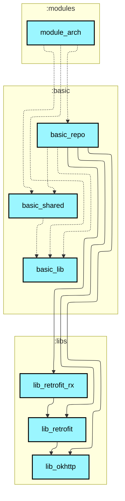
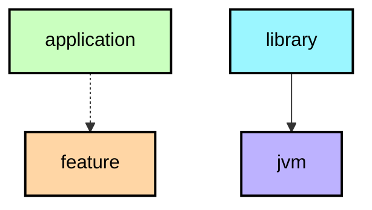

# `:modules:module_arch`

## Module dependency graph

<!--region graph-->

📋 Graph legend

<!--endregion-->

## 功能概述

本模块集中展示 Android 平台主流的架构模式演进，各架构模式在子包下独立管理，便于读者横向对比：

| 架构模式 | 页面 | 核心技术栈 | 核心设计特点 |
|---|---|---|---|
| **MVP** | `MvpActivity` | Contract + Presenter | 经典契约分离，View 与 Presenter 相互持有抽象接口，回调驱动渲染 |
| **MVVM** | `MvvmActivity` | LiveData + UseCase | 数据驱动，生命周期感知，支持协程/RxJava/UseCase 多种加载范式 |
| **MVI** | `MviActivity` | StateFlow + Intent + Effect | 单向数据流（UDF），单一不可变 ViewState，单次副作用由 Effect 通道分发 |
| **Compose MVI** | `ComposeMviActivity` | Jetpack Compose + StateFlow | 现代声明式 UI 下的 MVI 最佳实践，结合 SmartRefresh Compose 下拉刷新 |
| **Mavericks** | `MavericksActivity` | Airbnb Mavericks + MVI | 响应式 MVI 框架，MavericksState 状态自动合并，Async 异步结果包装 |
| **Offline-First (SSOT)** | `OfflineFirstActivity` | Room Flow + Write-Only Sync | **Now in Android 官方推荐架构**：Room 作为唯一数据源，UI 仅监听 Room Flow，网络仅负责写入 Room |

