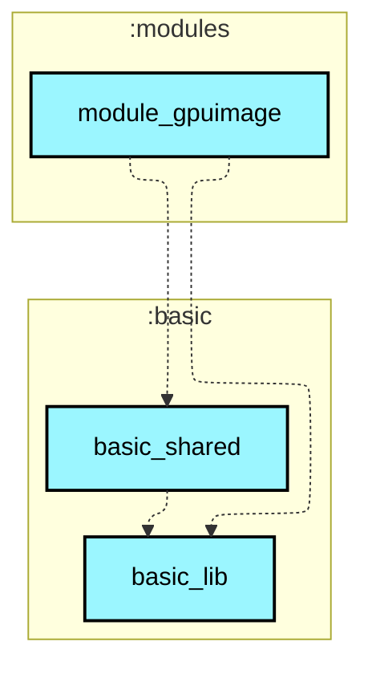
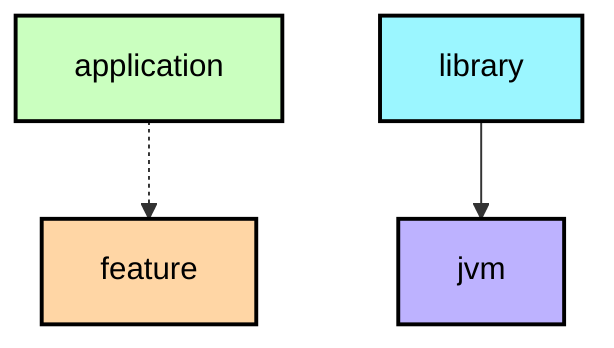

# `:modules:module_gpuimage`

## Module dependency graph

<!--region graph-->

📋 Graph legend

<!--endregion-->

## 功能列表

- **滤镜实时预览** (`GpuImageFilterActivity`)：GPUImageView 载入图片，动态应用 16 种滤镜效果与保存相册。
- **滤镜参数调节** (`GpuImageAdjustActivity`)：9 种滤镜参数（亮度/对比度/饱和度等）连续实时调节。
- **多级滤镜链** (`GpuImageGroupActivity`)：GPUImageFilterGroup 多滤镜串联离屏过渡渲染。
- **相机实时帧滤镜** (`GpuImageCameraFilterActivity`)：CameraX `ImageAnalysis` 取帧，经 `GPUImageRenderer#onPreviewFrame` 上传纹理并实时渲染预览（不产出文件）。
- **全像素滤镜拍照** (`GpuImagePhotoActivity`)：CameraX `ImageCapture` 拍摄全分辨率原图，由 `GPUImage` 离屏渲染管线应用 OpenGL 滤镜后无损保存。
- **CameraX 特效滤镜录像** (`GpuImageCameraEffectActivity`)：CameraX 1.3+ `CameraEffect` + `SurfaceProcessor` 硬件滤镜直通管线，向 `VideoCapture` 输出带滤镜的高清 MP4 视频。
- **经典 EGL + MediaCodec 滤镜录像** (`GpuImageCodecRecordActivity`)：`GLSurfaceView` 渲染线程双 EGLSurface 切换，直通 `MediaCodec.InputSurface` H.264 视频硬编，搭配 `AudioRecord` AAC 音频硬编与 `MediaMuxer` 混流输出 MP4。
