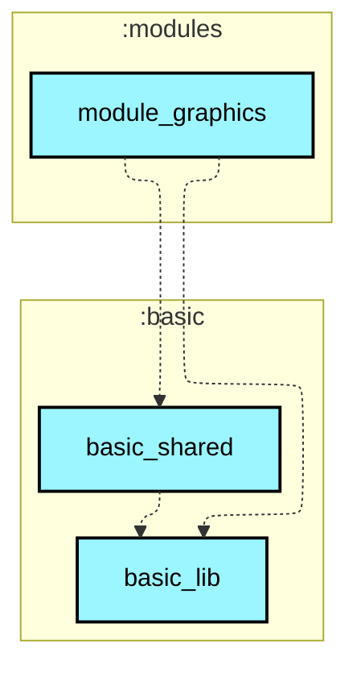
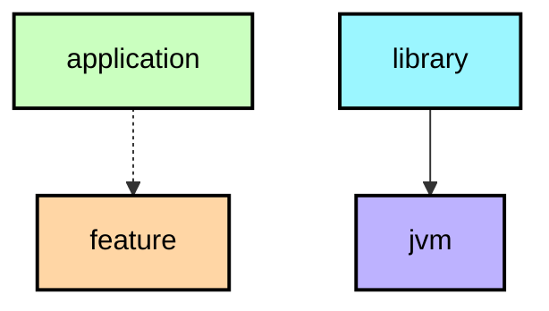

# `:modules:module_graphics`

> 演示 Android 底层图形图像处理、着色器与渲染特效（RenderEffect 渲染特效、HardwareRenderer 离屏渲染与 RenderScript 历史计算）。

## Module dependency graph

<!--region graph-->

📋 Graph legend

<!--endregion-->
